# Consensus50 Functional-Gene Tree Analysis Report: 10 Selected Genes

Date prepared: 2026-08-09  
Project: `symbiosis_sorted_v2_consensus_sequences_50percent`  
Primary cluster folder: `/mnt/dv/wid/projects6/SolisLemus-Intbio-raw/processed-data/symbiosis_sorted_v2_consensus_sequences_50percent`  
Local GitHub folder: `/Users/rosa/Desktop/ALLWork/Madison/Project/ryan-nitfix/intbio-nitfix-git/symbiosis_sorted_all_sample_consensus_sequences_50percent`

## 1. Purpose

This analysis uses the new Ryan/Pranoti consensus50 functional-gene reference to recover functional symbiosis genes from all V2 symbiosis-sorted samples, construct per-gene consensus sequences, build strict and mixed-IUPAC gene trees, assign sample-derived consensus sequences to closest known reference taxa by BLAST, and summarize whether recovery and tree patterns differ across `nif`, canonical `nod`, and `Other`.

The main goal is to create a reproducible set of gene trees and summary tables that can later be used to test whether host or geographic patterns are consistent across functional genes, following Ryan and Ahmed's suggestion that the additional gene trees should support downstream host/geography comparisons.

## 2. Key Results

| Result | Value |
|---|---:|
| Samples analyzed | 2,907 |
| Functional genes in consensus50 reference | 72 |
| Total sample-gene coverage rows | 209,304 |
| Good coverage threshold | percent covered >=80 and mean depth >=10 |
| Selected genes for tree analysis | 10 |
| Strict trees built | 10 |
| Mixed-IUPAC trees built | 10 |
| Strict trees with converged UFBoot | 8/10 |
| Mixed-IUPAC trees with converged UFBoot | 3/10 |
| Metadata rows available | 2,898 |

The selected 10 genes are:

| Analysis group | Genes |
|---|---|
| `nif` genes | `nifH`, `nifD`, `nifK`, `nifJ` |
| `nod` genes | `nodL`, `nodX` |
| `Other` | `nolG`, `nolF`, `noeA`, `noeB` |


## 3. Inputs

| Input | Description | Cluster path | Local path |
|---|---|---|---|
| Trimmed reads | Reused V2 fastp-trimmed paired reads | `/mnt/dv/wid/projects6/SolisLemus-Intbio-raw/processed-data/symbiosis_sorted_v2/symbiosis_trimmed_fastp` | not copied locally |
| Consensus50 reference FASTA | 72 gene-level consensus reference sequences | `/mnt/dv/wid/projects6/SolisLemus-Intbio-raw/processed-data/symbiosis_sorted_v2_consensus_sequences_50percent/reference/consensus_sequences_50percent.fasta` | `../result/reference/consensus_sequences_50percent.fasta` |
| Original symbiosis islands FASTA | Original functional reference used for context | `/mnt/dv/wid/projects6/SolisLemus-Intbio-raw/processed-data/symbiosis_sorted_v2_consensus_sequences_50percent/reference/symbiosis_islands.fasta` | `../result/reference/symbiosis_islands.fasta` |
| GenBank annotation | Symbiosis-island GenBank annotation | `/mnt/dv/wid/projects6/SolisLemus-Intbio-raw/processed-data/symbiosis_sorted_v2_consensus_sequences_50percent/reference/symbiosis_islands.gb` | `../result/reference/symbiosis_islands.gb` |
| Gene list | Gene grouping table from Ryan/Pranoti | `/mnt/dv/wid/projects6/SolisLemus-Intbio-raw/processed-data/symbiosis_sorted_v2_consensus_sequences_50percent/reference/symbiosis_islands_gene_list.xlsx` | `../result/reference/symbiosis_islands_gene_list.xlsx` |
| Reference taxon alignments | Per-gene aligned reference taxa used for BLAST/taxon annotation | `/mnt/dv/wid/projects6/SolisLemus-Intbio-raw/processed-data/symbiosis_sorted_v2_consensus_sequences_50percent/reference_taxon_fastas_by_gene` | `../result/reference/taxon_fastas_by_gene` |
| Metadata | Sample metadata used for tree annotation and summaries | `/mnt/dv/wid/projects6/SolisLemus-Intbio-raw/processed-data/symbiosis_sorted_v2_consensus_sequences_50percent/metadata` | `metadata available on cluster under `$OUT/metadata`; local metadata-derived outputs are in `../result/metadata_tree_comparison`` |

## 4. Reference Checks

The consensus50 reference contains 72 functional gene records. Across the full reference, the sequence composition was:

| Reference component | Count | Percent |
|---|---:|---:|
| A/C/G/T confident bases | 70,208 | 89.60% |
| IUPAC ambiguity excluding N | 6,724 | 8.58% |
| N bases | 1,425 | 1.82% |
| Total reference length | 78,357 | 100.00% |

The per-gene taxon reference alignments were checked against the gene-list table. The only gene listed in `symbiosis_islands_gene_list.xlsx` that was not present in `taxon_fastas_by_gene` was `nopT`. The selected 10 tree genes all had matching taxon-reference alignments.

Reference check output:

https://github.com/solislemuslab/IntBio-NitFix/tree/main/comparing_trees/result/reference/taxon_fastas_vs_symbiosis_islands_gene_list_match.tsv

## 5. Reproducible Pipeline

All main analysis paths below use the cluster output folder:

```bash
OUT="/mnt/dv/wid/projects6/SolisLemus-Intbio-raw/processed-data/symbiosis_sorted_v2_consensus_sequences_50percent"
GENES="nifH,nifD,nifK,nifJ,nodL,nolG,nolF,noeA,noeB,nodX"
```

### Step 1. Reuse Trimmed Reads

No new read trimming was done. The analysis reused the previously trimmed paired-end FASTQ files from the all-sample V2 analysis.

| Input | Method/code run | Result/output |
|---|---|---|
| V2 trimmed paired reads: `*_P1.fastq.gz` and `*_P2.fastq.gz` | No new code. Reads were already trimmed by `fastp` in the previous V2 workflow. | 2,907 paired samples available for mapping. |

### Step 2. Map Reads To The Consensus50 Reference

Trimmed V2 reads were mapped to the consensus50 reference using BWA-MEM. This step creates one sorted/indexed BAM file per sample and a flagstat report per sample.

### Mapping Parameters

| Parameter | Value |
|---|---|
| Mapper | BWA-MEM |
| BWA threads per job | 4 by default |
| Parallel jobs | configurable; full run used GNU Parallel |
| Sort tool | `samtools sort` |
| Sort threads per job | 2 by default |
| BAM index | `samtools index` |
| Mapping QC | `samtools flagstat` |


| Item | Path |
|---|---|
| Code, cluster | `$OUT/Rscripts_v2/11_map_consensus50_all_samples_parallel.sh` |
| Input reads | `/mnt/dv/wid/projects6/SolisLemus-Intbio-raw/processed-data/symbiosis_sorted_v2/symbiosis_trimmed_fastp` |
| Input reference | `$OUT/reference/consensus_sequences_50percent.fasta` |
| Output BAM folder | `$OUT/consensus_mapping_full` |
| Output log folder | `$OUT/consensus_mapping_logs` |

Run command:

```bash
OUT="/mnt/dv/wid/projects6/SolisLemus-Intbio-raw/processed-data/symbiosis_sorted_v2_consensus_sequences_50percent"

MAX_SAMPLES=0 JOBS=2 BWA_THREADS=4 SORT_THREADS=2 \
bash "$OUT/Rscripts_v2/11_map_consensus50_all_samples_parallel.sh" \
  | tee "$OUT/consensus_mapping_logs/consensus50_all_samples_mapping_run.log"
```
```text
MAX_SAMPLES=0 Run all samples. If this were set to 2, only two samples would be run for testing.
JOBS=2Run two samples in parallel at the same time.
BWA_THREADS=4Use 4 CPU threads for bwa mem per sample.
SORT_THREADS=2Use 2 CPU threads for samtools sort per sample.
```

Result: 2,907 samples were mapped. The mapping output is used for all downstream gene coverage and consensus sequence extraction.

### Step 3. Calculate Per-Gene Coverage

Coverage was calculated for all 72 consensus50 reference genes across all 2,907 samples.

| Item | Path |
|---|---|
| Code, cluster | `$OUT/Rscripts_v2/12_calculate_consensus_gene_coverage_v2.sh` |
| Input BAM folder | `$OUT/consensus_mapping_full` |
| Output coverage table | `$OUT/consensus_gene_coverage/consensus50_gene_coverage_all_samples.tsv` |
| Output coverage table | [`consensus50_gene_coverage_all_samples.tsv`](https://github.com/solislemuslab/IntBio-NitFix/blob/main/comparing_trees/result/tables/consensus50_gene_coverage_all_samples.tsv) |

### Coverage Table Columns

| Column | Meaning |
|---|---|
| `sample` | Sample ID. |
| `gene_ref` | Reference FASTA record, for example `nifH.fa`. |
| `gene` | Gene name after removing `.fa`. |
| `gene_length` | Length of the reference gene. |
| `covered_bases` | Number of reference positions with depth > 0. |
| `percent_covered` | `covered_bases / gene_length * 100`. |
| `mean_depth` | Mean depth across the full gene, including zero-depth positions. |
| `max_depth` | Maximum observed depth at any position in the gene. |


Run command:

```bash
OUT="/mnt/dv/wid/projects6/SolisLemus-Intbio-raw/processed-data/symbiosis_sorted_v2_consensus_sequences_50percent"
mkdir -p "$OUT/consensus_gene_coverage_logs"

MAX_SAMPLES=0 JOBS=4 \
bash "$OUT/Rscripts_v2/12_calculate_consensus_gene_coverage_v2.sh" \
  | tee "$OUT/consensus_gene_coverage_logs/consensus50_gene_coverage_run.log"
```


### Good-Coverage Definition

A sample-gene pair was counted as good when:

- `percent_covered >= 80`
- `mean_depth >= 10`

| Metric | Value |
|---|---:|
| Samples analyzed | 2,907 |
| Genes in consensus50 reference | 72 |
| Total sample-gene rows | 209,304 |
| Good sample-gene rows | 6,179 |
| Samples with at least one good gene | 2,052 |


## Sample-Level Gene-Recovery Results

A sample can recover more than one functional gene. For example, a sample with 3 good genes passed `percent_covered >=80` and `mean_depth >=10` for 3 of the 10 selected genes.

Main tables:

- [sample_overlap_good_genes_pct80_depth10](../result/comparative_tree_analysis/tables/09_sample_overlap_good_genes_pct80_depth10.tsv)
- [sample_overlap_summary_by_sample_type](../result/comparative_tree_analysis/tables/10_sample_overlap_summary_by_sample_type.tsv)
- [sample_gene_recovery_combinations_pct80_depth10](../result/comparative_tree_analysis/tables/10a_sample_gene_recovery_combinations_pct80_depth10.tsv)
- [top_gene_recovery_combinations_pct80_depth10](../result/comparative_tree_analysis/tables/10b_top_gene_recovery_combinations_pct80_depth10.tsv)
- [gene_recovery_combinations_by_sample_type_pct80_depth10](../result/comparative_tree_analysis/tables/10c_gene_recovery_combinations_by_sample_type_pct80_depth10.tsv)

Main figures:

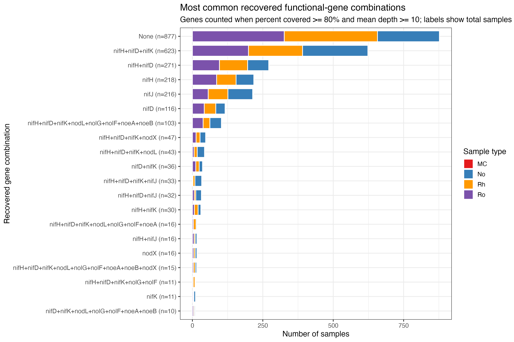

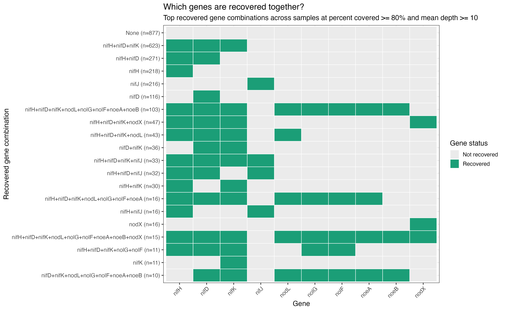


## Gene Coverage Results

Coverage threshold: `percent_covered >= 80` and `mean_depth >= 10`.

| Gene | Group | Good samples | Percent of 2,907 samples | Mean percent covered | Median percent covered | Mean depth |
|---|---|---:|---:|---:|---:|---:|
| `nifH` | nif | 1,572 | 54.08% | 76.51 | 80.64 | 1551.88 |
| `nifD` | nif | 1,497 | 51.50% | 75.80 | 80.74 | 1201.12 |
| `nifK` | nif | 1,088 | 37.43% | 63.25 | 69.46 | 575.24 |
| `nifJ` | nif | 328 | 11.28% | 37.96 | 29.68 | 279.96 |
| `nodL` | nod | 239 | 8.22% | 26.05 | 10.62 | 127.91 |
| `nolG` | `Other` | 230 | 7.91% | 20.96 | 2.41 | 102.56 |
| `nolF` | `Other` | 209 | 7.19% | 20.25 | 1.71 | 99.78 |
| `noeA` | `Other`  | 197 | 6.78% | 19.75 | 0.00 | 99.77 |
| `noeB` | `Other`  | 149 | 5.13% | 17.75 | 0.00 | 90.95 |
| `nodX` | nod | 137 | 4.71% | 14.47 | 0.00 | 51.15 |

Main table:

- [coverage_summary_by_gene_pct80_depth10](../result/comparative_tree_analysis/tables/01_coverage_summary_by_gene_pct80_depth10.tsv)

Main figures:

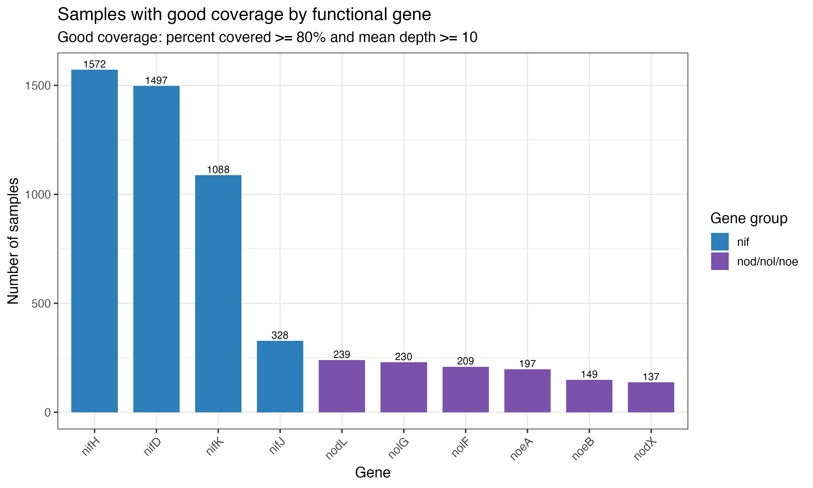

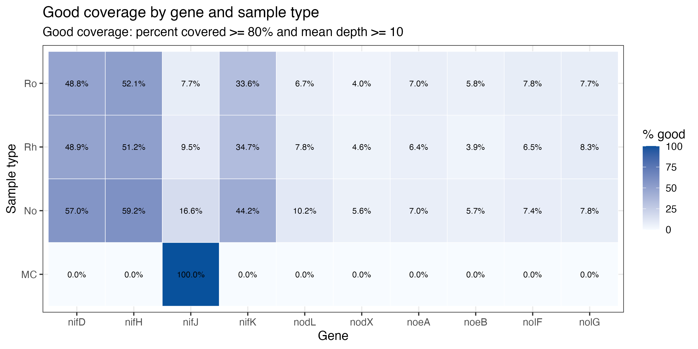


### Step 4. Select Genes For Tree Construction

From the 72-gene coverage summary, 10 genes were selected because they had enough sample recovery to support tree construction and comparison:

- `nif`: `nifH`, `nifD`, `nifK`, `nifJ`
- `nod`: `nodL`, `nodX`
- `Other`: `nolG`, `nolF`, `noeA`, `noeB`

| Gene | Reference sequences available |
|---|---:|
| `nifH` | 746 |
| `nifD` | 367 |
| `nifK` | 328 |
| **`nifJ`** | **2** |
| `nodL` | 129 |
| `nodX` | 53 |
| `nolG` | 78 |
| `nolF` | 74 |
| `noeA` | 59 |
| `noeB` | 59 |


### Step 5. Extract Per-Gene Consensus Sequences

This step means: after mapping, we used the BAM files to build one DNA sequence for each sample and each gene.

For each selected gene, consensus sequences were extracted from the BAM pileup. The consensus-calling logic was designed to avoid copying reference ambiguity into sample sequences. If the reference base was `N` or an IUPAC ambiguity code, sample consensus bases were called only from explicit read bases, not from reference-match symbols.

Consensus extraction thresholds:

| Parameter | Value |
|---|---:|
| Minimum percent covered | 80% |
| Minimum mean depth | 10 |
| Maximum N percent | 20% |
| Minimum base quality in pileup | 20 |
| Minimum mapping quality in pileup | 10 |
| Mixed-site depth threshold | 20 |
| Mixed-site minor count threshold | 5 |
| Mixed-site minor fraction threshold | 0.20 |
| Mixed sequence rule | mixed positions >10 |

For each gene, two FASTA sets were created:

| FASTA set | Meaning |
|---|---|
| strict single-dominant | Only passing sequences with no strong mixed-template signal |
| mixed-IUPAC all-pass | Both strict single-dominant and mixed possible multitemplate sequences |

Important interpretation: mixed-IUPAC calls suggest possible multiple templates, multicopy signal, or mixed infection, but they do not prove multiple organisms because variants are not phased across the gene.

| Item | Path |
|---|---|
| Pipeline code, cluster | `$OUT/Rscripts_v2/gene_tree_pipelines` |
| Runner script | `$OUT/Rscripts_v2/gene_tree_pipelines/run_selected_step_for_genes.sh` |
| Output folder | `$OUT/gene_trees/<gene>/01_consensus` |

Run command:

```bash
OUT="/mnt/dv/wid/projects6/SolisLemus-Intbio-raw/processed-data/symbiosis_sorted_v2_consensus_sequences_50percent"
GENES="nifH,nifD,nifK,nifJ,nodL,nolG,nolF,noeA,noeB,nodX"

STEP=02 JOBS=2 GENES="$GENES" \
bash "$OUT/Rscripts_v2/gene_tree_pipelines/run_selected_step_for_genes.sh" \
  | tee "$OUT/gene_trees/run_step02_consensus_all_genes.log"
```

### Step 6. Align Consensus Sequences With MAFFT

The strict and mixed-IUPAC FASTA files were aligned separately for every selected gene with MAFFT.

| Item | Path |
|---|---|
| Pipeline code | `$OUT/Rscripts_v2/gene_tree_pipelines/<gene>/03_align_<gene>_consensus50_with_mafft.sh` |
| Output folder | `$OUT/gene_trees/<gene>/02_alignment` |

Run command:

```bash
STEP=03 JOBS=2 GENES="$GENES" \
bash "$OUT/Rscripts_v2/gene_tree_pipelines/run_selected_step_for_genes.sh" \
  | tee "$OUT/gene_trees/run_step03_mafft_all_genes.log"
```

### Step 7. Build Strict Single-Dominant Trees With IQ-TREE

Strict trees are the primary trees because they use only sample consensus sequences that passed the coverage/depth/N filters and did not exceed the mixed-site threshold.

IQ-TREE command structure:

```bash
iqtree \
  -s <strict_alignment.fasta> \
  -st DNA \
  -m MFP \
  -B 1000 \
  -alrt 1000 \
  -nm 5000 \
  -T AUTO \
  --prefix <output_prefix>
```

| Item | Path |
|---|---|
| Pipeline code | `$OUT/Rscripts_v2/gene_tree_pipelines/<gene>/04_build_<gene>_strict_tree_nm5000_consensus50.sh` |
| Output folder | `$OUT/gene_trees/<gene>/03_tree_strict_nm5000` |

Run command:

```bash
STEP=04 JOBS=1 GENES="$GENES" \
bash "$OUT/Rscripts_v2/gene_tree_pipelines/run_selected_step_for_genes.sh" \
  | tee "$OUT/gene_trees/run_step04_strict_trees_all_genes.log"
```

### Step 8. Build Mixed-IUPAC Trees With IQ-TREE

Mixed-IUPAC trees include both single-dominant and mixed possible multitemplate sequences. These trees are useful as sensitivity/exploratory trees, but most mixed-IUPAC trees did not reach UFBoot convergence even with `-nm 5000`.

| Item | Path |
|---|---|
| Pipeline code | `$OUT/Rscripts_v2/gene_tree_pipelines/<gene>/05_build_<gene>_iupac_tree_nm5000_consensus50.sh` |
| Output folder | `$OUT/gene_trees/<gene>/04_tree_iupac_nm5000` |

Run command:

```bash
STEP=05 JOBS=1 GENES="$GENES" \
bash "$OUT/Rscripts_v2/gene_tree_pipelines/run_selected_step_for_genes.sh" \
  | tee "$OUT/gene_trees/run_step05_iupac_trees_all_genes.log"
```


###  Check Tree Outputs

Output checking was run to summarize tip counts, model choice, tree length, and UFBoot convergence status.

| Item | Path |
|---|---|
| Check scripts | `$OUT/Rscripts_v2/gene_tree_pipelines/<gene>/07_check_<gene>_tree_outputs.sh` |
| Summary tables | `../result/comparative_tree_analysis/tables` |

Run command:

```bash
STEP=07 JOBS=1 GENES="$GENES" \
bash "$OUT/Rscripts_v2/gene_tree_pipelines/run_selected_step_for_genes.sh" \
  | tee "$OUT/gene_trees/run_step07_check_all_genes.log"
```


## Strict Single-Dominant Tree Results

Strict trees are the primary phylogenies for interpretation because they avoid mixed-template consensus sequences.

| Gene | Group | Input sequences | Alignment length | IQ-TREE tips | Best model | Tree length | Final UFBoot correlation | Status |
|---|---|---:|---:|---:|---|---:|---:|---|
| `nifH` | nif | 387 | 997 | 387 | `GTR+F+R6` | 9.850 | 0.990 | converged |
| `nifD` | nif | 348 | 1,532 | 348 | `GTR+F+I+R6` | 10.328 | 0.992 | converged |
| `nifK` | nif | 455 | 1,588 | 455 | `GTR+F+I+R6` | 12.807 | 0.903 | not converged |
| `nifJ` | nif | 181 | 3,584 | 181 | `TVM+F+I+R3` | 1.411 | 0.961 | not converged |
| `nodL` | canonical nod | 216 | 612 | 189 | `TIM3+F+I+G4` | 1.268 | 0.993 | converged |
| `nolG` | accessory | 201 | 3,198 | 176 | `TPM3u+F+R4` | 0.170 | 0.992 | converged |
| `nolF` | accessory | 208 | 1,110 | 176 | `HKY+F+R3` | 0.181 | 0.991 | converged |
| `noeA` | accessory | 193 | 1,431 | 176 | `HKY+I+G4` | 0.110 | 0.991 | converged |
| `noeB` | accessory | 132 | 1,674 | 105 | `TPM3u+I+G4` | 0.248 | 0.994 | converged |
| `nodX` | canonical nod | 129 | 1,121 | 102 | `HKY+F+R3` | 0.358 | 0.996 | converged |

Note: some IQ-TREE tip counts are lower than input sequence counts because IQ-TREE collapses identical sequences internally for tree search. This is why, for example, `nodL` has 216 input sequences but 189 IQ-TREE taxa/tips.

For the strict nifH phylogeny, the 387 input sequences represent 387 sample-derived consensus sequences that passed the coverage, depth, N-content, and mixed-site filters. These sequences were aligned with the 997-bp nifH reference region, producing an alignment of 997 positions; therefore, each sequence occupies 997 aligned columns, although some positions may be missing or represented as N. IQ-TREE retained 387 tips, indicating that all input strict sequences were included in the tree. The best-fit substitution model was GTR+F+R6, which allows different nucleotide substitution rates, empirical base frequencies, and rate variation among sites. The tree length of 9.850 is the sum of all branch lengths and reflects the total amount of estimated sequence change across the tree, not the length of the gene or the number of samples. Finally, the UFBoot correlation of 0.990 indicates that the ultrafast bootstrap replicates reached the standard convergence threshold (0.99), so the bootstrap procedure was considered converged.

Main tables:

- [tree_summary_strict_and_mixed_iupac](../result/comparative_tree_analysis/tables/05_tree_summary_strict_and_mixed_iupac.tsv)
-[strict_tree_summary](../result/comparative_tree_analysis/tables/06_strict_tree_summary.tsv)

Strict tree files are organized by gene:

- `../result/gene_trees_full/<gene>/03_tree_strict_nm5000/<gene>_consensus50_strict_single_dominant_nm5000.treefile`
- `../result/gene_trees_full/<gene>/03_tree_strict_nm5000/<gene>_consensus50_strict_single_dominant_nm5000.contree`
- `../result/gene_trees_full/<gene>/03_tree_strict_nm5000/<gene>_consensus50_strict_single_dominant_nm5000.iqtree`
- `../result/gene_trees_full/<gene>/03_tree_strict_nm5000/<gene>_consensus50_strict_single_dominant_nm5000.log`

## Mixed-IUPAC Tree Results

Mixed-IUPAC trees include all passing sequences, including those flagged as possible mixed/multitemplate. These trees are useful for sensitivity analyses and for asking how much phylogenetic placement changes when mixed signal is retained.

| Gene | Group | Input sequences | Alignment length | IQ-TREE tips | Best model | Tree length | Final UFBoot correlation | Status |
|---|---|---:|---:|---:|---|---:|---:|---|
| `nifH` | nif | 1,538 | 997 | 1,532 | `GTR+F+I+R9` | 27.178 | 0.939 | not converged |
| `nifD` | nif | 1,464 | 1,532 | 1,458 | `GTR+F+I+R10` | 34.697 | 0.918 | not converged |
| `nifK` | nif | 1,052 | 1,542 | 1,046 | `GTR+F+R9` | 24.723 | 0.835 | not converged |
| `nifJ` | nif | 325 | 3,678 | 325 | `TVM+F+R5` | 2.646 | 0.947 | not converged |
| `nodL` | canonical nod | 230 | 612 | 210 | `TIM3+F+I+G4` | 1.252 | 0.967 | not converged |
| `nolG` | accessory | 229 | 3,198 | 218 | `TIM3+F+I+G4` | 0.162 | 0.915 | not converged |
| `nolF` | accessory | 209 | 1,110 | 202 | `HKY+F+I+G4` | 0.112 | 0.975 | not converged |
| `noeA` | accessory | 195 | 1,431 | 194 | `HKY+I` | 0.076 | 0.993 | converged |
| `noeB` | accessory | 149 | 1,674 | 134 | `TPM3u+I+G4` | 0.207 | 0.991 | converged |
| `nodX` | canonical nod | 133 | 1,121 | 109 | `HKY+F+R3` | 0.319 | 0.992 | converged |

Main table:

- [mixed_iupac_tree_summary](../result/comparative_tree_analysis/tables/07_mixed_iupac_tree_summary.tsv)

Mixed-IUPAC tree files are organized by gene:

- `../result/gene_trees_full/<gene>/04_tree_iupac_nm5000/<gene>_consensus50_iupac_all_pass_nm5000.treefile`
- `../result/gene_trees_full/<gene>/04_tree_iupac_nm5000/<gene>_consensus50_iupac_all_pass_nm5000.contree`
- `../result/gene_trees_full/<gene>/04_tree_iupac_nm5000/<gene>_consensus50_iupac_all_pass_nm5000.iqtree`
- `../result/gene_trees_full/<gene>/04_tree_iupac_nm5000/<gene>_consensus50_iupac_all_pass_nm5000.log`

Main figure:

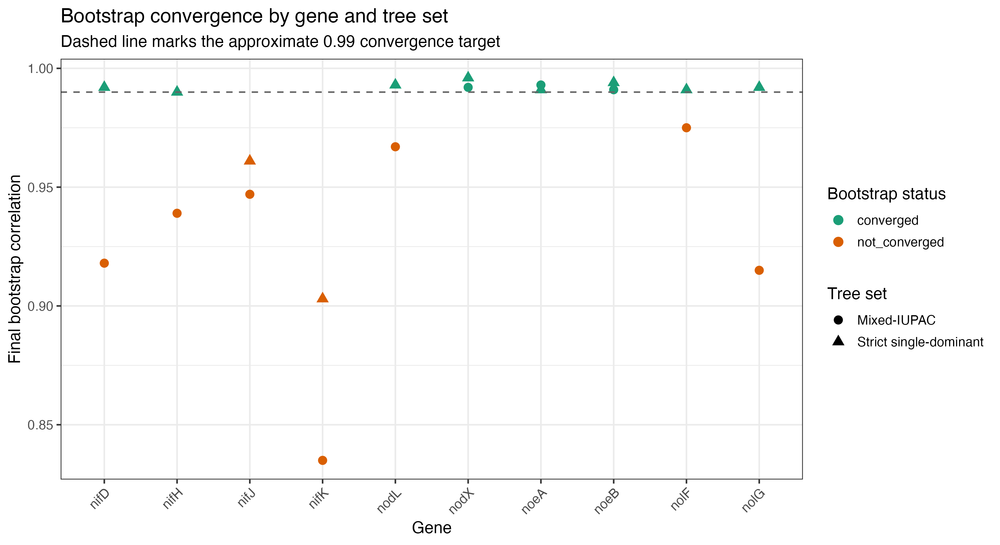

### Local R Summaries And Figures

Two local R scripts created the comparative tables, metadata summaries, and figures.

| Script | Purpose | Output folder |
|---|---|---|
| `/Users/rosa/Desktop/ALLWork/Madison/Project/ryan-nitfix/Rcode/01_compare_functional_gene_trees_consensus50.R` | gene/tree/BLAST comparison figures and tables | `../result/comparative_tree_analysis` |
| `/Users/rosa/Desktop/ALLWork/Madison/Project/ryan-nitfix/Rcode/02_metadata_and_report_comparisons_consensus50.R` | metadata-aware recovery and tree comparison summaries | `../result/metadata_tree_comparison` |


## Consensus Sequence Results

| Gene | Fail high N | Mixed possible multitemplate | Strict single-dominant | Strict FASTA sequences | Mixed-IUPAC FASTA sequences |
|---|---:|---:|---:|---:|---:|
| `nifH` | 34 | 1,151 | 387 | 387 | 1,538 |
| `nifD` | 33 | 1,116 | 348 | 348 | 1,464 |
| `nifK` | 36 | 597 | 455 | 455 | 1,052 |
| `nifJ` | 3 | 144 | 181 | 181 | 325 |
| `nodL` | 9 | 14 | 216 | 216 | 230 |
| `nolG` | 1 | 28 | 201 | 201 | 229 |
| `nolF` | 0 | 1 | 208 | 208 | 209 |
| `noeA` | 2 | 2 | 193 | 193 | 195 |
| `noeB` | 0 | 17 | 132 | 132 | 149 |
| `nodX` | 4 | 4 | 129 | 129 | 133 |

Main tables:

- [consensus_qc_status_summary_long](../result/comparative_tree_analysis/tables/03_consensus_qc_status_summary_long.tsv)
- [consensus_qc_status_summary_wide](../result/comparative_tree_analysis/tables/04_consensus_qc_status_summary_wide.tsv)

Main figure:

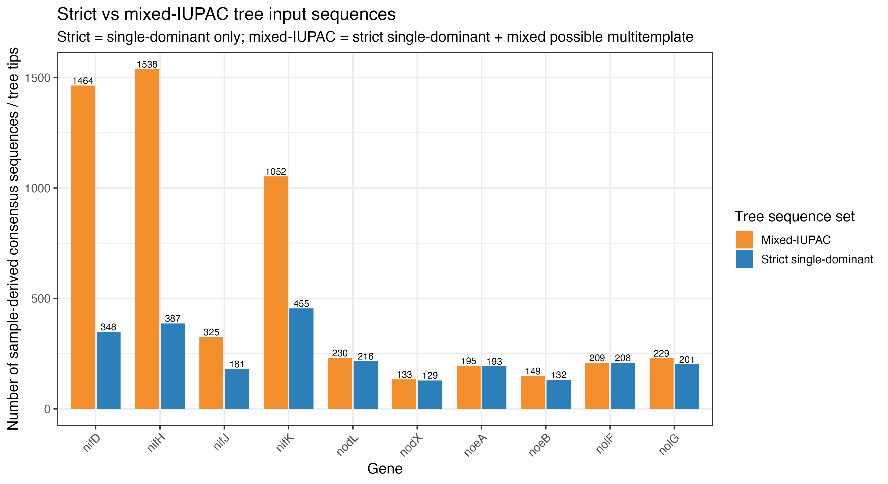

Note: the y-axis in this figure is number of tree-input consensus sequences. For the strict bars, this means strict single-dominant sequences. For the mixed-IUPAC bars, this means strict single-dominant plus mixed possible multitemplate sequences.


| Gene | Strict sequences | Strict alignment length | Mixed-IUPAC sequences | Mixed-IUPAC alignment length |
|---|---:|---:|---:|---:|
| `nifH` | 387 | 997 bp | 1,538 | 997 bp |
| `nifD` | 348 | 1,532 bp | 1,464 | 1,532 bp |
| `nifK` | 455 | 1,588 bp | 1,052 | 1,542 bp |
| `nifJ` | 181 | 3,584 bp | 325 | 3,678 bp |
| `nodL` | 216 | 612 bp | 230 | 612 bp |
| `nolG` | 201 | 3,198 bp | 229 | 3,198 bp |
| `nolF` | 208 | 1,110 bp | 209 | 1,110 bp |
| `noeA` | 193 | 1,431 bp | 195 | 1,431 bp |
| `noeB` | 132 | 1,674 bp | 149 | 1,674 bp |
| `nodX` | 129 | 1,121 bp | 133 | 1,121 bp |

The strict alignments contain no IUPAC mixed codes by design. The mixed-IUPAC alignments retain ambiguity codes when positions pass the mixed-site rule. For example, the mixed-IUPAC `nifH` alignment contains 3.33% IUPAC ambiguity excluding N, while the strict `nifH` alignment contains 0.00% IUPAC ambiguity excluding N.

Main table:

- [alignment_sequence_composition](../result/comparative_tree_analysis/tables/08_alignment_sequence_composition.tsv)

Main figure:

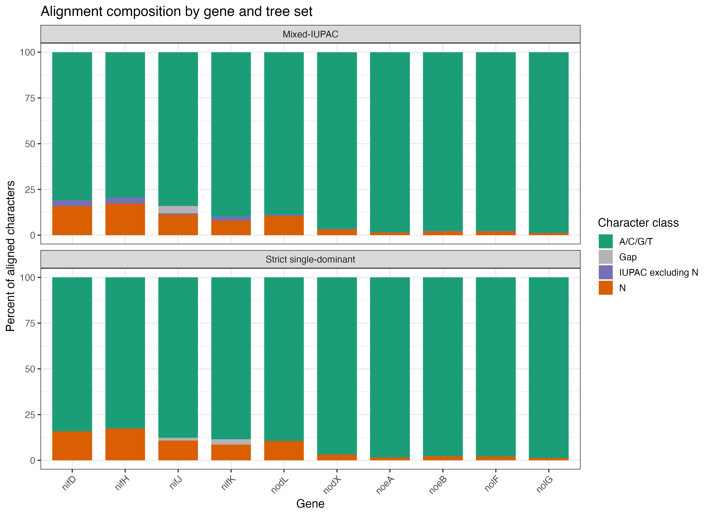


### Step 9. Assign Closest Known Reference Taxa With BLAST

BLAST was used after tree construction to assign each sample-derived consensus sequence to its closest known reference sequence from the per-gene taxon reference alignments. This is different from BWA mapping:

- BWA was used to map raw reads to the consensus50 reference and build sample consensus sequences.
- BLAST was used to label each finished sample consensus sequence with a closest known reference hit.

The BLAST label is a closest known reference hit, not a confirmed species identification.

Example reference label:

```text
nifH|Methylobacterium_sp._CB376|WFT77218.1
```

This is parsed as:

| Part | Meaning |
|---|---|
| `nifH` | gene |
| `Methylobacterium_sp._CB376` | closest reference taxon label |
| `WFT77218.1` | accession |

For genus-level summaries, the genus is parsed as the first word before the first underscore. In the example above, the genus label is `Methylobacterium`.

| Item | Path |
|---|---|
| Pipeline code | `$OUT/Rscripts_v2/gene_tree_pipelines/<gene>/06_blast_<gene>_consensus_to_taxon_reference.sh` |
| Reference taxon FASTA/alignment | `$OUT/reference_taxon_fastas_by_gene/<gene>.fa.aln` |
| Output folder | `$OUT/gene_trees/<gene>/05_blast_taxon_assignment` |

Run command:

```bash
module load blast+/2.17.0

STEP=06 JOBS=2 GENES="$GENES" \
bash "$OUT/Rscripts_v2/gene_tree_pipelines/run_selected_step_for_genes.sh" \
  | tee "$OUT/gene_trees/run_step06_blast_all_genes.log"
```


## BLAST Closest-Reference Annotation Results

BLAST annotation was used to label each sample-derived consensus sequence by closest known reference taxon and genus. These labels are helpful for interpreting tree regions and comparing functional-gene signal with 16S/community results later.


### BLAST-Based Closest Reference Assignment

For each selected gene, sample-derived consensus sequences were compared against the gene-specific reference taxon sequences using BLASTN. For example, `nifD` consensus sequences were searched only against the `nifD` reference taxon alignment. Before BLAST, reference and query alignments were ungapped so that BLAST compared nucleotide sequences rather than alignment columns.

BLAST was run with an E-value threshold of **`1e-20`** and allowed to return up to 10 candidate reference hits per consensus sequence. From these candidate hits, one best reference hit was selected for each sample consensus sequence using **highest bitscore**, then **highest percent** identity, then **longest alignment length**. The output table reports the selected closest reference taxon, closest genus, percent identity, alignment length, query coverage, E-value, and bitscore.

These BLAST labels should be interpreted as closest known reference matches, not confirmed species identities. A hit with weak statistical support, such as E-value `0.9`, would not be included because the BLAST search only keeps hits with `E-value <= 1e-20`. However, percent identity and query coverage are reported rather than used as strict filters in this script, so downstream summaries can optionally apply additional confidence filters such as percent identity `>=88%` and query coverage `>=80%`.

Main BLAST tables:

- [blast_source_file_row_counts](../result/comparative_tree_analysis/tables/11a_blast_source_file_row_counts.tsv)
- [blast_assignment_rows_deduplicated_strict_iupac](../result/comparative_tree_analysis/tables/11b_blast_assignment_rows_deduplicated_strict_iupac.tsv)
- [blast_closest_genus_summary](../result/comparative_tree_analysis/tables/12_blast_closest_genus_summary_grouped_min5.tsv)

Main BLAST figures:

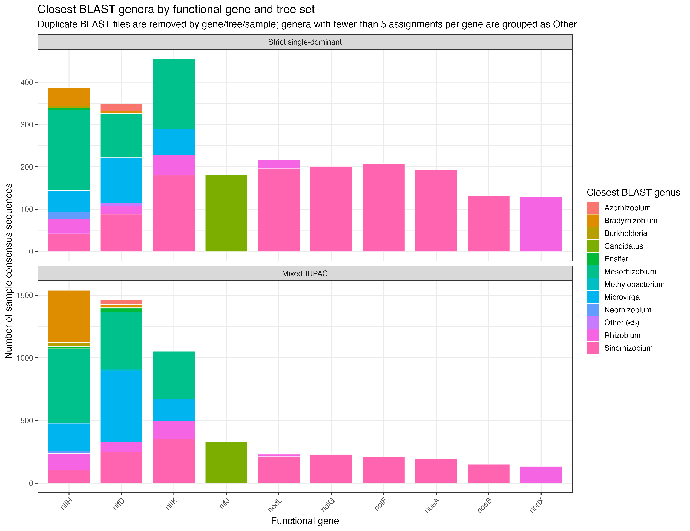

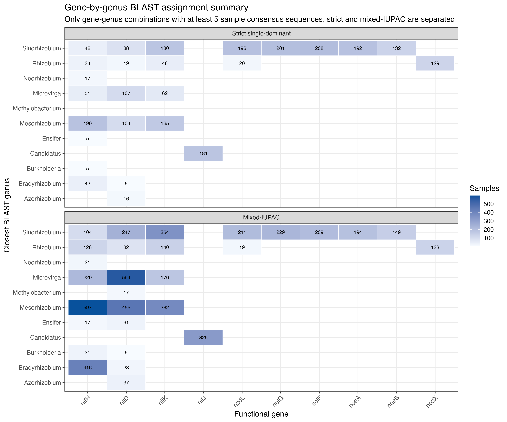

Interpretation note: the y-axis categories in these figures are closest BLAST genus labels, and the x-axis/counts represent sample-derived consensus sequences/tree tips assigned to those genera. 

| Output file | Row size | Meaning |
|---|---:|---|
| `<gene>_strict_blast.tsv` | up to `strict consensus sequences × 10` rows | Raw BLAST candidate hits for strict consensus sequences. BLAST can return up to 10 hits per sequence if they pass the E-value threshold (`1e-20`). |
| `<gene>_strict_best_reference_hit_with_taxon.tsv` | `strict consensus sequences` rows | Final strict BLAST table. One selected best reference hit per strict consensus sequence. |
| `<gene>_iupac_blast.tsv` | up to `mixed-IUPAC consensus sequences × 10` rows | Raw BLAST candidate hits for mixed-IUPAC consensus sequences. BLAST can return up to 10 hits per sequence if they pass the E-value threshold (`1e-20`). |
| `<gene>_iupac_best_reference_hit_with_taxon.tsv` | `mixed-IUPAC consensus sequences` rows | Final mixed-IUPAC BLAST table. One selected best reference hit per mixed-IUPAC consensus sequence. |

BLASTN was run with `-evalue 1e-20` and `-max_target_seqs 10`, following standard BLAST+ usage (Camacho et al. 2009; Madden, NCBI BLAST+ manual). I retained one best hit per consensus sequence based on highest bitscore, then highest percent identity, then longest alignment length; the use of stringent E-value thresholds and reporting of percent identity, alignment coverage, and E-value is consistent with recommended manual homology-search practice (Nestor et al. 2023).


## Step10. Metadata-Aware Summaries

Metadata was used to summarize recovery and annotation patterns by sample type, host, and geography. 

Main metadata tables:

- [metadata_tree_comparison_output_index](../result/metadata_tree_comparison/tables/00_metadata_tree_comparison_output_index.tsv)
- [gene_categories_for_report](../result/metadata_tree_comparison/tables/01_gene_categories_for_report.tsv)
- [gene_recovery_by_metadata_category_pct80_depth10](../result/metadata_tree_comparison/tables/02_gene_recovery_by_metadata_category_pct80_depth10.tsv)
- [tree_reliability_summary_for_report](../result/metadata_tree_comparison/tables/03_tree_reliability_summary_for_report.tsv)
- [blast_closest_genus_by_gene_sample_type](../result/metadata_tree_comparison/tables/04_blast_closest_genus_by_gene_sample_type.tsv)
- [metadata_gene_recovery_association_screen](../result/metadata_tree_comparison/tables/05_metadata_gene_recovery_association_screen.tsv)
- [report_interpretation_notes](../result/metadata_tree_comparison/tables/06_report_interpretation_notes.tsv)

Main metadata figures:

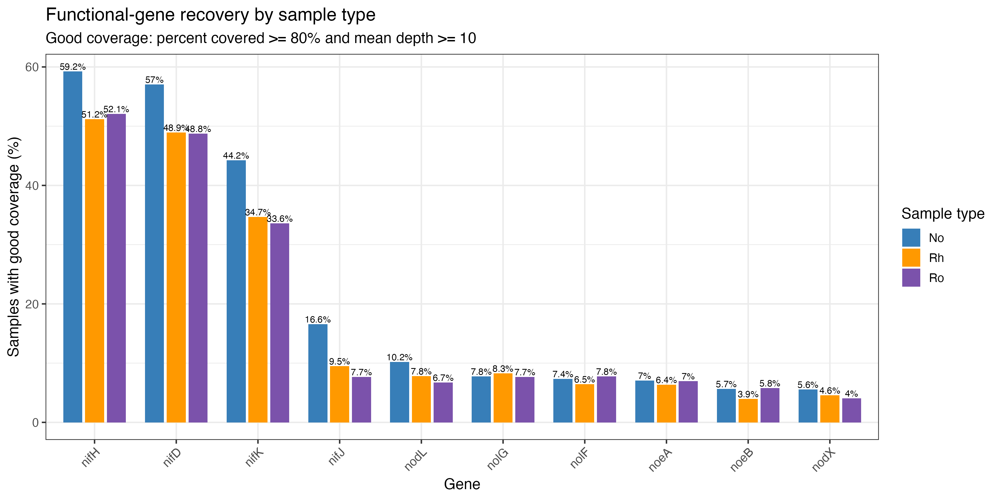

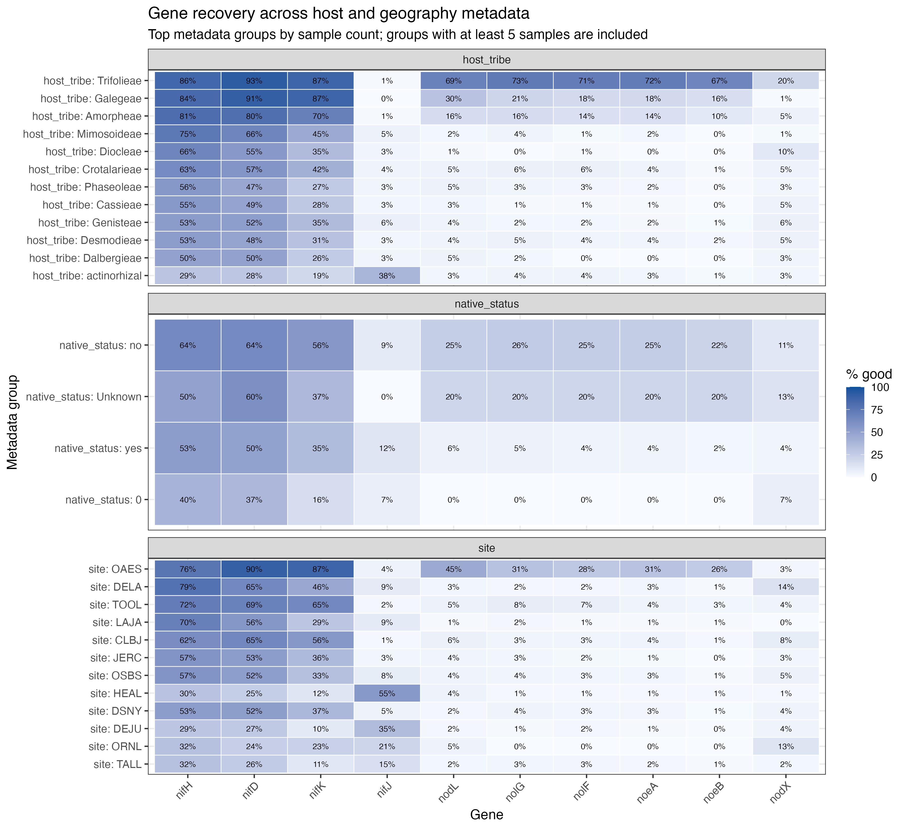

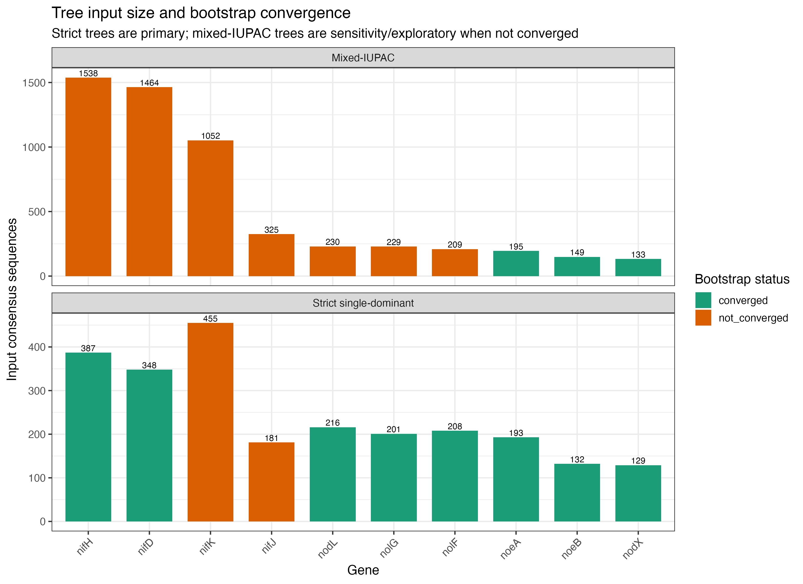

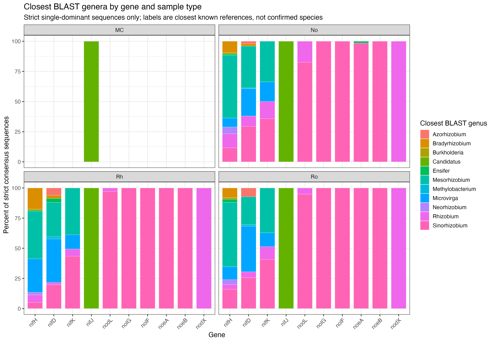

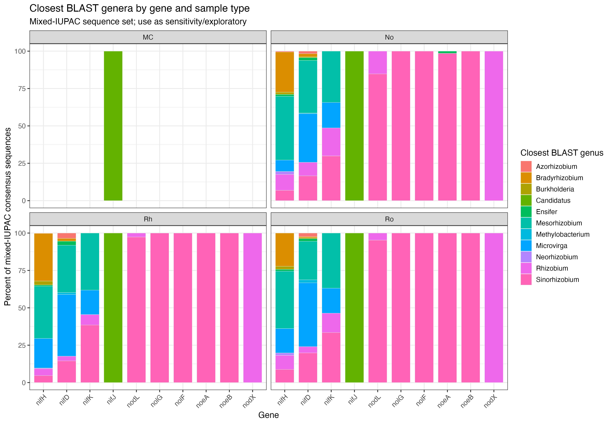


## iTOL Tree Figures

As as example:  nifH trees

| Figure | Path |
|---|---|
| nifH strict pct80 family strip | [strict_pct80_Nle20_itol_family_colorstrip](../result/trees/Figure/strict_pct80_Nle20_itol_family_colorstrip.svg) |
| nifH strict pct80 sample-type strip | [strict_pct80_Nle20_itol_sample_type_colorstrip](../result/trees/Figure/strict_pct80_Nle20_itol_sample_type_colorstrip.svg) |
| nifH strict pct80 tribe strip | [strict_pct80_Nle20_itol_tribe_colorstrip](../result/trees/Figure/strict_pct80_Nle20_itol_tribe_colorstrip.svg) |
| nifH strict pct80 native strip | [strict_pct80_Nle20_itol_native_colorstrip](../result/trees/Figure/strict_pct80_Nle20_itol_native_colorstrip.svg) |
| nifH strict closest BLAST genus | [strict_single_blast_closest_genus_colorstrip_5000](../result/trees/Figure/strict_single_blast_closest_genus_colorstrip_5000.svg) |
| nifH strict closest BLAST taxon | [strict_single_blast_closest_taxon_colorstrip_5000](../result/trees/Figure/strict_single_blast_closest_taxon_colorstrip_5000.svg) |
| nifH mixed-IUPAC closest BLAST genus | [iupac_nm5000_blast_closest_genus_colorstrip](../result/trees/Figure/iupac_nm5000_blast_closest_genus_colorstrip.svg) |
| nifH mixed-IUPAC closest BLAST taxon | [iupac_nm5000_blast_closest_taxon_colorstrip](../result/trees/Figure/iupac_nm5000_blast_closest_taxon_colorstrip.svg) |

Example figures:
**family level nifH trees (strict)**

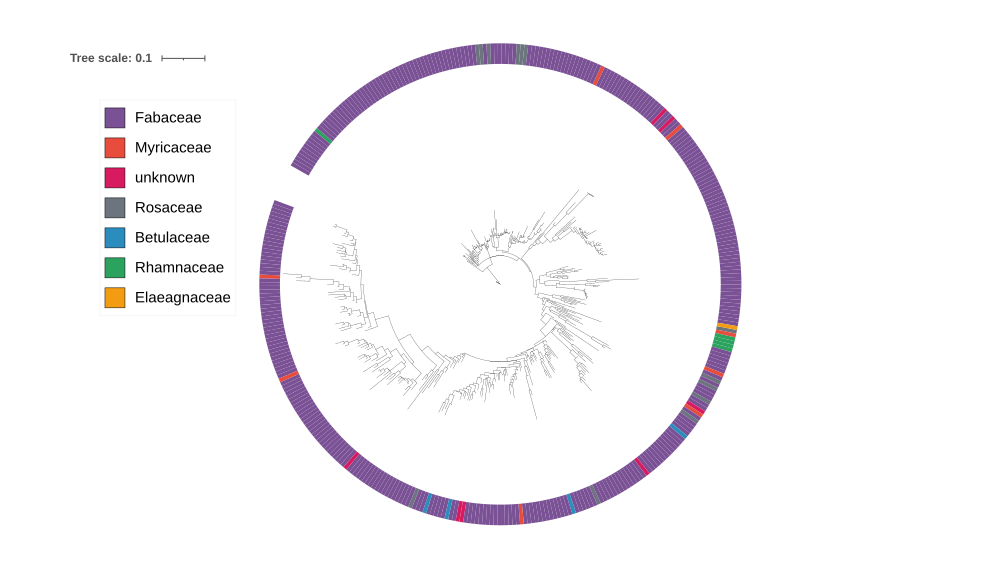

**genus level nifH trees (strict)**
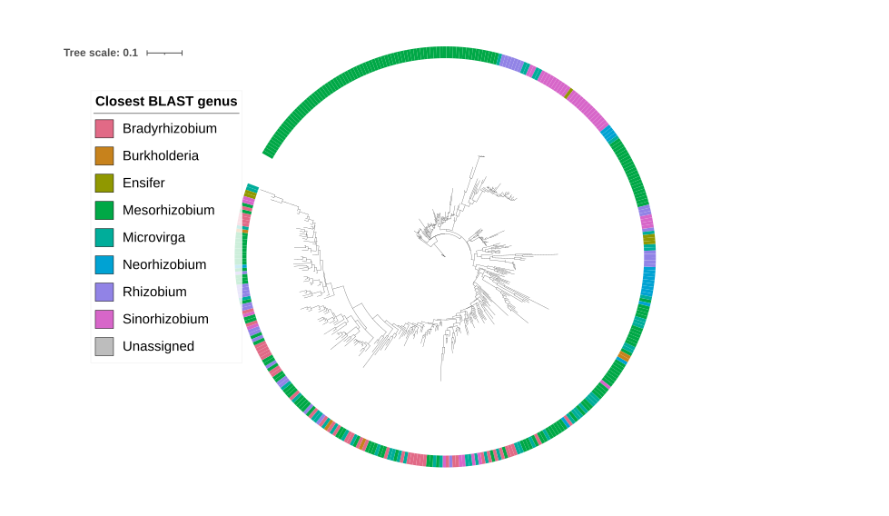

**genus level nifH trees (iupac)**


## Output Index

| Output type | Local path | Cluster path |
|---|---|---|
| Per-gene tree folders | `../result/gene_trees_full/<gene>` | `$OUT/gene_trees/<gene>` |
| Comparative tables | `../result/comparative_tree_analysis/tables` | created locally from copied results |
| Comparative figures | `../result/comparative_tree_analysis/figures` | created locally from copied results |
| Metadata comparison tables | `../result/metadata_tree_comparison/tables` | created locally from copied results |
| Metadata comparison figures | `../result/metadata_tree_comparison/figures` | created locally from copied results |
| iTOL exported tree figures | `../result/trees/Figure` | exported locally from iTOL |
| Reference/taxon matching table | `../result/reference/taxon_fastas_vs_symbiosis_islands_gene_list_match.tsv` | copied/generated from reference checks |

Other final summary table for the 20 gene trees is:

- [tree_summary_strict_and_mixed_iupac](../result/comparative_tree_analysis/tables/05_tree_summary_strict_and_mixed_iupac.tsv)

The most important final coverage table is:

- [coverage_summary_by_gene_pct80_depth10](../result/comparative_tree_analysis/tables/01_coverage_summary_by_gene_pct80_depth10.tsv)

The most important final BLAST/taxon table is:

- [blast_assignment_rows_deduplicated_strict_iupac](../result/comparative_tree_analysis/tables/11b_blast_assignment_rows_deduplicated_strict_iupac.tsv)


# Phylocom And Nearest-Neighbor Tree Comparison

This section describes two related analyses that use the functional-gene trees to ask whether samples with the same label are close together in the tree.

The labels tested here include the closest BLAST genus assigned to each sample consensus sequence. The most important question is:

> If several samples are assigned to the same closest BLAST genus, are those samples close together in the gene tree?

The analyses were run separately for each gene and each tree set:

- Strict single-dominant trees
- Mixed-IUPAC trees

Genes included:

`nifH`, `nifD`, `nifK`, `nifJ`, `nodL`, `nolG`, `nolF`, `noeA`, `noeB`, `nodX`

## Part 1. Phylocom-Style Clustering Test

### Purpose

We used the `phylocomr` package to test whether samples with the same label are more clustered in the tree than expected by random labels.

For example, for:

```text
gene = nifH
tree set = Mixed-IUPAC
closest BLAST genus = Mesorhizobium
n = 597 samples
```

the Phylocom-style test asks:

```text
Are the 597 Mesorhizobium-assigned nifH tips closer together in the nifH tree
than expected if genus labels were randomly placed on the same tree?
```

This is a group-level test. It gives one p-value for the whole group, not one p-value for each sample.

### Package, Function, Input, And Output

Package:

```r
library(phylocomr)
```

Function used:

```r
phylocomr::ph_comstruct()
```

One-line comment for how the package runs:

```r
# ph_comstruct() takes a phylogenetic tree and a sample/group table, randomizes tip labels, and tests whether tips in each group are closer together than expected by random labels.
```

Main input to `ph_comstruct()`:

| Input | Meaning in this analysis |
|---|---|
| `phylo` | One functional-gene tree, for example the Mixed-IUPAC `nifH` tree |
| `sample` | A table saying which tree tips belong to each group, for example which tips are `Mesorhizobium` |
| `null_model = 0` | Randomly reshuffle labels/tips to create the null expectation |
| `randomizations = 999` | Run 999 random label tests |
| `abundance = FALSE` | Treat each tip as present once; do not use abundance weights |

Main output from `ph_comstruct()`:

| Output | Meaning |
|---|---|
| `ntaxa` | Number of tips tested in that group |
| `mpd` | Observed mean pairwise phylogenetic distance among tips in the group |
| `mpd_random` | Mean MPD from randomized groups |
| `nri` | Net Relatedness Index; positive values mean same-label tips are closer than random |
| `p_mpd_cluster` | p-value for clustering based on MPD |
| `fdr_mpd` | BH/FDR-corrected p-value |

### NRI Meaning

NRI means Net Relatedness Index.

It is calculated from MPD, the mean pairwise tree distance among samples in a group:

```text
NRI = -1 * (observed MPD - mean random MPD) / sd random MPD
```

Interpretation:

| NRI value | Meaning |
|---|---|
| Positive NRI | Same-label tips are closer together than random |
| NRI near 0 | Same-label tips are about as close as random |
| Negative NRI | Same-label tips are more spread out than random |

In this report, we interpret a group as having supported clustering when:

```text
NRI > 0 and FDR(MPD) < 0.05
```

### Important Sample-Set Check

The Phylocom test must use the same sample set as the BLAST genus heatmap. To make this correct, the updated Step 10 starts from the same deduplicated BLAST assignment table used for the BLAST heatmap:

[11b_blast_assignment_rows_deduplicated_strict_iupac.tsv](../result/comparative_tree_analysis/tables/11b_blast_assignment_rows_deduplicated_strict_iupac.tsv)

The new code checks that:

```text
BLAST heatmap n = Phylocom ntaxa
```

Check table:

[10_blast_count_vs_phylocom_ntaxa_check.tsv](../result/phylocom_clustering/tables/10_blast_count_vs_phylocom_ntaxa_check.tsv)

Result:

```text
All matched BLAST genus counts agree with Phylocom ntaxa.
```

For example:

| Tree set | Gene | Closest BLAST genus | BLAST n | Phylocom ntaxa | NRI | FDR(MPD) |
|---|---|---:|---:|---:|---:|---:|
| Mixed-IUPAC | nifH | Mesorhizobium | 597 | 597 | 5.5921 | 0.0021 |

This means the Phylocom test for Mixed-IUPAC `nifH` + `Mesorhizobium` used the same 597 samples shown in the BLAST heatmap.

### Phylocom Result Files

Code:

- [10_phylocom_clustering_matched_to_blast_heatmap.R](../code/Rcode/10_phylocom_clustering_matched_to_blast_heatmap.R)
- [11_plot_blast_heatmap_with_matched_phylocom_NRI.R](../code/Rcode/11_plot_blast_heatmap_with_matched_phylocom_NRI.R)

Main tables:

- [10_phylocom_report_table_matched.tsv](../result/phylocom_clustering/tables/10_phylocom_report_table_matched.tsv)
- [10_blast_closest_genus_summary_matched_min5.tsv](../result/phylocom_clustering/tables/10_blast_closest_genus_summary_matched_min5.tsv)
- [10_blast_count_vs_phylocom_ntaxa_check.tsv](../result/phylocom_clustering/tables/10_blast_count_vs_phylocom_ntaxa_check.tsv)
- [11_blast_genus_counts_with_matched_phylocom_NRI.tsv](../result/phylocom_clustering/tables/11_blast_genus_counts_with_matched_phylocom_NRI.tsv)
- [11_matched_heatmap_join_check.tsv](../result/phylocom_clustering/tables/11_matched_heatmap_join_check.tsv)

Main figure:


Figure file:

[11_blast_genus_by_gene_heatmap_min5_with_matched_phylocom_NRI.png](../result/phylocom_clustering/figures/11_blast_genus_by_gene_heatmap_min5_with_matched_phylocom_NRI.png)

### Example Phylocom Results

Some strong positive NRI results were:

| Tree set | Gene | Closest BLAST genus | n | NRI | FDR(MPD) | Meaning |
|---|---|---:|---:|---:|---:|---|
| Mixed-IUPAC | nifK | Mesorhizobium | 382 | 21.0949 | 0.0021 | Strong clustering |
| Mixed-IUPAC | nifK | Sinorhizobium | 354 | 16.6006 | 0.0021 | Strong clustering |
| Mixed-IUPAC | nifH | Bradyrhizobium | 416 | 16.5468 | 0.0021 | Strong clustering |
| Mixed-IUPAC | nifK | Microvirga | 176 | 14.1392 | 0.0021 | Strong clustering |
| Mixed-IUPAC | nodL | Sinorhizobium | 211 | 10.5318 | 0.0021 | Strong clustering |
| Mixed-IUPAC | nifH | Mesorhizobium | 597 | 5.5921 | 0.0021 | Same-genus tips are closer than random |

## Part 2. Sample-Level Nearest-Neighbor Analysis

### Purpose

The Phylocom result is useful, but it is not a per-sample result. Because of that, we added a second analysis to answer a more direct question:

```text
For each sample, is its nearest neighbor in the tree assigned to the same closest BLAST genus?
```

This produces one row per sample/tip.

For each sample, the code finds:

1. The closest tip to that sample in the tree.
2. The closest BLAST genus of the sample.
3. The closest BLAST genus of the nearest-neighbor tip.
4. Whether the two genera are the same.

### What Is A Nearest Neighbor In The Tree?

Each tree has branch lengths. The distance between two tips is the total branch length connecting them.

For one sample/tip, the nearest neighbor is the other tip with the smallest tree distance.

Example:

| Sample | Distance to sample B | Distance to sample C | Distance to sample D | Nearest neighbor |
|---|---:|---:|---:|---|
| sample A | 0.01 | 0.20 | 0.35 | sample B |

If sample A and sample B are both assigned to `Mesorhizobium`, then sample A is counted as:

```text
nearest_neighbor_same_blast_genus = TRUE
```

If sample A is `Mesorhizobium` but sample B is `Bradyrhizobium`, then sample A is counted as:

```text
nearest_neighbor_same_blast_genus = FALSE
```

### Why This Analysis Is Easier To Explain

This analysis gives a direct fraction.

For example:

```text
454 / 597 nifH Mesorhizobium samples have a nearest neighbor also assigned to Mesorhizobium.
```

That is:

```text
76.0%
```

So the interpretation is:

```text
Most Mixed-IUPAC nifH samples assigned to Mesorhizobium are nearest to another
Mesorhizobium-assigned nifH sample in the tree.
```

### Random Test For The Nearest-Neighbor Result

We also asked whether the observed nearest-neighbor percentage is higher than expected by random labels.

For each gene and tree set, the code:

1. Keeps the same tree.
2. Keeps the same number of tips.
3. Keeps the same number of samples assigned to each genus.
4. Randomly shuffles the genus labels across tips.
5. Recalculates how many samples have a same-genus nearest neighbor.
6. Repeats this 999 times.

This gives a random expectation.

For example, for Mixed-IUPAC `nifH` + `Mesorhizobium`:

| Value | Result |
|---|---:|
| Total samples assigned to Mesorhizobium | 597 |
| Samples whose nearest neighbor is also Mesorhizobium | 454 |
| Observed percent | 76.0% |
| Random expected percent | 38.8% |
| FDR | 0.0016 |

Interpretation:

```text
Mesorhizobium-assigned nifH samples are much more often nearest to other
Mesorhizobium-assigned nifH samples than expected by random labels.
```

### Nearest-Neighbor Result Files

Code:

- [12_nearest_neighbor_same_blast_genus_in_trees.R](../code/Rcode/12_nearest_neighbor_same_blast_genus_in_trees.R)

Main tables:

- [12_nearest_neighbor_by_sample.tsv](../result/tree_nearest_neighbor/tables/12_nearest_neighbor_by_sample.tsv)
- [12_nearest_neighbor_summary_by_gene_genus.tsv](../result/tree_nearest_neighbor/tables/12_nearest_neighbor_summary_by_gene_genus.tsv)
- [12_nearest_neighbor_summary_with_random_test.tsv](../result/tree_nearest_neighbor/tables/12_nearest_neighbor_summary_with_random_test.tsv)
- [12_nearest_neighbor_n_matches_blast_heatmap_check.tsv](../result/tree_nearest_neighbor/tables/12_nearest_neighbor_n_matches_blast_heatmap_check.tsv)

Main figure:

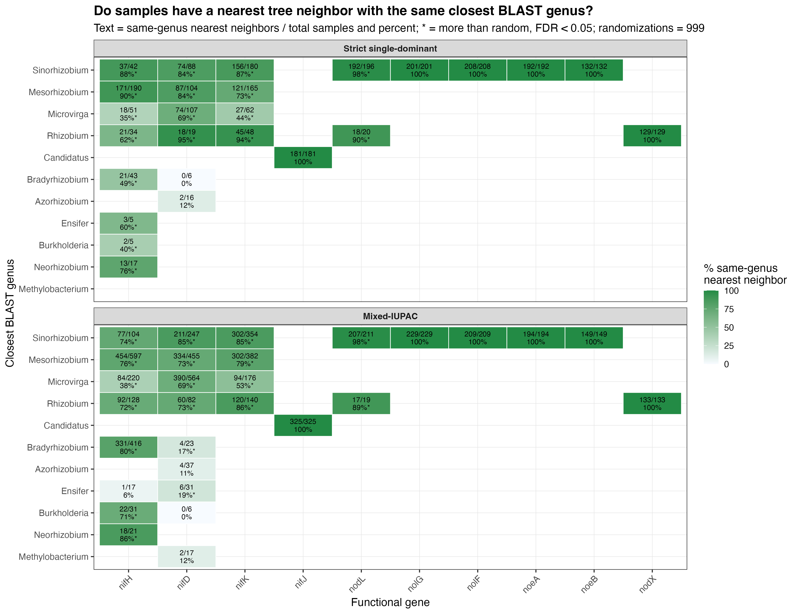

Figure file:

[12_nearest_neighbor_same_blast_genus_heatmap.png](../result/tree_nearest_neighbor/figures/12_nearest_neighbor_same_blast_genus_heatmap.png)

### Meaning Of Columns In The Sample-Level Table

File:

[12_nearest_neighbor_by_sample.tsv](../result/tree_nearest_neighbor/tables/12_nearest_neighbor_by_sample.tsv)

| Column | Meaning |
|---|---|
| `tree_set` | `strict` or `iupac` |
| `tree_set_label` | Clear tree-set name |
| `gene` | Functional gene |
| `sample_id` | Sample name |
| `tip_label` | Full tip label in the tree |
| `closest_genus_report` | Closest BLAST genus assigned to that sample consensus sequence |
| `nearest_neighbor_tip` | Closest tip to this sample in the tree |
| `nearest_neighbor_sample_id` | Sample name of the nearest-neighbor tip |
| `nearest_neighbor_closest_genus` | Closest BLAST genus assigned to the nearest-neighbor tip |
| `nearest_neighbor_distance` | Tree distance from this sample to its nearest neighbor |
| `nearest_neighbor_same_blast_genus` | `TRUE` if sample and nearest neighbor have the same closest BLAST genus |
| `nearest_neighbor_tie_count` | Number of equally closest tips if there is a tie |
| `sample_type`, `site`, `state`, `host_genus`, `host_tribe`, `native_status` | Metadata for the sample |

### Meaning Of Columns In The Summary Table

File:

[12_nearest_neighbor_summary_with_random_test.tsv](../result/tree_nearest_neighbor/tables/12_nearest_neighbor_summary_with_random_test.tsv)

| Column | Meaning |
|---|---|
| `tree_set` | `strict` or `iupac` |
| `gene` | Functional gene |
| `closest_genus_report` | Closest BLAST genus |
| `n` | Number of samples/tips in that gene-genus group |
| `same_nearest_neighbor_n` | Number of samples whose nearest neighbor has the same closest BLAST genus |
| `same_nearest_neighbor_percent` | Percent of samples whose nearest neighbor has the same closest BLAST genus |
| `random_mean_same_n` | Mean same-genus nearest-neighbor count from randomized labels |
| `random_mean_same_percent` | Mean same-genus nearest-neighbor percent from randomized labels |
| `nearest_neighbor_z` | How far the observed value is from the random mean, in random standard deviations |
| `p_more_same_than_random` | p-value for having more same-genus nearest neighbors than random |
| `fdr_more_same_than_random` | FDR-corrected p-value |
| `interpretation` | Simple interpretation of the result |

### Example Nearest-Neighbor Results

Some strong sample-level nearest-neighbor results were:

| Tree set | Gene | Closest BLAST genus | n | Same-genus nearest neighbors | Observed % | Random expected % | FDR | Meaning |
|---|---|---:|---:|---:|---:|---:|---:|---|
| Mixed-IUPAC | nodL | Sinorhizobium | 211 | 207 | 98.1% | 91.7% | 0.0016 | More same-genus nearest neighbors than random |
| Mixed-IUPAC | nifK | Rhizobium | 140 | 120 | 85.7% | 13.2% | 0.0016 | Strong sample-level clustering |
| Mixed-IUPAC | nifD | Sinorhizobium | 247 | 211 | 85.4% | 16.8% | 0.0016 | Strong sample-level clustering |
| Mixed-IUPAC | nifK | Sinorhizobium | 354 | 302 | 85.3% | 33.7% | 0.0016 | Strong sample-level clustering |
| Mixed-IUPAC | nifH | Bradyrhizobium | 416 | 331 | 79.6% | 26.9% | 0.0016 | Strong sample-level clustering |
| Mixed-IUPAC | nifK | Mesorhizobium | 382 | 302 | 79.1% | 36.2% | 0.0016 | Strong sample-level clustering |
| Mixed-IUPAC | nifH | Mesorhizobium | 597 | 454 | 76.0% | 38.8% | 0.0016 | Strong sample-level clustering |
| Mixed-IUPAC | nifD | Mesorhizobium | 455 | 334 | 73.4% | 31.1% | 0.0016 | Strong sample-level clustering |
| Mixed-IUPAC | nifD | Microvirga | 564 | 390 | 69.1% | 38.6% | 0.0016 | Strong sample-level clustering |

## How To Report These Two Analyses Together

The two analyses answer related but different questions.

| Analysis | Question | Result type |
|---|---|---|
| Phylocom NRI | Are all tips in a label group closer together than random? | One NRI and one p-value per group |
| Nearest-neighbor analysis | For each sample, is the closest tree neighbor the same BLAST genus? | One row per sample, plus a percent summary per group |

Suggested report sentence:

```text
We first used phylocomr::ph_comstruct to test whether tips assigned to the same
closest BLAST genus were phylogenetically clustered within each functional-gene
tree. We then performed a sample-level nearest-neighbor analysis to make the
tree pattern easier to interpret. For each sample, we identified the closest
tip in the tree and asked whether that nearest neighbor had the same closest
BLAST genus assignment. This provided an interpretable percentage for each
gene-genus group.
```

Example result sentence:

```text
For the Mixed-IUPAC nifH tree, 597 samples were assigned to Mesorhizobium by
BLAST. Of these, 454 samples had a nearest tree neighbor also assigned to
Mesorhizobium (76.0%), compared with a random expectation of 38.8%
(FDR = 0.0016). This indicates that Mesorhizobium-assigned nifH samples are
not randomly distributed across the tree, but tend to occur near other
Mesorhizobium-assigned nifH samples.
```

## Reproducibility

Run Step 10 first:

```bash
Rscript comparing_trees/code/Rcode/10_phylocom_clustering_matched_to_blast_heatmap.R
```

Then run Step 11:

```bash
Rscript comparing_trees/code/Rcode/11_plot_blast_heatmap_with_matched_phylocom_NRI.R
```

Then run Step 12:

```bash
Rscript comparing_trees/code/Rcode/12_nearest_neighbor_same_blast_genus_in_trees.R
```

The result files are under:

[comparing_trees/result](../result)

On GitHub, the result folder will be available here after pushing:

https://github.com/solislemuslab/IntBio-NitFix/tree/main/comparing_trees/result

## Reference

Webb, C. O., Ackerly, D. D., & Kembel, S. W. (2008). Phylocom: software for the analysis of phylogenetic community structure and trait evolution. *Bioinformatics*, 24(18), 2098-2100. DOI: [10.1093/bioinformatics/btn358](https://doi.org/10.1093/bioinformatics/btn358)
