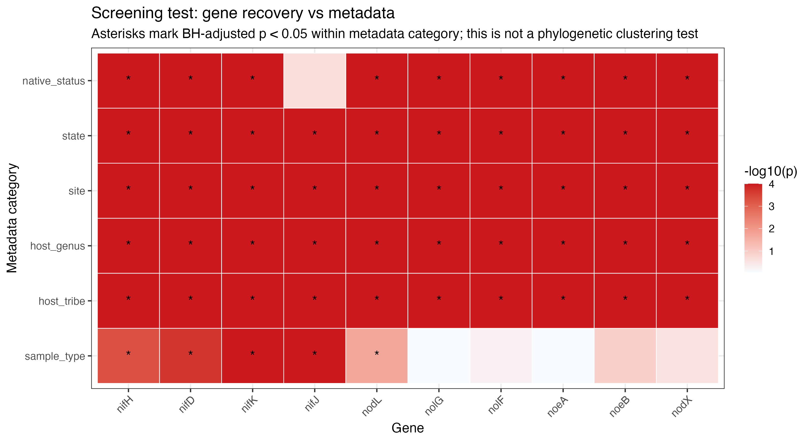

# Consensus50 Functional-Gene Tree Analysis Report: 10 Selected Genes

Date prepared: 2026-08-09  
Project: `symbiosis_sorted_v2_consensus_sequences_50percent`  
Primary cluster folder: `/mnt/dv/wid/projects6/SolisLemus-Intbio-raw/processed-data/symbiosis_sorted_v2_consensus_sequences_50percent`  
Local GitHub folder: `/Users/rosa/Desktop/ALLWork/Madison/Project/ryan-nitfix/intbio-nitfix-git/symbiosis_sorted_all_sample_consensus_sequences_50percent`

## 1. Purpose

This analysis uses the new Ryan/Pranoti consensus50 functional-gene reference to recover functional symbiosis genes from all V2 symbiosis-sorted samples, construct per-gene consensus sequences, build strict and mixed-IUPAC gene trees, assign sample-derived consensus sequences to closest known reference taxa by BLAST, and summarize whether recovery and tree patterns differ across `nif`, canonical `nod`, and `Other`.

The main goal is to create a reproducible set of gene trees and summary tables that can later be used to test whether host or geographic patterns are consistent across functional genes, following Ryan and Ahmed's suggestion that the additional gene trees should support downstream host/geography comparisons.

## 2. Key Results

| Result | Value |
|---|---:|
| Samples analyzed | 2,907 |
| Functional genes in consensus50 reference | 72 |
| Total sample-gene coverage rows | 209,304 |
| Good coverage threshold | percent covered >=80 and mean depth >=10 |
| Selected genes for tree analysis | 10 |
| Strict trees built | 10 |
| Mixed-IUPAC trees built | 10 |
| Strict trees with converged UFBoot | 8/10 |
| Mixed-IUPAC trees with converged UFBoot | 3/10 |
| Metadata rows available | 2,898 |

The selected 10 genes are:

| Analysis group | Genes |
|---|---|
| `nif` genes | `nifH`, `nifD`, `nifK`, `nifJ` |
| `nod` genes | `nodL`, `nodX` |
| `Other` | `nolG`, `nolF`, `noeA`, `noeB` |


## 3. Inputs

| Input | Description | Cluster path | Local path |
|---|---|---|---|
| Trimmed reads | Reused V2 fastp-trimmed paired reads | `/mnt/dv/wid/projects6/SolisLemus-Intbio-raw/processed-data/symbiosis_sorted_v2/symbiosis_trimmed_fastp` | not copied locally |
| Consensus50 reference FASTA | 72 gene-level consensus reference sequences | `/mnt/dv/wid/projects6/SolisLemus-Intbio-raw/processed-data/symbiosis_sorted_v2_consensus_sequences_50percent/reference/consensus_sequences_50percent.fasta` | `../result/reference/consensus_sequences_50percent.fasta` |
| Original symbiosis islands FASTA | Original functional reference used for context | `/mnt/dv/wid/projects6/SolisLemus-Intbio-raw/processed-data/symbiosis_sorted_v2_consensus_sequences_50percent/reference/symbiosis_islands.fasta` | `../result/reference/symbiosis_islands.fasta` |
| GenBank annotation | Symbiosis-island GenBank annotation | `/mnt/dv/wid/projects6/SolisLemus-Intbio-raw/processed-data/symbiosis_sorted_v2_consensus_sequences_50percent/reference/symbiosis_islands.gb` | `../result/reference/symbiosis_islands.gb` |
| Gene list | Gene grouping table from Ryan/Pranoti | `/mnt/dv/wid/projects6/SolisLemus-Intbio-raw/processed-data/symbiosis_sorted_v2_consensus_sequences_50percent/reference/symbiosis_islands_gene_list.xlsx` | `../result/reference/symbiosis_islands_gene_list.xlsx` |
| Reference taxon alignments | Per-gene aligned reference taxa used for BLAST/taxon annotation | `/mnt/dv/wid/projects6/SolisLemus-Intbio-raw/processed-data/symbiosis_sorted_v2_consensus_sequences_50percent/reference_taxon_fastas_by_gene` | `../result/reference/taxon_fastas_by_gene` |
| Metadata | Sample metadata used for tree annotation and summaries | `/mnt/dv/wid/projects6/SolisLemus-Intbio-raw/processed-data/symbiosis_sorted_v2_consensus_sequences_50percent/metadata` | `metadata available on cluster under `$OUT/metadata`; local metadata-derived outputs are in `../result/metadata_tree_comparison`` |

## 4. Reference Checks

The consensus50 reference contains 72 functional gene records. Across the full reference, the sequence composition was:

| Reference component | Count | Percent |
|---|---:|---:|
| A/C/G/T confident bases | 70,208 | 89.60% |
| IUPAC ambiguity excluding N | 6,724 | 8.58% |
| N bases | 1,425 | 1.82% |
| Total reference length | 78,357 | 100.00% |

The per-gene taxon reference alignments were checked against the gene-list table. The only gene listed in `symbiosis_islands_gene_list.xlsx` that was not present in `taxon_fastas_by_gene` was `nopT`. The selected 10 tree genes all had matching taxon-reference alignments.

Reference check output:

https://github.com/solislemuslab/IntBio-NitFix/tree/main/comparing_trees/result/reference/taxon_fastas_vs_symbiosis_islands_gene_list_match.tsv

## 5. Reproducible Pipeline

All main analysis paths below use the cluster output folder:

```bash
OUT="/mnt/dv/wid/projects6/SolisLemus-Intbio-raw/processed-data/symbiosis_sorted_v2_consensus_sequences_50percent"
GENES="nifH,nifD,nifK,nifJ,nodL,nolG,nolF,noeA,noeB,nodX"
```

### Step 1. Reuse Trimmed Reads

No new read trimming was done. The analysis reused the previously trimmed paired-end FASTQ files from the all-sample V2 analysis.

| Input | Method/code run | Result/output |
|---|---|---|
| V2 trimmed paired reads: `*_P1.fastq.gz` and `*_P2.fastq.gz` | No new code. Reads were already trimmed by `fastp` in the previous V2 workflow. | 2,907 paired samples available for mapping. |

### Step 2. Map Reads To The Consensus50 Reference

Trimmed V2 reads were mapped to the consensus50 reference using BWA-MEM. This step creates one sorted/indexed BAM file per sample and a flagstat report per sample.

### Mapping Parameters

| Parameter | Value |
|---|---|
| Mapper | BWA-MEM |
| BWA threads per job | 4 by default |
| Parallel jobs | configurable; full run used GNU Parallel |
| Sort tool | `samtools sort` |
| Sort threads per job | 2 by default |
| BAM index | `samtools index` |
| Mapping QC | `samtools flagstat` |


| Item | Path |
|---|---|
| Code, cluster | `$OUT/Rscripts_v2/11_map_consensus50_all_samples_parallel.sh` |
| Input reads | `/mnt/dv/wid/projects6/SolisLemus-Intbio-raw/processed-data/symbiosis_sorted_v2/symbiosis_trimmed_fastp` |
| Input reference | `$OUT/reference/consensus_sequences_50percent.fasta` |
| Output BAM folder | `$OUT/consensus_mapping_full` |
| Output log folder | `$OUT/consensus_mapping_logs` |

Run command:

```bash
OUT="/mnt/dv/wid/projects6/SolisLemus-Intbio-raw/processed-data/symbiosis_sorted_v2_consensus_sequences_50percent"

MAX_SAMPLES=0 JOBS=2 BWA_THREADS=4 SORT_THREADS=2 \
bash "$OUT/Rscripts_v2/11_map_consensus50_all_samples_parallel.sh" \
  | tee "$OUT/consensus_mapping_logs/consensus50_all_samples_mapping_run.log"
```
```text
MAX_SAMPLES=0 Run all samples. If this were set to 2, only two samples would be run for testing.
JOBS=2Run two samples in parallel at the same time.
BWA_THREADS=4Use 4 CPU threads for bwa mem per sample.
SORT_THREADS=2Use 2 CPU threads for samtools sort per sample.
```

Result: 2,907 samples were mapped. The mapping output is used for all downstream gene coverage and consensus sequence extraction.

### Step 3. Calculate Per-Gene Coverage

Coverage was calculated for all 72 consensus50 reference genes across all 2,907 samples.

| Item | Path |
|---|---|
| Code, cluster | `$OUT/Rscripts_v2/12_calculate_consensus_gene_coverage_v2.sh` |
| Input BAM folder | `$OUT/consensus_mapping_full` |
| Output coverage table | `$OUT/consensus_gene_coverage/consensus50_gene_coverage_all_samples.tsv` |
| Output coverage table | [`consensus50_gene_coverage_all_samples.tsv`](https://github.com/solislemuslab/IntBio-NitFix/blob/main/comparing_trees/result/tables/consensus50_gene_coverage_all_samples.tsv) |

### Coverage Table Columns

| Column | Meaning |
|---|---|
| `sample` | Sample ID. |
| `gene_ref` | Reference FASTA record, for example `nifH.fa`. |
| `gene` | Gene name after removing `.fa`. |
| `gene_length` | Length of the reference gene. |
| `covered_bases` | Number of reference positions with depth > 0. |
| `percent_covered` | `covered_bases / gene_length * 100`. |
| `mean_depth` | Mean depth across the full gene, including zero-depth positions. |
| `max_depth` | Maximum observed depth at any position in the gene. |


Run command:

```bash
OUT="/mnt/dv/wid/projects6/SolisLemus-Intbio-raw/processed-data/symbiosis_sorted_v2_consensus_sequences_50percent"
mkdir -p "$OUT/consensus_gene_coverage_logs"

MAX_SAMPLES=0 JOBS=4 \
bash "$OUT/Rscripts_v2/12_calculate_consensus_gene_coverage_v2.sh" \
  | tee "$OUT/consensus_gene_coverage_logs/consensus50_gene_coverage_run.log"
```


### Good-Coverage Definition

A sample-gene pair was counted as good when:

- `percent_covered >= 80`
- `mean_depth >= 10`

| Metric | Value |
|---|---:|
| Samples analyzed | 2,907 |
| Genes in consensus50 reference | 72 |
| Total sample-gene rows | 209,304 |
| Good sample-gene rows | 6,179 |
| Samples with at least one good gene | 2,052 |


### Step 4. Select Genes For Tree Construction

From the 72-gene coverage summary, 10 genes were selected because they had enough sample recovery to support tree construction and comparison:

- `nif`: `nifH`, `nifD`, `nifK`, `nifJ`
- `nod`: `nodL`, `nodX`
- `Other`: `nolG`, `nolF`, `noeA`, `noeB`


### Step 4. Extract Per-Gene Consensus Sequences

For each selected gene, consensus sequences were extracted from the BAM pileup. The consensus-calling logic was designed to avoid copying reference ambiguity into sample sequences. If the reference base was `N` or an IUPAC ambiguity code, sample consensus bases were called only from explicit read bases, not from reference-match symbols.

Consensus extraction thresholds:

| Parameter | Value |
|---|---:|
| Minimum percent covered | 80% |
| Minimum mean depth | 10 |
| Maximum N percent | 20% |
| Minimum base quality in pileup | 20 |
| Minimum mapping quality in pileup | 10 |
| Mixed-site depth threshold | 20 |
| Mixed-site minor count threshold | 5 |
| Mixed-site minor fraction threshold | 0.20 |
| Mixed sequence rule | mixed positions >10 |

For each gene, two FASTA sets were created:

| FASTA set | Meaning |
|---|---|
| strict single-dominant | Only passing sequences with no strong mixed-template signal |
| mixed-IUPAC all-pass | Both strict single-dominant and mixed possible multitemplate sequences |

Important interpretation: mixed-IUPAC calls suggest possible multiple templates, multicopy signal, or mixed infection, but they do not prove multiple organisms because variants are not phased across the gene.

| Item | Path |
|---|---|
| Pipeline code, cluster | `$OUT/Rscripts_v2/gene_tree_pipelines` |
| Runner script | `$OUT/Rscripts_v2/gene_tree_pipelines/run_selected_step_for_genes.sh` |
| Output folder | `$OUT/gene_trees/<gene>/01_consensus` |

Run command:

```bash
OUT="/mnt/dv/wid/projects6/SolisLemus-Intbio-raw/processed-data/symbiosis_sorted_v2_consensus_sequences_50percent"
GENES="nifH,nifD,nifK,nifJ,nodL,nolG,nolF,noeA,noeB,nodX"

STEP=02 JOBS=2 GENES="$GENES" \
bash "$OUT/Rscripts_v2/gene_tree_pipelines/run_selected_step_for_genes.sh" \
  | tee "$OUT/gene_trees/run_step02_consensus_all_genes.log"
```

### Step 5. Align Consensus Sequences With MAFFT

The strict and mixed-IUPAC FASTA files were aligned separately for every selected gene with MAFFT.

| Item | Path |
|---|---|
| Pipeline code | `$OUT/Rscripts_v2/gene_tree_pipelines/<gene>/03_align_<gene>_consensus50_with_mafft.sh` |
| Output folder | `$OUT/gene_trees/<gene>/02_alignment` |

Run command:

```bash
STEP=03 JOBS=2 GENES="$GENES" \
bash "$OUT/Rscripts_v2/gene_tree_pipelines/run_selected_step_for_genes.sh" \
  | tee "$OUT/gene_trees/run_step03_mafft_all_genes.log"
```

### Step 6. Build Strict Single-Dominant Trees With IQ-TREE

Strict trees are the primary trees because they use only sample consensus sequences that passed the coverage/depth/N filters and did not exceed the mixed-site threshold.

IQ-TREE command structure:

```bash
iqtree \
  -s <strict_alignment.fasta> \
  -st DNA \
  -m MFP \
  -B 1000 \
  -alrt 1000 \
  -nm 5000 \
  -T AUTO \
  --prefix <output_prefix>
```

| Item | Path |
|---|---|
| Pipeline code | `$OUT/Rscripts_v2/gene_tree_pipelines/<gene>/04_build_<gene>_strict_tree_nm5000_consensus50.sh` |
| Output folder | `$OUT/gene_trees/<gene>/03_tree_strict_nm5000` |

Run command:

```bash
STEP=04 JOBS=1 GENES="$GENES" \
bash "$OUT/Rscripts_v2/gene_tree_pipelines/run_selected_step_for_genes.sh" \
  | tee "$OUT/gene_trees/run_step04_strict_trees_all_genes.log"
```

### Step 7. Build Mixed-IUPAC Trees With IQ-TREE

Mixed-IUPAC trees include both single-dominant and mixed possible multitemplate sequences. These trees are useful as sensitivity/exploratory trees, but most mixed-IUPAC trees did not reach UFBoot convergence even with `-nm 5000`.

| Item | Path |
|---|---|
| Pipeline code | `$OUT/Rscripts_v2/gene_tree_pipelines/<gene>/05_build_<gene>_iupac_tree_nm5000_consensus50.sh` |
| Output folder | `$OUT/gene_trees/<gene>/04_tree_iupac_nm5000` |

Run command:

```bash
STEP=05 JOBS=1 GENES="$GENES" \
bash "$OUT/Rscripts_v2/gene_tree_pipelines/run_selected_step_for_genes.sh" \
  | tee "$OUT/gene_trees/run_step05_iupac_trees_all_genes.log"
```

### Step 8. Assign Closest Known Reference Taxa With BLAST

BLAST was used after tree construction to assign each sample-derived consensus sequence to its closest known reference sequence from the per-gene taxon reference alignments. This is different from BWA mapping:

- BWA was used to map raw reads to the consensus50 reference and build sample consensus sequences.
- BLAST was used to label each finished sample consensus sequence with a closest known reference hit.

The BLAST label is a closest known reference hit, not a confirmed species identification.

Example reference label:

```text
nifH|Methylobacterium_sp._CB376|WFT77218.1
```

This is parsed as:

| Part | Meaning |
|---|---|
| `nifH` | gene |
| `Methylobacterium_sp._CB376` | closest reference taxon label |
| `WFT77218.1` | accession |

For genus-level summaries, the genus is parsed as the first word before the first underscore. In the example above, the genus label is `Methylobacterium`.

| Item | Path |
|---|---|
| Pipeline code | `$OUT/Rscripts_v2/gene_tree_pipelines/<gene>/06_blast_<gene>_consensus_to_taxon_reference.sh` |
| Reference taxon FASTA/alignment | `$OUT/reference_taxon_fastas_by_gene/<gene>.fa.aln` |
| Output folder | `$OUT/gene_trees/<gene>/05_blast_taxon_assignment` |

Run command:

```bash
module load blast+/2.17.0

STEP=06 JOBS=2 GENES="$GENES" \
bash "$OUT/Rscripts_v2/gene_tree_pipelines/run_selected_step_for_genes.sh" \
  | tee "$OUT/gene_trees/run_step06_blast_all_genes.log"
```

### Step 9. Check Tree Outputs

Output checking was run to summarize tip counts, model choice, tree length, and UFBoot convergence status.

| Item | Path |
|---|---|
| Check scripts | `$OUT/Rscripts_v2/gene_tree_pipelines/<gene>/07_check_<gene>_tree_outputs.sh` |
| Summary tables | `../result/comparative_tree_analysis/tables` |

Run command:

```bash
STEP=07 JOBS=1 GENES="$GENES" \
bash "$OUT/Rscripts_v2/gene_tree_pipelines/run_selected_step_for_genes.sh" \
  | tee "$OUT/gene_trees/run_step07_check_all_genes.log"
```

### Step 10. Local R Summaries And Figures

Two local R scripts created the comparative tables, metadata summaries, and figures.

| Script | Purpose | Output folder |
|---|---|---|
| `/Users/rosa/Desktop/ALLWork/Madison/Project/ryan-nitfix/Rcode/01_compare_functional_gene_trees_consensus50.R` | gene/tree/BLAST comparison figures and tables | `../result/comparative_tree_analysis` |
| `/Users/rosa/Desktop/ALLWork/Madison/Project/ryan-nitfix/Rcode/02_metadata_and_report_comparisons_consensus50.R` | metadata-aware recovery and tree comparison summaries | `../result/metadata_tree_comparison` |

## 6. Gene Coverage Results

Coverage threshold: `percent_covered >= 80` and `mean_depth >= 10`.

| Gene | Group | Good samples | Percent of 2,907 samples | Mean percent covered | Median percent covered | Mean depth |
|---|---|---:|---:|---:|---:|---:|
| `nifH` | nif | 1,572 | 54.08% | 76.51 | 80.64 | 1551.88 |
| `nifD` | nif | 1,497 | 51.50% | 75.80 | 80.74 | 1201.12 |
| `nifK` | nif | 1,088 | 37.43% | 63.25 | 69.46 | 575.24 |
| `nifJ` | nif | 328 | 11.28% | 37.96 | 29.68 | 279.96 |
| `nodL` | nod | 239 | 8.22% | 26.05 | 10.62 | 127.91 |
| `nolG` | `Other` | 230 | 7.91% | 20.96 | 2.41 | 102.56 |
| `nolF` | `Other` | 209 | 7.19% | 20.25 | 1.71 | 99.78 |
| `noeA` | `Other`  | 197 | 6.78% | 19.75 | 0.00 | 99.77 |
| `noeB` | `Other`  | 149 | 5.13% | 17.75 | 0.00 | 90.95 |
| `nodX` | nod | 137 | 4.71% | 14.47 | 0.00 | 51.15 |

Main table:

- `../result/comparative_tree_analysis/tables/01_coverage_summary_by_gene_pct80_depth10.tsv`

Main figures:


## 7. Consensus Sequence Results

| Gene | Fail high N | Mixed possible multitemplate | Strict single-dominant | Strict FASTA sequences | Mixed-IUPAC FASTA sequences |
|---|---:|---:|---:|---:|---:|
| `nifH` | 34 | 1,151 | 387 | 387 | 1,538 |
| `nifD` | 33 | 1,116 | 348 | 348 | 1,464 |
| `nifK` | 36 | 597 | 455 | 455 | 1,052 |
| `nifJ` | 3 | 144 | 181 | 181 | 325 |
| `nodL` | 9 | 14 | 216 | 216 | 230 |
| `nolG` | 1 | 28 | 201 | 201 | 229 |
| `nolF` | 0 | 1 | 208 | 208 | 209 |
| `noeA` | 2 | 2 | 193 | 193 | 195 |
| `noeB` | 0 | 17 | 132 | 132 | 149 |
| `nodX` | 4 | 4 | 129 | 129 | 133 |

Main tables:

- `../result/comparative_tree_analysis/tables/03_consensus_qc_status_summary_long.tsv`
- `../result/comparative_tree_analysis/tables/04_consensus_qc_status_summary_wide.tsv`

Main figure:


Note: the y-axis in this figure is number of tree-input consensus sequences. For the strict bars, this means strict single-dominant sequences. For the mixed-IUPAC bars, this means strict single-dominant plus mixed possible multitemplate sequences.

## 8. Alignment Results

| Gene | Strict sequences | Strict alignment length | Mixed-IUPAC sequences | Mixed-IUPAC alignment length |
|---|---:|---:|---:|---:|
| `nifH` | 387 | 997 bp | 1,538 | 997 bp |
| `nifD` | 348 | 1,532 bp | 1,464 | 1,532 bp |
| `nifK` | 455 | 1,588 bp | 1,052 | 1,542 bp |
| `nifJ` | 181 | 3,584 bp | 325 | 3,678 bp |
| `nodL` | 216 | 612 bp | 230 | 612 bp |
| `nolG` | 201 | 3,198 bp | 229 | 3,198 bp |
| `nolF` | 208 | 1,110 bp | 209 | 1,110 bp |
| `noeA` | 193 | 1,431 bp | 195 | 1,431 bp |
| `noeB` | 132 | 1,674 bp | 149 | 1,674 bp |
| `nodX` | 129 | 1,121 bp | 133 | 1,121 bp |

The strict alignments contain no IUPAC mixed codes by design. The mixed-IUPAC alignments retain ambiguity codes when positions pass the mixed-site rule. For example, the mixed-IUPAC `nifH` alignment contains 3.33% IUPAC ambiguity excluding N, while the strict `nifH` alignment contains 0.00% IUPAC ambiguity excluding N.

Main table:

- `../result/comparative_tree_analysis/tables/08_alignment_sequence_composition.tsv`

Main figure:


## 9. Strict Single-Dominant Tree Results

Strict trees are the primary phylogenies for interpretation because they avoid mixed-template consensus sequences.

| Gene | Group | Input sequences | Alignment length | IQ-TREE tips | Best model | Tree length | Final UFBoot correlation | Status |
|---|---|---:|---:|---:|---|---:|---:|---|
| `nifH` | nif | 387 | 997 | 387 | `GTR+F+R6` | 9.850 | 0.990 | converged |
| `nifD` | nif | 348 | 1,532 | 348 | `GTR+F+I+R6` | 10.328 | 0.992 | converged |
| `nifK` | nif | 455 | 1,588 | 455 | `GTR+F+I+R6` | 12.807 | 0.903 | not converged |
| `nifJ` | nif | 181 | 3,584 | 181 | `TVM+F+I+R3` | 1.411 | 0.961 | not converged |
| `nodL` | canonical nod | 216 | 612 | 189 | `TIM3+F+I+G4` | 1.268 | 0.993 | converged |
| `nolG` | accessory | 201 | 3,198 | 176 | `TPM3u+F+R4` | 0.170 | 0.992 | converged |
| `nolF` | accessory | 208 | 1,110 | 176 | `HKY+F+R3` | 0.181 | 0.991 | converged |
| `noeA` | accessory | 193 | 1,431 | 176 | `HKY+I+G4` | 0.110 | 0.991 | converged |
| `noeB` | accessory | 132 | 1,674 | 105 | `TPM3u+I+G4` | 0.248 | 0.994 | converged |
| `nodX` | canonical nod | 129 | 1,121 | 102 | `HKY+F+R3` | 0.358 | 0.996 | converged |

Note: some IQ-TREE tip counts are lower than input sequence counts because IQ-TREE collapses identical sequences internally for tree search. This is why, for example, `nodL` has 216 input sequences but 189 IQ-TREE taxa/tips.

Main tables:

- `../result/comparative_tree_analysis/tables/05_tree_summary_strict_and_mixed_iupac.tsv`
- `../result/comparative_tree_analysis/tables/06_strict_tree_summary.tsv`

Strict tree files are organized by gene:

- `../result/gene_trees_full/<gene>/03_tree_strict_nm5000/<gene>_consensus50_strict_single_dominant_nm5000.treefile`
- `../result/gene_trees_full/<gene>/03_tree_strict_nm5000/<gene>_consensus50_strict_single_dominant_nm5000.contree`
- `../result/gene_trees_full/<gene>/03_tree_strict_nm5000/<gene>_consensus50_strict_single_dominant_nm5000.iqtree`
- `../result/gene_trees_full/<gene>/03_tree_strict_nm5000/<gene>_consensus50_strict_single_dominant_nm5000.log`

## 10. Mixed-IUPAC Tree Results

Mixed-IUPAC trees include all passing sequences, including those flagged as possible mixed/multitemplate. These trees are useful for sensitivity analyses and for asking how much phylogenetic placement changes when mixed signal is retained.

| Gene | Group | Input sequences | Alignment length | IQ-TREE tips | Best model | Tree length | Final UFBoot correlation | Status |
|---|---|---:|---:|---:|---|---:|---:|---|
| `nifH` | nif | 1,538 | 997 | 1,532 | `GTR+F+I+R9` | 27.178 | 0.939 | not converged |
| `nifD` | nif | 1,464 | 1,532 | 1,458 | `GTR+F+I+R10` | 34.697 | 0.918 | not converged |
| `nifK` | nif | 1,052 | 1,542 | 1,046 | `GTR+F+R9` | 24.723 | 0.835 | not converged |
| `nifJ` | nif | 325 | 3,678 | 325 | `TVM+F+R5` | 2.646 | 0.947 | not converged |
| `nodL` | canonical nod | 230 | 612 | 210 | `TIM3+F+I+G4` | 1.252 | 0.967 | not converged |
| `nolG` | accessory | 229 | 3,198 | 218 | `TIM3+F+I+G4` | 0.162 | 0.915 | not converged |
| `nolF` | accessory | 209 | 1,110 | 202 | `HKY+F+I+G4` | 0.112 | 0.975 | not converged |
| `noeA` | accessory | 195 | 1,431 | 194 | `HKY+I` | 0.076 | 0.993 | converged |
| `noeB` | accessory | 149 | 1,674 | 134 | `TPM3u+I+G4` | 0.207 | 0.991 | converged |
| `nodX` | canonical nod | 133 | 1,121 | 109 | `HKY+F+R3` | 0.319 | 0.992 | converged |

Main table:

- `../result/comparative_tree_analysis/tables/07_mixed_iupac_tree_summary.tsv`

Mixed-IUPAC tree files are organized by gene:

- `../result/gene_trees_full/<gene>/04_tree_iupac_nm5000/<gene>_consensus50_iupac_all_pass_nm5000.treefile`
- `../result/gene_trees_full/<gene>/04_tree_iupac_nm5000/<gene>_consensus50_iupac_all_pass_nm5000.contree`
- `../result/gene_trees_full/<gene>/04_tree_iupac_nm5000/<gene>_consensus50_iupac_all_pass_nm5000.iqtree`
- `../result/gene_trees_full/<gene>/04_tree_iupac_nm5000/<gene>_consensus50_iupac_all_pass_nm5000.log`

Main figure:


## 11. BLAST Closest-Reference Annotation Results

BLAST annotation was used to label each sample-derived consensus sequence by closest known reference taxon and genus. These labels are helpful for interpreting tree regions and comparing functional-gene signal with 16S/community results later.

Main BLAST tables:

- `../result/comparative_tree_analysis/tables/11a_blast_source_file_row_counts.tsv`
- `../result/comparative_tree_analysis/tables/11b_blast_assignment_rows_deduplicated_strict_iupac.tsv`
- `../result/comparative_tree_analysis/tables/12_blast_closest_genus_summary_grouped_min5.tsv`

Main BLAST figures:


Interpretation note: the y-axis categories in these figures are closest BLAST genus labels, and the x-axis/counts represent sample-derived consensus sequences/tree tips assigned to those genera. They are not direct bacterial abundance estimates.

## 12. Sample-Level Gene-Recovery Results

A sample can recover more than one functional gene. For example, a sample with 3 good genes passed `percent_covered >=80` and `mean_depth >=10` for 3 of the 10 selected genes.

Main tables:

- `../result/comparative_tree_analysis/tables/09_sample_overlap_good_genes_pct80_depth10.tsv`
- `../result/comparative_tree_analysis/tables/10_sample_overlap_summary_by_sample_type.tsv`
- `../result/comparative_tree_analysis/tables/10a_sample_gene_recovery_combinations_pct80_depth10.tsv`
- `../result/comparative_tree_analysis/tables/10b_top_gene_recovery_combinations_pct80_depth10.tsv`
- `../result/comparative_tree_analysis/tables/10c_gene_recovery_combinations_by_sample_type_pct80_depth10.tsv`

Main figures:


These combination figures are more interpretable than a simple “number of good genes per sample” histogram because they show which genes make up each recovery pattern.

## 13. Metadata-Aware Summaries

Metadata was used to summarize recovery and annotation patterns by sample type, host, and geography. The metadata-aware summaries are intended as the bridge to Ryan and Ahmed's requested next analysis: testing whether host or geographic patterns are consistent across `nif`, canonical `nod`, and `Other` genes.

Main metadata tables:

- `../result/metadata_tree_comparison/tables/00_metadata_tree_comparison_output_index.tsv`
- `../result/metadata_tree_comparison/tables/01_gene_categories_for_report.tsv`
- `../result/metadata_tree_comparison/tables/02_gene_recovery_by_metadata_category_pct80_depth10.tsv`
- `../result/metadata_tree_comparison/tables/03_tree_reliability_summary_for_report.tsv`
- `../result/metadata_tree_comparison/tables/04_blast_closest_genus_by_gene_sample_type.tsv`
- `../result/metadata_tree_comparison/tables/05_metadata_gene_recovery_association_screen.tsv`
- `../result/metadata_tree_comparison/tables/06_report_interpretation_notes.tsv`

Main metadata figures:




## 14. iTOL Tree Figures

The current iTOL exports are mainly for the earlier nifH trees. They are kept here as visual examples and report-ready tree images.

| Figure | Path |
|---|---|
| nifH strict pct80 family strip | `../result/trees/Figure/strict_pct80_Nle20_itol_family_colorstrip.svg` |
| nifH strict pct80 sample-type strip | `../result/trees/Figure/strict_pct80_Nle20_itol_sample_type_colorstrip.svg` |
| nifH strict pct80 tribe strip | `../result/trees/Figure/strict_pct80_Nle20_itol_tribe_colorstrip.svg` |
| nifH strict pct80 native strip | `../result/trees/Figure/strict_pct80_Nle20_itol_native_colorstrip.svg` |
| nifH strict closest BLAST genus | `../result/trees/Figure/strict_single_blast_closest_genus_colorstrip_5000.svg` |
| nifH strict closest BLAST taxon | `../result/trees/Figure/strict_single_blast_closest_taxon_colorstrip_5000.svg` |
| nifH mixed-IUPAC closest BLAST genus | `../result/trees/Figure/iupac_nm5000_blast_closest_genus_colorstrip.svg` |
| nifH mixed-IUPAC closest BLAST taxon | `../result/trees/Figure/iupac_nm5000_blast_closest_taxon_colorstrip.svg` |

Example figures:


## 15. Interpretation

The strongest recovery was from the core nitrogen-fixation genes `nifH`, `nifD`, and `nifK`, with `nifH` and `nifD` recovered in more than half of all samples at the 80% coverage and 10x depth threshold. `nifJ` was recovered in fewer samples, and canonical `nod` plus accessory `nol/noe` genes were recovered in a smaller subset of samples. This pattern is biologically plausible because not all symbiosis genes are universal across all nitrogen-fixing lineages, and some nodulation-related genes are lineage- or host-specific.

The strict single-dominant trees are the preferred trees for downstream biological interpretation because they avoid mixed-template consensus sequences. Most strict trees converged under IQ-TREE ultrafast bootstrap, but `nifK` and `nifJ` strict trees did not fully converge and should be interpreted with extra caution. The mixed-IUPAC trees include many more sequences, especially for `nifH` and `nifD`, but most mixed-IUPAC trees did not converge; therefore, they should be treated as sensitivity/exploratory trees rather than the main phylogenetic evidence.

The BLAST annotation provides a practical way to label each sample-derived consensus sequence by closest known functional-gene reference. These labels make the trees more interpretable, but they should not be reported as confirmed species identities. The correct language is “closest BLAST reference taxon/genus” or “closest known functional-gene hit.”

## 16. Caveats

MC controls are limited to `n=2`, so they are useful as a background check but are not enough for strong absence/presence filtering. Mixed-IUPAC calls are threshold-based: a sequence is called mixed possible multitemplate only when more than 10 positions pass the mixed-site rule. Mixed signal suggests possible multiple templates, multicopy signal, or mixed infection, but it does not prove multiple organisms because the variants are not phased across the gene. Tree tips are sample-derived consensus sequences, not unique biological samples or confirmed bacterial isolates. BLAST taxon labels are closest reference hits, not confirmed species identities.

## 17. Recommended Next Analyses

1. Use the strict, converged trees first for host/geography tests.
2. Compare host and geography patterns across `nifH`, `nifD`, `nodL`, `nodX`, and accessory `nol/noe` trees where recovery is sufficient.
3. Use tree-based clustering or permutation tests to ask whether samples from the same host group, tribe, country, or site cluster more than expected by chance.
4. Compare functional-gene BLAST genus summaries with 16S-based taxonomic profiles, especially for nodule samples where the number of taxa may be smaller and easier to pair with functional genes.
5. Treat mixed-IUPAC trees as sensitivity analyses and report their nonconvergence clearly.

## 18. Main Output Index

| Output type | Local path | Cluster path |
|---|---|---|
| Per-gene tree folders | `../result/gene_trees_full/<gene>` | `$OUT/gene_trees/<gene>` |
| Comparative tables | `../result/comparative_tree_analysis/tables` | created locally from copied results |
| Comparative figures | `../result/comparative_tree_analysis/figures` | created locally from copied results |
| Metadata comparison tables | `../result/metadata_tree_comparison/tables` | created locally from copied results |
| Metadata comparison figures | `../result/metadata_tree_comparison/figures` | created locally from copied results |
| iTOL exported tree figures | `../result/trees/Figure` | exported locally from iTOL |
| Reference/taxon matching table | `../result/reference/taxon_fastas_vs_symbiosis_islands_gene_list_match.tsv` | copied/generated from reference checks |

The most important final summary table for the 20 gene trees is:

- `../result/comparative_tree_analysis/tables/05_tree_summary_strict_and_mixed_iupac.tsv`

The most important final coverage table is:

- `../result/comparative_tree_analysis/tables/01_coverage_summary_by_gene_pct80_depth10.tsv`

The most important final BLAST/taxon table is:

- `../result/comparative_tree_analysis/tables/11b_blast_assignment_rows_deduplicated_strict_iupac.tsv`
