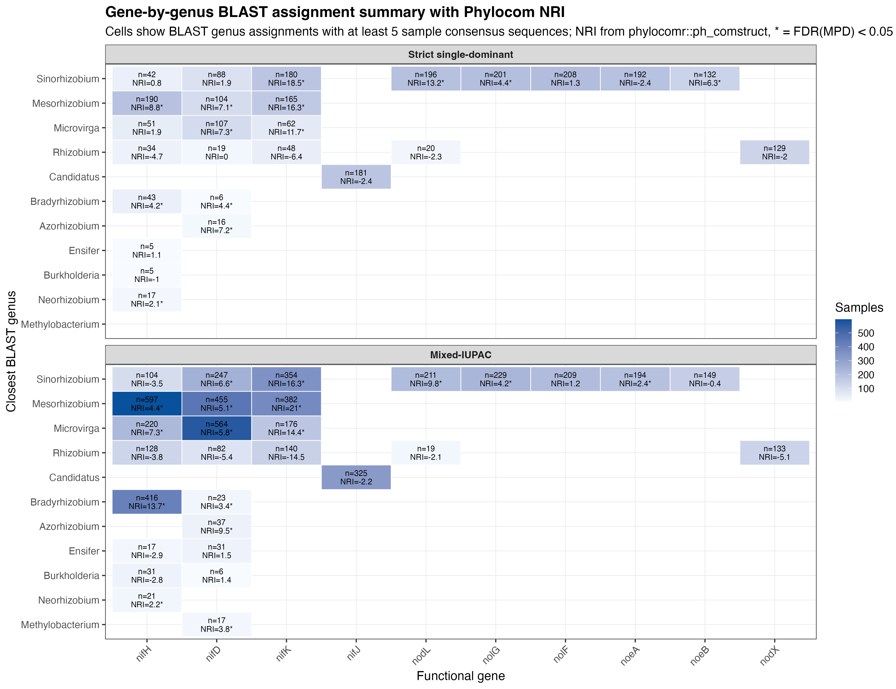

# Phylocom And Nearest-Neighbor Tree Comparison

This section describes two related analyses that use the functional-gene trees to ask whether samples with the same label are close together in the tree.

The labels tested here include the closest BLAST genus assigned to each sample consensus sequence. The most important question is:

> If several samples are assigned to the same closest BLAST genus, are those samples close together in the gene tree?

The analyses were run separately for each gene and each tree set:

- Strict single-dominant trees
- Mixed-IUPAC trees


## Part 1. Phylocom-Style Clustering Test

### Purpose

I used the `phylocomr` package to test whether samples with the same label are more clustered in the tree than expected by random labels.

For example, for:

```text
gene = nifH
tree set = Mixed-IUPAC
closest BLAST genus = Mesorhizobium
n = 597 samples
```

the Phylocom-style test asks:

```text
Are the 597 Mesorhizobium-assigned nifH tips closer together in the nifH tree
than expected if genus labels were randomly placed on the same tree?
```

This is a group-level test. It gives one p-value for the whole group, **not one p-value for each sample**.

### Package, Function, Input, And Output

Package:

```r
library(phylocomr)
phylocomr::ph_comstruct()
```
 
 ph_comstruct() takes a phylogenetic tree and a sample/group table, randomizes tip labels, and tests whether tips in each group are closer together than expected by random labels.


Main input to `ph_comstruct()`:

| Input | Meaning in this analysis |
|---|---|
| `phylo` | One functional-gene tree, for example the Mixed-IUPAC `nifH` tree |
| `sample` | A table saying which tree tips belong to each group, for example which tips are `Mesorhizobium` |
| `null_model = 0` | Randomly reshuffle labels/tips to create the null expectation |
| `randomizations = 999` | Run 999 random label tests |
| `abundance = FALSE` | Treat each tip as present once; do not use abundance weights |

Main output from `ph_comstruct()`:

| Output | Meaning |
|---|---|
| `ntaxa` | Number of tips tested in that group |
| `mpd` | Observed mean pairwise phylogenetic distance among tips in the group |
| `mpd_random` | Mean MPD from randomized groups |
| `nri` | Net Relatedness Index; **positive values mean same-label tips are closer than random** |
| `p_mpd_cluster` | p-value for clustering based on MPD |
| `fdr_mpd` | BH/FDR-corrected p-value |

### NRI Meaning

NRI means Net Relatedness Index.

It is calculated from MPD, the mean pairwise tree distance among samples in a group:

```text
NRI = -1 * (observed MPD - mean random MPD) / sd random MPD
```

Interpretation:

| NRI value | Meaning |
|---|---|
| Positive NRI | Same-label tips are closer together than random |
| NRI near 0 | Same-label tips are about as close as random |
| Negative NRI | Same-label tips are more spread out than random |

In this report, I interpret a group as having supported clustering when:

```text
NRI > 0 and FDR(MPD) < 0.05
```

### Important Sample-Set Check

The Phylocom test must use the same sample set as the BLAST genus heatmap. To make this correct, the updated Step 10 starts from the same deduplicated BLAST assignment table used for the BLAST heatmap:

[11b_blast_assignment_rows_deduplicated_strict_iupac.tsv](../result/comparative_tree_analysis/tables/11b_blast_assignment_rows_deduplicated_strict_iupac.tsv)

The new code checks that:

```text
BLAST heatmap n = Phylocom ntaxa
```

Result:

```text
All matched BLAST genus counts agree with Phylocom ntaxa.
```

For example:

| Tree set | Gene | Closest BLAST genus | BLAST n | Phylocom ntaxa | NRI | FDR(MPD) |
|---|---|---:|---:|---:|---:|---:|
| Mixed-IUPAC | nifH | Mesorhizobium | 597 | 597 | 5.5921 | 0.0021 |

This means the Phylocom test for Mixed-IUPAC `nifH` + `Mesorhizobium` used the same 597 samples shown in the BLAST heatmap.

### Phylocom Result Files

Code:

- [10_phylocom_clustering_matched_to_blast_heatmap.R](../code/Rcode/10_phylocom_clustering_matched_to_blast_heatmap.R)
- [11_plot_blast_heatmap_with_matched_phylocom_NRI.R](../code/Rcode/11_plot_blast_heatmap_with_matched_phylocom_NRI.R)

Main tables:

- [10_phylocom_report_table_matched.tsv](../result/phylocom_clustering/tables/10_phylocom_report_table_matched.tsv)
- [10_blast_closest_genus_summary_matched_min5.tsv](../result/phylocom_clustering/tables/10_blast_closest_genus_summary_matched_min5.tsv)
- [10_blast_count_vs_phylocom_ntaxa_check.tsv](../result/phylocom_clustering/tables/10_blast_count_vs_phylocom_ntaxa_check.tsv)
- [11_blast_genus_counts_with_matched_phylocom_NRI.tsv](../result/phylocom_clustering/tables/11_blast_genus_counts_with_matched_phylocom_NRI.tsv)
- [11_matched_heatmap_join_check.tsv](../result/phylocom_clustering/tables/11_matched_heatmap_join_check.tsv)


Main figure:



### Example Phylocom Results

Some strong positive NRI results were:

| Tree set | Gene | Closest BLAST genus | n | NRI | FDR(MPD) | Meaning |
|---|---|---:|---:|---:|---:|---|
| Mixed-IUPAC | nifK | Mesorhizobium | 382 | 21.0949 | 0.0021 | Strong clustering |
| Mixed-IUPAC | nifK | Sinorhizobium | 354 | 16.6006 | 0.0021 | Strong clustering |
| Mixed-IUPAC | nifH | Bradyrhizobium | 416 | 16.5468 | 0.0021 | Strong clustering |
| Mixed-IUPAC | nifK | Microvirga | 176 | 14.1392 | 0.0021 | Strong clustering |
| Mixed-IUPAC | nodL | Sinorhizobium | 211 | 10.5318 | 0.0021 | Strong clustering |
| Mixed-IUPAC | nifH | Mesorhizobium | 597 | 5.5921 | 0.0021 | Same-genus tips are closer than random |

## Part 2. Sample-Level Nearest-Neighbor Analysis

### Purpose

The Phylocom result is useful, but it is not a per-sample result. Because of that, I added a second analysis to answer a more direct question:

```text
For each sample, is its nearest neighbor in the tree assigned to the same closest BLAST genus?
```

This produces one row per sample/tip.

For each sample, the code finds:

1. The closest tip to that sample in the tree.
2. The closest BLAST genus of the sample.
3. The closest BLAST genus of the nearest-neighbor tip.
4. Whether the two genera are the same.

### What Is A Nearest Neighbor In The Tree?

Each tree has branch lengths. The distance between two tips is the total branch length connecting them.

For one sample/tip, the nearest neighbor is the other tip with the smallest tree distance (dist_mat <- cophenetic.phylo(tr)).

Example:

| Sample | Distance to sample B | Distance to sample C | Distance to sample D | Nearest neighbor |
|---|---:|---:|---:|---|
| sample A | 0.01 | 0.20 | 0.35 | sample B |

If sample A and sample B are both assigned to `Mesorhizobium`, then sample A is counted as:

```text
nearest_neighbor_same_blast_genus = TRUE
```

If sample A is `Mesorhizobium` but sample B is `Bradyrhizobium`, then sample A is counted as:

```text
nearest_neighbor_same_blast_genus = FALSE
```

This analysis gives a direct fraction.

For example:

```text
454 / 597 nifH Mesorhizobium samples have a nearest neighbor also assigned to Mesorhizobium.
```

That is:

```text
76.0%
```

So the interpretation is:

```text
Most Mixed-IUPAC nifH samples assigned to Mesorhizobium are nearest to another
Mesorhizobium-assigned nifH sample in the tree.
```

### Random Test For The Nearest-Neighbor Result

I also asked whether the observed nearest-neighbor percentage is higher than expected by random labels.

For each gene and tree set, the code:

1. Keeps the same tree.
2. Keeps the same number of tips.
3. Keeps the same number of samples assigned to each genus.
4. Randomly shuffles the genus labels across tips.
5. Recalculates how many samples have a same-genus nearest neighbor.
6. Repeats this 999 times.

This gives a random expectation.

For example, for Mixed-IUPAC `nifH` + `Mesorhizobium`:

| Value | Result |
|---|---:|
| Total samples assigned to Mesorhizobium | 597 |
| Samples whose nearest neighbor is also Mesorhizobium | 454 |
| Observed percent | 76.0% |
| Random expected percent | 38.8% |
| FDR | 0.0016 |

I kept the tree fixed and randomly shuffled only the closest BLAST genus labels across the tips. Then we compared the real result to the randomized results to test whether samples assigned to the same genus were closer together than expected by chance.
```text
Mesorhizobium-assigned nifH samples are much more often nearest to other
Mesorhizobium-assigned nifH samples than expected by random labels.
```

### Nearest-Neighbor Result Files

Code:

- [12_nearest_neighbor_same_blast_genus_in_trees.R](../code/Rcode/12_nearest_neighbor_same_blast_genus_in_trees.R)

Result:

- [12_nearest_neighbor_by_sample.tsv](../result/tree_nearest_neighbor/tables/12_nearest_neighbor_by_sample.tsv)
- [12_nearest_neighbor_summary_by_gene_genus.tsv](../result/tree_nearest_neighbor/tables/12_nearest_neighbor_summary_by_gene_genus.tsv)
- [12_nearest_neighbor_summary_with_random_test.tsv](../result/tree_nearest_neighbor/tables/12_nearest_neighbor_summary_with_random_test.tsv)


### Meaning Of Columns In The Sample-Level Table

File:

[12_nearest_neighbor_by_sample.tsv](../result/tree_nearest_neighbor/tables/12_nearest_neighbor_by_sample.tsv)

| Column | Meaning |
|---|---|
| `tree_set` | `strict` or `iupac` |
| `tree_set_label` | Clear tree-set name |
| `gene` | Functional gene |
| `sample_id` | Sample name |
| `tip_label` | Full tip label in the tree |
| `closest_genus_report` | Closest BLAST genus assigned to that sample consensus sequence |
| `nearest_neighbor_tip` | Closest tip to this sample in the tree |
| `nearest_neighbor_sample_id` | Sample name of the nearest-neighbor tip |
| `nearest_neighbor_closest_genus` | Closest BLAST genus assigned to the nearest-neighbor tip |
| `nearest_neighbor_distance` | Tree distance from this sample to its nearest neighbor |
| `nearest_neighbor_same_blast_genus` | `TRUE` if sample and nearest neighbor have the same closest BLAST genus |
| `nearest_neighbor_tie_count` | Number of equally closest tips if there is a tie |
| `sample_type`, `site`, `state`, `host_genus`, `host_tribe`, `native_status` | Metadata for the sample |

### Meaning Of Columns In The Summary Table


[12_nearest_neighbor_summary_with_random_test.tsv](../result/tree_nearest_neighbor/tables/12_nearest_neighbor_summary_with_random_test.tsv)

| Column | Meaning |
|---|---|
| `tree_set` | `strict` or `iupac` |
| `gene` | Functional gene |
| `closest_genus_report` | Closest BLAST genus |
| `n` | Number of samples/tips in that gene-genus group |
| `same_nearest_neighbor_n` | Number of samples whose nearest neighbor has the same closest BLAST genus |
| `same_nearest_neighbor_percent` | Percent of samples whose nearest neighbor has the same closest BLAST genus |
| `random_mean_same_n` | Mean same-genus nearest-neighbor count from randomized labels |
| `random_mean_same_percent` | Mean same-genus nearest-neighbor percent from randomized labels |
| `nearest_neighbor_z` | How far the observed value is from the random mean, in random standard deviations |
| `p_more_same_than_random` | p-value for having more same-genus nearest neighbors than random |
| `fdr_more_same_than_random` | FDR-corrected p-value |
| `interpretation` | Simple interpretation of the result |

### Example Nearest-Neighbor Results

Some strong sample-level nearest-neighbor results were:

| Tree set | Gene | Closest BLAST genus | n | Same-genus nearest neighbors | Observed % | Random expected % | FDR | Meaning |
|---|---|---:|---:|---:|---:|---:|---:|---|
| Mixed-IUPAC | nodL | Sinorhizobium | 211 | 207 | 98.1% | 91.7% | 0.0016 | More same-genus nearest neighbors than random |
| Mixed-IUPAC | nifK | Rhizobium | 140 | 120 | 85.7% | 13.2% | 0.0016 | Strong sample-level clustering |
| Mixed-IUPAC | nifD | Sinorhizobium | 247 | 211 | 85.4% | 16.8% | 0.0016 | Strong sample-level clustering |
| Mixed-IUPAC | nifK | Sinorhizobium | 354 | 302 | 85.3% | 33.7% | 0.0016 | Strong sample-level clustering |
| Mixed-IUPAC | nifH | Bradyrhizobium | 416 | 331 | 79.6% | 26.9% | 0.0016 | Strong sample-level clustering |
| Mixed-IUPAC | nifK | Mesorhizobium | 382 | 302 | 79.1% | 36.2% | 0.0016 | Strong sample-level clustering |
| Mixed-IUPAC | nifH | Mesorhizobium | 597 | 454 | 76.0% | 38.8% | 0.0016 | Strong sample-level clustering |
| Mixed-IUPAC | nifD | Mesorhizobium | 455 | 334 | 73.4% | 31.1% | 0.0016 | Strong sample-level clustering |
| Mixed-IUPAC | nifD | Microvirga | 564 | 390 | 69.1% | 38.6% | 0.0016 | Strong sample-level clustering |


The two analyses answer related but different questions.

| Analysis | Question | Result type |
|---|---|---|
| Phylocom NRI | Are all tips in a label group closer together than random? | One NRI and one p-value per group |
| Nearest-neighbor analysis | For each sample, is the closest tree neighbor the same BLAST genus? | One row per sample, plus a percent summary per group |


I first used phylocomr::ph_comstruct to test whether tips assigned to the same
closest BLAST genus were phylogenetically clustered within each functional-gene
tree. I then performed a sample-level nearest-neighbor analysis to make the
tree pattern easier to interpret. For each sample, I identified the closest
tip in the tree and asked whether that nearest neighbor had the same closest
BLAST genus assignment. This provided an interpretable percentage for each
gene-genus group.


Example result sentence:


For the Mixed-IUPAC nifH tree, 597 samples were assigned to Mesorhizobium by
BLAST. Of these, 454 samples had a nearest tree neighbor also assigned to
Mesorhizobium (76.0%), compared with a random expectation of 38.8%
(FDR = 0.0016). This indicates that Mesorhizobium-assigned nifH samples are
not randomly distributed across the tree, but tend to occur near other
Mesorhizobium-assigned nifH samples.


## Running code

Run Step 10 first:

```bash
Rscript comparing_trees/code/Rcode/10_phylocom_clustering_matched_to_blast_heatmap.R
```

Then run Step 11:

```bash
Rscript comparing_trees/code/Rcode/11_plot_blast_heatmap_with_matched_phylocom_NRI.R
```

Then run Step 12:

```bash
Rscript comparing_trees/code/Rcode/12_nearest_neighbor_same_blast_genus_in_trees.R
```

## Reference

Webb, C. O., Ackerly, D. D., & Kembel, S. W. (2008). Phylocom: software for the analysis of phylogenetic community structure and trait evolution. *Bioinformatics*, 24(18), 2098-2100. DOI: [10.1093/bioinformatics/btn358](https://doi.org/10.1093/bioinformatics/btn358)

## Literature Support For Significant Closest-BLAST Genus Patterns

The significant closest-BLAST genus patterns below come from our Phylocom/NRI tree-clustering analysis. The literature references do not prove our exact sample assignments. Instead, they support that the same genus and gene, or the same genus and closely related symbiosis-gene region, has been reported before in nitrogen-fixation or nodulation studies.

| Gene name | Significant closest BLAST genus in our analysis | Exact sentence or phrase from reference supporting this genus/gene pattern | Reference link |
|---|---|---|---|
| `nifH` | `Mesorhizobium` | “Three Phylogenetic Groups of nodA and nifH Genes in Sinorhizobium and Mesorhizobium…” | [Haukka et al. 1998](https://pmc.ncbi.nlm.nih.gov/articles/PMC106060/) |
| `nifD` | `Mesorhizobium` | “a phylogenetic tree based on 715 bp of the nitrogenase alpha-subunit (nifD) gene…” | [Qian & Parker 2002](https://pubmed.ncbi.nlm.nih.gov/12086191/) |
| `nifK` | `Mesorhizobium` | “symbiosis-gene-carrying integrative and conjugative elements (ICESyms)” | [Colombi et al. 2023](https://doi.org/10.1099/mgen.0.000918) |
| `nifH` | `Bradyrhizobium` | “A phylogenetic analysis of nifH…showed that nifH…” | [Okazaki et al. 2016](https://pmc.ncbi.nlm.nih.gov/articles/PMC5017802/) |
| `nifD` | `Bradyrhizobium` | “The analysis of nodA, nodC, as well as nifD and nifH gene sequences revealed…” | [Stępkowski et al. 2018](https://pmc.ncbi.nlm.nih.gov/articles/PMC5867884/) |
| `nifH` | `Microvirga` | “the nifD and nifH sequence for Microvirga lupini…” | [Andrews et al. 2018](https://pmc.ncbi.nlm.nih.gov/articles/PMC6071183/) |
| `nifD` | `Microvirga` | “the nifD and nifH sequence for Microvirga lupini…” | [Andrews et al. 2018](https://pmc.ncbi.nlm.nih.gov/articles/PMC6071183/) |
| `nifK` | `Microvirga` | “Microvirga…can nodulate specific Lupinus spp.” | [Andrews et al. 2018](https://pmc.ncbi.nlm.nih.gov/articles/PMC6071183/) |
| `nifD` | `Azorhizobium` | “Azorhizobium caulinodans…a stem-nodulating nitrogen-fixing bacterium…” | [Dreyfus et al. 1988](https://doi.org/10.1099/00207713-38-1-89) |
| `nifD` | `Methylobacterium` | “legume root-nodule-forming and nitrogen-fixing bacteria” | [Jourand et al. 2004](https://doi.org/10.1099/ijs.0.02902-0) |
| `nifH` | `Neorhizobium` | “R. galegae…represented a new genus, for which the name Neorhizobium is proposed.” | [Mousavi et al. 2014](https://doi.org/10.1016/j.syapm.2013.12.007) |
| `nifD` | `Sinorhizobium` | “The symbiotic nitrogen-fixing soil bacterium Sinorhizobium meliloti…” | [Barnett et al. 2001](https://doi.org/10.1073/pnas.161294798) |
| `nifK` | `Sinorhizobium` | “genes known to be specifically involved in symbiosis” | [Barnett et al. 2001](https://pmc.ncbi.nlm.nih.gov/articles/PMC55547/) |
| `nodL` | `Sinorhizobium` | “Sinorhizobium meliloti nodL and nodF mutations…” | [Miwa et al. 2013](https://pmc.ncbi.nlm.nih.gov/articles/PMC3908372/) |
| `noeA` | `Sinorhizobium` | “nodM, nolFG…noeBA, nodL” | [Sá et al. 2023](https://doi.org/10.3389/fagro.2023.1175524) |
| `noeB` | `Sinorhizobium` | “nodM, nolFG…noeBA, nodL” | [Sá et al. 2023](https://doi.org/10.3389/fagro.2023.1175524) |
| `nolG` | `Sinorhizobium` | “nodM, nolFG…noeBA, nodL” | [Sá et al. 2023](https://doi.org/10.3389/fagro.2023.1175524) |
| `nodX` | `Rhizobium` | “Identification of nodX, a gene that allows Rhizobium leguminosarum…” | [Davis et al. 1988](https://doi.org/10.1007/BF00330860) |
## Literature Support For Significant Closest-BLAST Genus Patterns

