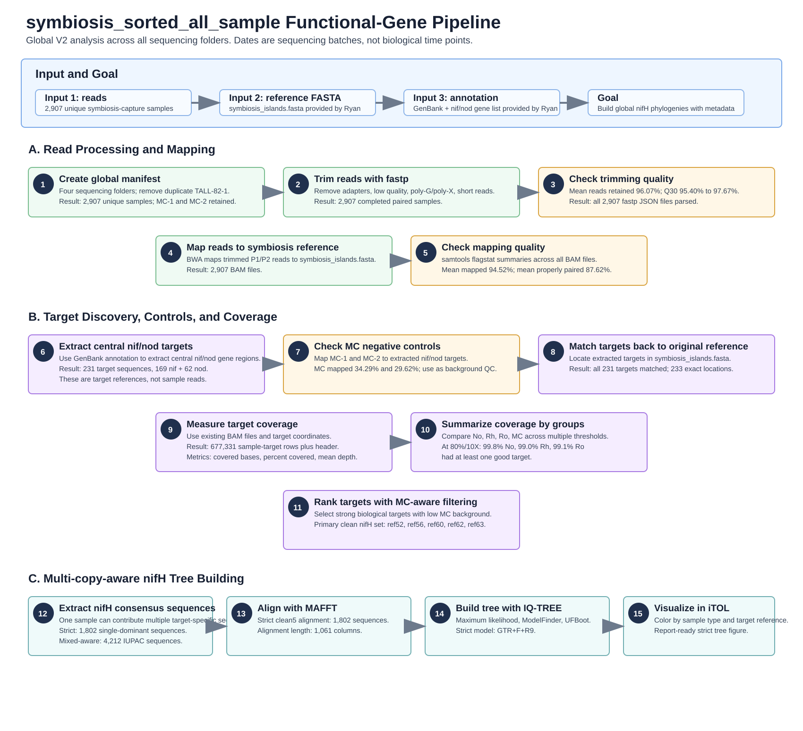

# symbiosis_sorted_all_sample Analysis Report

## Summary

This V2 analysis expands the earlier pilot from one processed August2025 folder to a global analysis across all available `symbiosis_sorted` sequencing batches. The sequencing dates are treated as sequencing batches, not biological time points. The analysis uses all unique samples, includes MC-1 and MC-2 as mock-community negative/background controls, and builds a multi-reference nifH tree that allows one sample to contribute more than one target-specific nifH sequence.

## Samples 
Across the original symbiosis_sorted data, I found four sequencing folders. After excluding the duplicate AAA_deletecopy, there are 2,910 R1 files representing 2,907 unique sample names. The sample types are approximately 952 nodule (No) samples, 989 rhizosphere (Rh) samples, 964 root (Ro) samples, and ONLY 2 mock-community controls (MC-1 and MC-2). The MC controls are present in the May2025 original symbiosis_sorted folder.

The sequencing-folder summaries are:

July2024:      24 samples, 2 site groups
May2025:    1,536 samples, 27 site groups, including MC-1 and MC-2
August2025: 1,116 samples, 28 site groups
December2025: 234 samples, 13 site groups
I also found only three sample names that appear in more than one sequencing folder: TALL-82-1-No, TALL-82-1-Rh, and TALL-82-1-Ro, which appear in both August2025 and December2025.

## Main Inputs

The analysis used symbiosis-capture reads from four sequencing batches and reference/annotation files provided by Ryan:

| Input | Description |
|---|---|
| Raw reads | 2,907 unique sample pairs after duplicate handling |
| Reference FASTA | `symbiosis_islands.fasta`, provided by Ryan |
| Annotation | `symbiosis_islands.gb` and gene list, provided by Ryan |
| Sample groups | 952 No, 989 Rh, 964 Ro, and 2 MC samples |

The duplicate sample names `TALL-82-1-No`, `TALL-82-1-Rh`, and `TALL-82-1-Ro` appeared in both August2025 and December2025. The December2025 copies were retained and the August2025 copies were excluded from the clean manifest.

## Read Cleaning and Mapping QC

Read trimming was performed with `fastp`. All 2,907 samples had successful fastp JSON summaries. The mean read-retention rate was 96.07%, and mean Q30 improved from 95.40% before trimming to 97.67% after trimming. The full trimming QC summary is available in [fastp_qc_overall_summary.tsv](../result/tables/fastp_qc_overall_summary.tsv), and the main QC figure is [fastp_qc_summary.svg](../result/figures/fastp_qc_summary.svg).

Trimmed reads were mapped to `symbiosis_islands.fasta` with BWA and summarized with `samtools flagstat`. All 2,907 samples had mapping summaries. The mean mapped-read percentage was 94.52%, the median mapped-read percentage was 95.11%, and the mean properly paired percentage was 87.62%. Mapping QC outputs are available in [symbiosis_mapping_overall_summary.tsv](../result/tables/symbiosis_mapping_overall_summary.tsv) and [symbiosis_mapping_qc_histograms.svg](../result/figures/symbiosis_mapping_qc_histograms.svg).

## nif/nod Target Extraction and MC Controls

The target extraction step used the GenBank annotation and gene list provided by Ryan to recover central nif/nod gene regions. This produced 231 unique target sequences: 169 nif targets and 62 nod targets. All 231 extracted targets matched the original reference FASTA, with 233 exact reference locations. Relevant target tables are [central_nif_nod_gene_summary.tsv](../result/tables/central_nif_nod_gene_summary.tsv) and [nif_nod_matches_in_original_reference.tsv](../result/tables/nif_nod_matches_in_original_reference.tsv).

Ryan clarified that BLAN is a real NEON site rather than a blank control. Therefore, MC-1 and MC-2 were used as the negative/background-control check. When MC reads were mapped to extracted nif/nod targets, MC-1 had 34.29% mapped reads and MC-2 had 29.62% mapped reads. Both had the same top target, `nifA|NC_009937|NC_009937_-_nifA_CDS|ref4`. This means MC is useful as a conservative background screen, but not as a zero-signal expectation. The table is [nif_nod_mc_negative_control_mapping_summary.tsv](../result/tables/nif_nod_mc_negative_control_mapping_summary.tsv).

## Coverage Summary

Coverage was measured for every sample and every target region using the existing BAM files and target coordinates. The full coverage table contains 677,331 sample-target rows plus a header. Because the uncompressed table is large, the repository copy is compressed as [nif_nod_region_coverage_all_samples.tsv.gz](../result/tables/nif_nod_region_coverage_all_samples.tsv.gz).

At the strict 80% covered / 10X mean-depth threshold:

| Sample group | Samples | Samples with any good target | Samples with any good nif target | Samples with any good nod target |
|---|---:|---:|---:|---:|
| No | 952 | 950 | 950 | 761 |
| Rh | 989 | 979 | 978 | 576 |
| Ro | 964 | 955 | 954 | 532 |
| MC | 2 | 2 | 2 | 2 |

These results show that the biological samples have broad nif/nod target signal, but MC also has non-zero target-associated mapping. Therefore, target-level MC-aware ranking is more informative than treating MC as a zero-control group. Coverage summaries are in [nif_nod_coverage_overall_threshold_summary.tsv](../result/tables/nif_nod_coverage_overall_threshold_summary.tsv), [nif_nod_gene_coverage_summary_by_sample_type_thresholds.tsv](../result/tables/nif_nod_gene_coverage_summary_by_sample_type_thresholds.tsv), and [v2_gene_coverage_heatmap_pct80_depth10.svg](../result/figures/v2_gene_coverage_heatmap_pct80_depth10.svg).

## nifH Target Selection

There were 14 nifH target references in the target set. For the first V2 tree, five targets were selected as the primary MC-aware clean set:

| Target | No good | Rh good | Ro good | MC good | Interpretation |
|---|---:|---:|---:|---:|---|
| ref56 | 671 | 690 | 571 | 0 | strongest clean target |
| ref63 | 459 | 373 | 341 | 0 | strong clean target |
| ref52 | 244 | 145 | 132 | 0 | clean target |
| ref62 | 111 | 97 | 91 | 0 | clean target |
| ref60 | 125 | 84 | 78 | 0 | clean and divergent target |

Other targets, including ref55, ref61, and ref54, had strong biological coverage but also MC-good calls, so they are better treated as sensitivity-analysis targets rather than the primary clean target set. The nifH target summary is [v2_nifH_target_good_coverage_by_sample_type_pct80_depth10.tsv](../result/tables/v2_nifH_target_good_coverage_by_sample_type_pct80_depth10.tsv).

## Multi-copy-aware nifH Strategy

The earlier pilot produced one dominant nifH consensus per sample for one reference target. V2 changes that assumption. For the five clean nifH targets, each sample can contribute one target-specific nifH consensus sequence for each target that passes QC. This means one sample can appear multiple times in the tree, for example as `sample|ref56|pass_single_dominant` and `sample|ref63|pass_single_dominant`.

This approach directly addresses the concern that biological samples may contain more than one nitrogen-fixing organism. The V2 extraction generated:

| Sequence set | Description | Count |
|---|---|---:|
| Strict single-dominant | Only clear dominant consensus calls | 1,802 |
| Mixed-aware IUPAC | Single + mixed possible multicopy cases with ambiguity codes | 4,212 |
| Unique biological samples with at least one clean nifH target | Across the five-target set | 2,428 |

The conceptual figure [nifH_clean5_one_sample_alignment_concept.svg](../result/figures/nifH_clean5_one_sample_alignment_concept.svg) explains how one sample can map to multiple clean nifH reference regions and contribute multiple target-specific sequences.

## Strict nifH Tree

The strict single-dominant FASTA was aligned with MAFFT. The alignment contained 1,802 sequences and 1,061 alignment columns. IQ-TREE inferred a maximum-likelihood tree using ModelFinder and ultrafast bootstrap. The best-fit model by BIC was GTR+F+R9. The tree output is [nifH_clean5_strict_single_dominant.treefile](../result/trees/nifH_clean5_strict_single_dominant.treefile), and the IQ-TREE report is [nifH_clean5_strict_single_dominant.iqtree](../result/trees/nifH_clean5_strict_single_dominant.iqtree).

The strict tree shows multiple divergent nifH lineages. Coloring by target reference indicates that the selected targets do not contribute identical phylogenetic signal. In particular, ref60 forms a distinct divergent clade, while ref52 and ref63 show more overlap. This supports the V2 multi-reference approach: a single-reference pilot tree would capture only part of the nifH diversity present in the samples.

## Report-ready Figure Caption

**Strict single-dominant nifH phylogeny from five MC-clean reference targets.** Maximum-likelihood tree inferred from 1,802 strict single-dominant sample-target nifH consensus sequences. Each tip represents one sample mapped to one nifH target reference. Color annotations show sample type and target reference, highlighting that the five selected nifH targets capture multiple distinct nifH lineages.

## Key Conclusions

1. The global V2 analysis includes 2,907 unique samples across all sequencing batches.
2. Trimming and mapping QC were strong across the dataset.
3. MC controls are not zero-signal; therefore they are best used for conservative target ranking rather than simple absence/presence filtering.
4. Five nifH target references, ref52, ref56, ref60, ref62, and ref63, were selected as the primary MC-aware clean set.
5. The multi-copy-aware approach avoids forcing one sample into one nifH sequence and allows samples to contribute multiple target-specific nifH sequences.
6. The strict nifH tree contains 1,802 sample-target sequences and recovers multiple divergent nifH lineages.

## Important Files

| File | Purpose |
|---|---|
| [flowchart.md](./flowchart.md) | Step-by-step pipeline with input, code, and result links |
| [symbiosis_sorted_all_sample_pipeline.svg](./symbiosis_sorted_all_sample_pipeline.svg) | Pipeline overview figure |
| [single_dominant.svg](../result/figures/single_dominant.svg) | iTOL strict tree figure |
| [strict_itol_sample_type_colorstrip.txt](../result/itol_annotations/strict_itol_sample_type_colorstrip.txt) | iTOL sample-type annotation |
| [strict_itol_target_ref_colorstrip.txt](../result/itol_annotations/strict_itol_target_ref_colorstrip.txt) | iTOL target-reference annotation |
| [nifH_clean5_strict_single_dominant.treefile](../result/trees/nifH_clean5_strict_single_dominant.treefile) | Strict tree file |
| [nif_nod_region_coverage_all_samples.tsv.gz](../result/tables/nif_nod_region_coverage_all_samples.tsv.gz) | Full coverage table, compressed |
