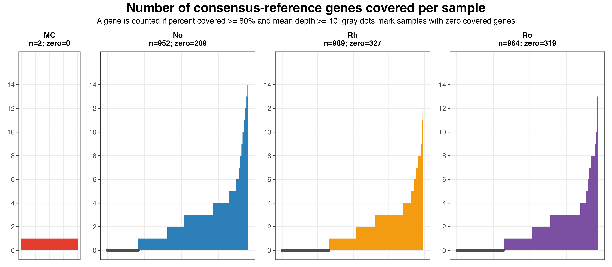
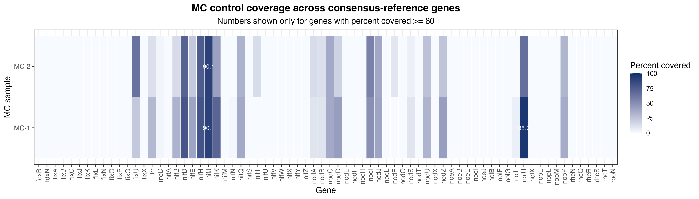
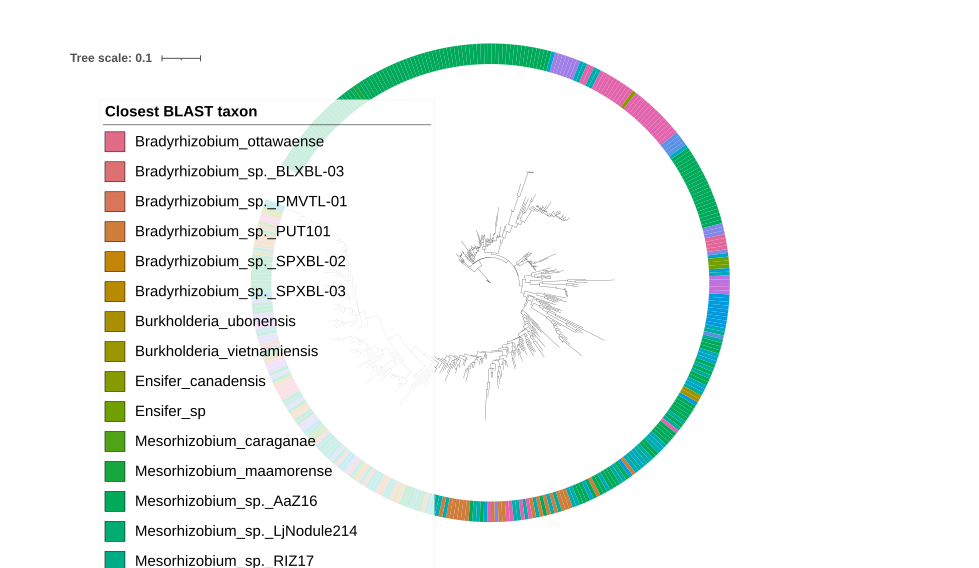
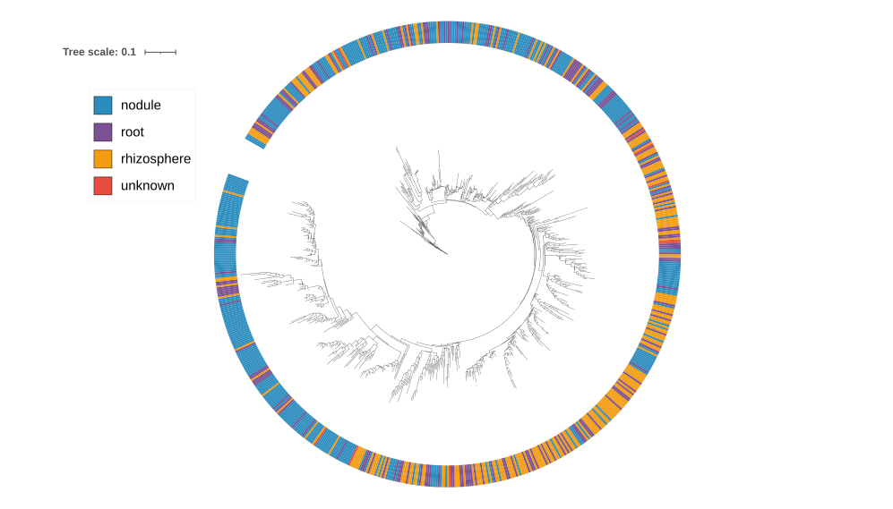
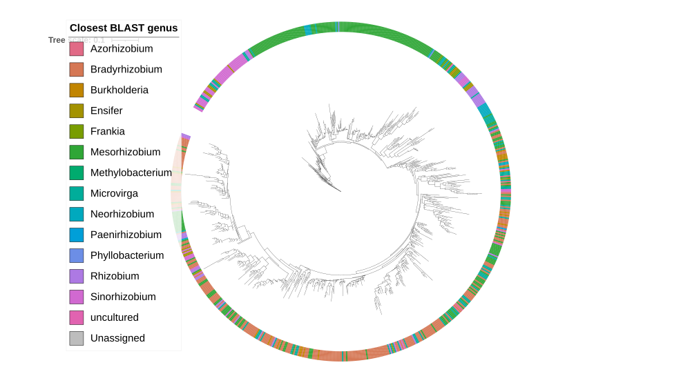
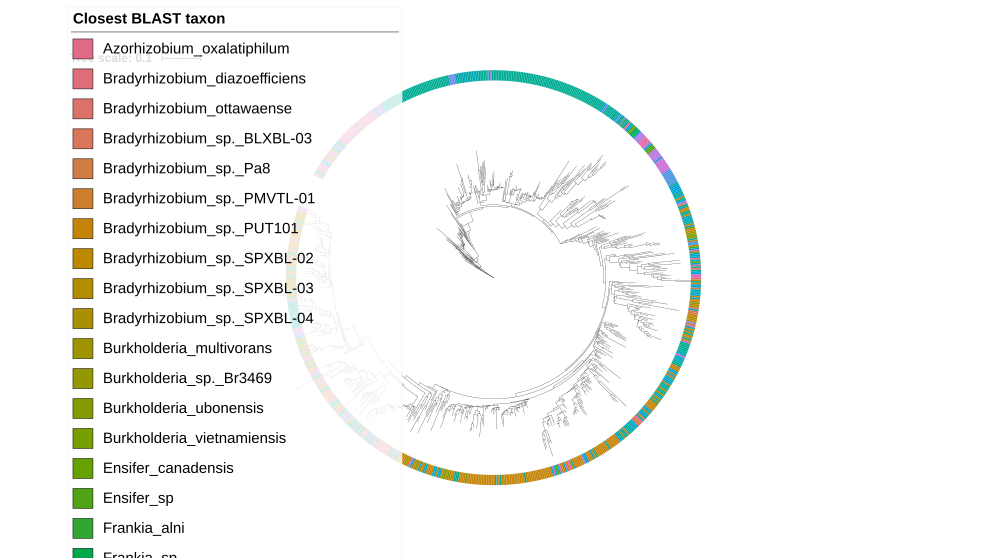

# symbiosis_sorted_all_sample_consensus_sequences_50percent Analysis Report

## Overview

This report summarizes the all-sample `symbiosis_sorted` functional-gene analysis using the updated `consensus_sequences_50percent.fasta` reference provided by Pranoti. The reference contains one consensus sequence per functional gene. IUPAC ambiguity codes are allowed when supported by at least 50% of the source sequences.

The goal of this version was to move from the earlier multi-region symbiosis-island reference to a cleaner gene-level reference. In the previous design, one gene such as `nifH` could have multiple target regions (14), so one biological sample could contribute multiple sample-target sequences to the same gene tree. In the consensus50 reference, each gene is represented once.

The first tree-building target was `nifH`, because it is a standard nitrogen-fixation marker and showed strong recovery in the consensus50 mapping and coverage results.

Reference: https://github.com/ryanafolk/intbio_microbiome/blob/main/references/functional_rosa/consensus_sequences_50percent.fasta
Alignment `nifH`:https://github.com/ryanafolk/intbio_microbiome/blob/main/references/functional_rosa/alignments/nifH.fa.aln 
## Key Conclusions

| Result | Value |
|---|---:|
| Samples analyzed | 2,907 |
| Functional genes in consensus50 reference | 72 |
| Sample-gene coverage rows | 2,907 * 72 = 209,304 |
| Good sample-gene rows, percent covered >=80 and mean depth >=10 | 6,179 |
| Samples with at least one good gene | 2,052 |
| Samples with good `nifH` coverage at >=80% and depth >=10 | 1,572 |
| Strict single-dominant `nifH` tree tips, pct80/depth10/N<=20 | 387 |
| Mixed-IUPAC `nifH` tree tips, pct80/depth10/N<=20 | 1,538 |
| `nifH` tree tips, pct60/depth10/N<=40 | 751 |
| Reference-only nifH taxon tree tips | 746 |
| Metadata rows | 2,898 |

The main recommended tree for interpretation is the **strict single-dominant pct80/depth10/N<=20 nm5000 tree** with **387** sample-derived consensus sequences. Also, I report the  **mixed-IUPAC pct80/depth10/N<=20 nm5000 tree** and  **single-dominant pct60/depth10/N<=40 nm5000 tree** trees, but their UFBoot support did not fully converge even with additional iterations.

## Main Inputs

| Input | Method/code run | Result/output |
|---|---|---|
| Trimmed paired-end reads from all samples | Reused previously trimmed all-sample V2 `fastp` output. No new trimming was performed in this version. | Cluster path: `/mnt/dv/wid/projects6/SolisLemus-Intbio-raw/processed-data/symbiosis_sorted_v2/symbiosis_trimmed_fastp` |
| Consensus50 functional-gene reference | Reference provided by Pranoti/Ryan; one gene-level consensus sequence per target gene. | [`consensus_sequences_50percent.fasta`](../result/reference/consensus_sequences_50percent.fasta) |
| Metadata | Used for sample matching and iTOL tree annotation. | [`intbio_metadata_draft4.csv`](../result/tables/intbio_metadata_draft4.csv) |

## Reference Summary

The consensus50 reference contains 72 functional-gene reference sequences. Each record is a gene-level consensus, not a long symbiosis-island region.

| Reference property | Value |
|---|---:|
| Reference records | 72 genes |
| Minimum gene length | 168 bp |
| Maximum gene length | 3,528 bp |
| Total reference length | 78,357 bp |
| A/C/G/T bases | 70,208 bp, 89.60% |
| IUPAC ambiguity bases excluding `N` | 6,724 bp, 8.58% |
| `N` bases | 1,425 bp, 1.82% |

Important interpretation: BWA-MEM does not biologically interpret IUPAC ambiguity codes as multiple possible alleles during mapping. Ambiguity-aware interpretation is handled later during pileup-based consensus calling.

## Step 1. Reuse Trimmed Reads

No new read trimming was done. The analysis reused the previously trimmed paired-end FASTQ files from the all-sample V2 analysis.

| Input | Method/code run | Result/output |
|---|---|---|
| V2 trimmed paired reads: `*_P1.fastq.gz` and `*_P2.fastq.gz` | No new code. Reads were already trimmed by `fastp` in the previous V2 workflow. | 2,907 paired samples available for mapping. |

## Step 2. Map Reads to the Consensus50 Reference

All trimmed samples were mapped to the consensus50 reference using BWA-MEM. Alignments were sorted and indexed with `samtools`.

| Input | Method/code run | Result/output |
|---|---|---|
| Trimmed paired FASTQ files and [`consensus_sequences_50percent.fasta`](../result/reference/consensus_sequences_50percent.fasta) | [`11_map_consensus50_all_samples_parallel.sh`](../code/11_map_consensus50_all_samples_parallel.sh) | Cluster BAM folder: `/mnt/dv/wid/projects6/SolisLemus-Intbio-raw/processed-data/symbiosis_sorted_v2_consensus_sequences_50percent/consensus_mapping_full` |
| Reference FASTA | `bwa index` was run if index files were missing. | BWA index files beside the reference on the cluster. |
| Each sample pair | `bwa mem -t $BWA_THREADS $REF P1 P2`, piped to `samtools sort -@ $SORT_THREADS`; then `samtools index` and `samtools flagstat`. | Mapping logs on cluster: `/mnt/dv/wid/projects6/SolisLemus-Intbio-raw/processed-data/symbiosis_sorted_v2_consensus_sequences_50percent/consensus_mapping_logs` |

### Mapping Parameters

| Parameter | Value |
|---|---|
| Mapper | BWA-MEM |
| BWA threads per job | 4 by default |
| Parallel jobs | configurable; full run used GNU Parallel |
| Sort tool | `samtools sort` |
| Sort threads per job | 2 by default |
| BAM index | `samtools index` |
| Mapping QC | `samtools flagstat` |

The total mapped-read percentage is lower than in the earlier symbiosis-island mapping because this reference is much smaller and contains only 72 gene sequences. 
## Step 3. Calculate Per-Gene Coverage

Coverage was calculated for every sample-gene pair.

| Input | Method/code run | Result/output |
|---|---|---|
| BAM files from `consensus_mapping_full`; consensus50 gene lengths | [`12_calculate_consensus_gene_coverage_v2.sh`](../code/12_calculate_consensus_gene_coverage_v2.sh) | [`consensus50_gene_coverage_all_samples.tsv`](../result/tables/consensus50_gene_coverage_all_samples.tsv) |
| Same coverage output | Local R code summarized coverage bins at mean depth >=10. | [`consensus50_gene_coverage_bins_depth10.tsv`](../result/tables/consensus50_gene_coverage_bins_depth10.tsv) |

### Coverage Table Columns

| Column | Meaning |
|---|---|
| `sample` | Sample ID. |
| `gene_ref` | Reference FASTA record, for example `nifH.fa`. |
| `gene` | Gene name after removing `.fa`. |
| `gene_length` | Length of the reference gene. |
| `covered_bases` | Number of reference positions with depth > 0. |
| `percent_covered` | `covered_bases / gene_length * 100`. |
| `mean_depth` | Mean depth across the full gene, including zero-depth positions. |
| `max_depth` | Maximum observed depth at any position in the gene. |

### Good-Coverage Definition

A sample-gene pair was counted as good when:

- `percent_covered >= 80`
- `mean_depth >= 10`

| Metric | Value |
|---|---:|
| Samples analyzed | 2,907 |
| Genes in consensus50 reference | 72 |
| Total sample-gene rows | 209,304 |
| Good sample-gene rows | 6,179 |
| Samples with at least one good gene | 2,052 |
| Good `nifH` sample-gene rows | 1,572 |

## Step 4. Summarize Gene Recovery Per Sample

For each sample, the number of genes passing the good-coverage threshold was counted.

| Input | Method/code run | Result/output |
|---|---|---|
| [`consensus50_gene_coverage_all_samples.tsv`](../result/tables/consensus50_gene_coverage_all_samples.tsv) | Local R visualization code counted genes with `percent_covered >= 80` and `mean_depth >= 10`. | [`consensus50_genes_per_sample_pct80.png`](../result/figures/consensus50_genes_per_sample_pct80.png) |
| Same table, grouped by sample type| Local R code also generated 50/10 and 80/10 versions. | [`covered_gene_count_by_sample_type_50_10.png`](../result/figures/covered_gene_count_by_sample_type_50_10.png), [`covered_gene_count_by_sample_type_80_10.png`](../result/figures/covered_gene_count_by_sample_type_80_10.png) |

## Step 5. Check MC Controls

BLAN is a real NEON site and should not be treated as a negative control. The only negative-control-like samples in this dataset are `MC-1` and `MC-2`, which are mock-community controls.

In simple words, `MC-1` and `MC-2` are samples with a known mock microbial community that should not contain nitrogen-fixing signal. They are useful for checking background/off-target signal, but there are only two of them.

| Input | Method/code run | Result/output |
|---|---|---|
| [`consensus50_gene_coverage_all_samples.tsv`](../result/tables/consensus50_gene_coverage_all_samples.tsv) | Filter `MC-1` and `MC-2`, then inspect genes with `percent_covered >= 80` and `mean_depth >= 10`. | [`consensus50_MC_gene_coverage_pct80.png`](../result/figures/consensus50_MC_gene_coverage_pct80.png) |

| MC result | Value |
|---|---:|
| MC samples | 2 |
| MC samples with at least one good gene | 2 |
| Gene recovered in both MC controls | `nifJ` |
| MC-1 `nifJ` coverage/depth | 90.08%; mean depth 14.38 |
| MC-2 `nifJ` coverage/depth | 90.05%; mean depth 10.15 |

Because the MC controls are n=2 and not zero-signal, they should be reported as a limited background check rather than used as a strict absence/presence filter.

## Step 6. Construct nifH Consensus Sequences

The first tree target was `nifH`. For the main analysis, a sample was selected for nifH consensus construction if `nifH` passed `percent_covered >= 80` and `mean_depth >= 10`.

| Input | Method/code run | Result/output |
|---|---|---|
| [`consensus50_gene_coverage_all_samples.tsv`](../result/tables/consensus50_gene_coverage_all_samples.tsv), consensus50 BAM files, and [`consensus_sequences_50percent.fasta`](../result/reference/consensus_sequences_50percent.fasta) | [`13_run_nifH_consensus_consensus50.sh`](../code/13_run_nifH_consensus_consensus50.sh), which calls [`13_extract_nifH_consensus_consensus50.py`](../code/13_extract_nifH_consensus_consensus50.py). | [`nifH_consensus_qc.tsv`](../result/tables/nifH_consensus_qc.tsv) |
| Single-dominant sequences | Pileup-based dominant-base consensus; only `pass_single_dominant` sequences are written to the strict FASTA. | [`nifH_consensus50_strict_single_dominant_pct80_depth10_Nle20.fasta`](../result/sequences/nifH_consensus50_strict_single_dominant_pct80_depth10_Nle20.fasta) |
| Single-dominant plus mixed-template sequences | Pileup-based consensus with IUPAC ambiguity codes for mixed positions. | [`nifH_consensus50_iupac_all_pass_pct80_depth10_Nle20.fasta`](../result/sequences/nifH_consensus50_iupac_all_pass_pct80_depth10_Nle20.fasta) |

### Pileup and Consensus Parameters

| Parameter | Value |
|---|---:|
| Target gene | `nifH.fa` |
| nifH reference length | 997 bp |
| Sample selection | `percent_covered >= 80`; `mean_depth >= 10` |
| Minimum base quality | Q20 |
| Minimum mapping quality | MAPQ 10 |
| Maximum allowed `N` percent | 20% |
| Mixed-site minimum depth | 20 |
| Mixed-site minor allele count | >=5 |
| Mixed-site minor allele fraction | >=0.20 |
| Mixed-sequence classification | mixed positions >10 |

### Treatment of Reference Ambiguity

The reference contains IUPAC ambiguity codes and some `N` bases. During consensus construction, these reference characters are not copied into the sample sequence automatically. Each sample position is called from aligned reads:

- if reads strongly support a single base, the sample consensus receives that A/C/G/T base;
- if two or more bases pass the mixed-site rule, the mixed-IUPAC sequence receives an ambiguity code such as `R` for A/G or `Y` for C/T;
- if read support is missing or too weak, the sample consensus receives `N`.

Therefore, `N` in the final sample consensus means unknown/no confident sample-level base, not necessarily that the raw reads contained `N`.

### nifH Consensus Output, pct80/depth10/N<=20

| Status | Count | Meaning |
|---|---:|---|
| `pass_single_dominant` | 387 | Clear dominant consensus; included in strict tree. |
| `pass_mixed_possible_multitemplate` | 1,151 | Passes coverage/N filters but has >10 mixed positions; included in mixed-IUPAC tree. |
| `fail_high_N` | 34 | Excluded because N percent was >20%. |
| Total evaluated | 1,572 | Samples with enough nifH coverage to attempt consensus calling. |

The strict FASTA contains 387 sequences. The mixed-IUPAC FASTA contains 1,538 sequences, which equals 387 single-dominant plus 1,151 mixed-possible-multitemplate sequences.

## Step 7. Sensitivity Consensus Set at pct60/depth10/N<=40

A analysis was also run to see how many additional single-dominant sequences could be recovered when allowing lower coverage and more missing positions.

| Input | Method/code run | Result/output |
|---|---|---|
| Same BAM and coverage files | [`17_run_nifH_strict_tree_pct60_depth10_Nle40_nm5000_consensus50.sh`](../code/17_run_nifH_strict_tree_pct60_depth10_Nle40_nm5000_consensus50.sh) | [`nifH_consensus_qc_pct60_depth10_Nle40.tsv`](../result/tables/nifH_consensus_qc_pct60_depth10_Nle40.tsv) |

| Status | Count | Meaning |
|---|---:|---|
| `pass_single_dominant` | 751 | Included in tree. |
| `pass_mixed_possible_multitemplate` | 1,843 | Still mixed; not included in tree. |
| `fail_high_N` | 9 | Excluded because N percent was >40%. |
| Total evaluated | 2,603 | Samples with enough nifH coverage to attempt consensus calling. |

## Step 8. Align nifH Consensus Sequences

Consensus sequences were aligned with MAFFT before tree inference.

| Input | Result/output | Tree tips / alignment summary |
|---|---|---|
| Strict FASTA, pct80/depth10/N<=20 | [`nifH_consensus50_strict_single_dominant.mafft.fasta`](../result/sequences/nifH_consensus50_strict_single_dominant.mafft.fasta) | 387 sequences; alignment length 997 bp; A/C/G/T = 82.55%; IUPAC ambiguity excluding N = 0.00%; N = 17.45%; gaps = 0.00% |
| Mixed-IUPAC FASTA, pct80/depth10/N<=20  | [`nifH_consensus50_iupac_all_pass.mafft.fasta`](../result/sequences/nifH_consensus50_iupac_all_pass.mafft.fasta) | 1,538 sequences (pass_single_dominant:387, pass_mixed_possible_multitemplate:1,151); alignment length 997 bp; A/C/G/T = 79.44%; IUPAC ambiguity excluding N = 3.33%; N = 17.23%; gaps = 0.00% |
|pct60/depth10/N<=40  | [`nifH_consensus50_strict_single_dominant_pct60_depth10_Nle40.mafft.fasta`](../result/sequences/nifH_consensus50_strict_single_dominant_pct60_depth10_Nle40.mafft.fasta) | 751 sequences; alignment length 1,046 bp; A/C/G/T = 73.83%; IUPAC ambiguity excluding N = 0.00%; N = 21.49%; gaps = 4.68% |

Because all sequences are reconstructed against the same `nifH.fa` coordinate system, the pct80 alignments are 997 bp. The  pct60/Nle40 alignment is 1,046 bp, indicating additional alignment uncertainty after including sequences with more missing data.

## Step 9. Build nifH Trees with IQ-TREE

Tree inference used IQ-TREE with ModelFinder and support estimation.

### IQ-TREE Parameters

| Parameter | Value |
|---|---|
| Tree program | IQ-TREE |
| Sequence type | DNA (`-st DNA`) |
| Model search | ModelFinder (`-m MFP`) for first model selection runs |
| Branch support 1 | 1,000 ultrafast bootstraps (`-B 1000`) |
| Branch support 2 | 1,000 SH-aLRT replicates (`-alrt 1000`) |
| Extended bootstrap search | `-nm 5000` for final nm5000 trees |
| Threads | `AUTO` |

### Tree Files and Metrics

### Tree Files and Metrics

| Tree | Tips/nodes | Alignment length | Best model | Tree length | Support/convergence | Main files |
|---|---:|---:|---|---:|---|---|
| Strict single-dominant pct80/depth10/N<=20, nm5000 | 387 sample consensus tips | 997 bp | `GTR+F+R7` | 9.7892 | Final UFBoot correlation 0.994; no final nonconvergence warning in nm5000 log. | [`treefile`](symbiosis_sorted_all_sample_consensus_sequences_50percent/result/trees/nifH_consensus50_strict_single_dominant_nm5000.treefile), [`contree`](symbiosis_sorted_all_sample_consensus_sequences_50percent/result/trees/nifH_consensus50_strict_single_dominant_nm5000.contree), [`iqtree`](symbiosis_sorted_all_sample_consensus_sequences_50percent/result/trees/nifH_consensus50_strict_single_dominant_nm5000.iqtree), [`log`](symbiosis_sorted_all_sample_consensus_sequences_50percent/result/trees/nifH_consensus50_strict_single_dominant_nm5000.log) |
| Mixed-IUPAC pct80/depth10/N<=20, nm5000 | 1,538 sample consensus tips | 997 bp | `GTR+F+I+R9` | 27.1782 | Bootstrap did not converge; final warning remains. Use as exploratory/sensitivity tree. | [`treefile`](symbiosis_sorted_all_sample_consensus_sequences_50percent/result/trees/nifH_consensus50_iupac_all_pass_nm5000.treefile), [`contree`](symbiosis_sorted_all_sample_consensus_sequences_50percent/result/trees/nifH_consensus50_iupac_all_pass_nm5000.contree), [`iqtree`](symbiosis_sorted_all_sample_consensus_sequences_50percent/result/trees/nifH_consensus50_iupac_all_pass_nm5000.iqtree), [`log`](symbiosis_sorted_all_sample_consensus_sequences_50percent/result/trees/nifH_consensus50_iupac_all_pass_nm5000.log) |
| Relaxed strict pct60/depth10/N<=40, nm5000 | 751 sample consensus tips | 1,046 bp | `GTR+F+I+R8` | 19.3354 | Bootstrap did not converge; final warning remains. Use as sensitivity tree. | [`treefile`](symbiosis_sorted_all_sample_consensus_sequences_50percent/result/trees/nifH_consensus50_strict_single_dominant_pct60_depth10_Nle40_nm5000.treefile), [`contree`](symbiosis_sorted_all_sample_consensus_sequences_50percent/result/trees/nifH_consensus50_strict_single_dominant_pct60_depth10_Nle40_nm5000.contree), [`iqtree`](symbiosis_sorted_all_sample_consensus_sequences_50percent/result/trees/nifH_consensus50_strict_single_dominant_pct60_depth10_Nle40_nm5000.iqtree), [`log`](symbiosis_sorted_all_sample_consensus_sequences_50percent/result/trees/nifH_consensus50_strict_single_dominant_pct60_depth10_Nle40_nm5000.log) |
| Reference-only nifH taxon tree, nm5000 | 746 reference taxa/accessions | 1,379 bp | `TIM+F+R4` | 43.0413 | Final UFBoot correlation 0.994; warnings include many gap/ambiguity-rich reference sequences and some saturated distances. | [`treefile`](symbiosis_sorted_all_sample_consensus_sequences_50percent/result/trees/nifH_reference_746_taxa_tree_nm5000.treefile), [`contree`](symbiosis_sorted_all_sample_consensus_sequences_50percent/result/trees/nifH_reference_746_taxa_tree_nm5000.contree), [`iqtree`](symbiosis_sorted_all_sample_consensus_sequences_50percent/result/trees/nifH_reference_746_taxa_tree_nm5000.iqtree), [`log`](symbiosis_sorted_all_sample_consensus_sequences_50percent/result/trees/nifH_reference_746_taxa_tree_nm5000.log) |

## Step 10. BLAST Assignment of Sample Consensus Sequences

BLAST was used after consensus construction to assign each sample-derived nifH consensus sequence to the closest known nifH reference sequence. This is different from the earlier BWA mapping step:

- BWA maps raw reads to the consensus50 gene reference so we can construct sample consensus sequences.
- BLAST compares each finished sample consensus sequence against the 746-reference nifH database to find the closest known reference hit.

This BLAST step is an annotation step, not the original read-mapping step.

| Tree/set | Input | Method/code run | Result/output |
|---|---|---|---|
| Strict pct80/depth10/N<=20 | 387 strict sample consensus sequences | BLASTN against ungapped 746 nifH reference sequences. | [`sample_nifH_best_reference_hit_with_taxon.tsv`](../result/tables/sample_nifH_best_reference_hit_with_taxon.tsv) |
| Mixed-IUPAC pct80/depth10/N<=20 | 1,538 mixed-IUPAC sample consensus sequences | BLASTN against ungapped 746 nifH reference sequences. | [`iupac_nifH_best_reference_hit_with_taxon.tsv`](../result/tables/iupac_nifH_best_reference_hit_with_taxon.tsv) |
| pct60/depth10/N<=40 | 751  consensus sequences | [`26_blast_assign_strict_pct60_nifH_consensus_to_reference_taxa.sh`](../code/26_blast_assign_strict_pct60_nifH_consensus_to_reference_taxa.sh) | [`strict_pct60_nifH_best_reference_hit_with_taxon.tsv`](../result/tables/strict_pct60_nifH_best_reference_hit_with_taxon.tsv) |

### BLAST Output Columns

| Column | Meaning |
|---|---|
| `sample_id` | Sample-derived consensus sequence ID used as the tree tip label. |
| `best_reference_id` | Full FASTA ID of the closest nifH reference hit. |
| `best_reference_taxon` | Taxon label parsed from the best reference hit. This is a closest known reference label, not confirmed species identity. |
| `percent_identity` | Percent nucleotide identity across the BLAST alignment. |
| `alignment_length` | Number of aligned bases in the BLAST local alignment. |
| `query_coverage_percent` | Percent of the sample consensus sequence covered by the BLAST alignment. |
| `reference_coverage_percent` | Percent of the reference sequence covered by the BLAST alignment when available. |
| `evalue` | BLAST E-value for the match. |
| `bitscore` | BLAST score; higher values indicate stronger local alignment. |

### BLAST Summary

| Set | Sample consensus sequences assigned | Unique closest taxa | Unique closest genera | Mean percent identity | Range percent identity | Mean query coverage |
|---|---:|---:|---:|---:|---:|---:|
| Strict pct80/depth10/N<=20 | 387 | 30 | 8 | 90.61% | 81.44-99.49% | 90.32% |
| Mixed-IUPAC pct80/depth10/N<=20 | 1,538 | 32 | 9 | 87.06% | 78.12-99.33% | 82.40% |
|  pct60/depth10/N<=40 | 751 | 45 | 14 | 90.55% | 81.44-99.49% | 76.46% |

The genus-level annotation is broader and easier to interpret. The taxon-level annotation is more specific, but should be interpreted as "closest known nifH reference hit" rather than a confirmed species call.

### Top Closest BLAST Genera

| Set | Most frequent closest genera |
|---|---|
| Strict pct80/depth10/N<=20 | `Mesorhizobium` 193, `Microvirga` 50, `Bradyrhizobium` 43, `Sinorhizobium` 41, `Rhizobium` 32, `Neorhizobium` 17, `Ensifer` 6, `Burkholderia` 5 |
| Mixed-IUPAC pct80/depth10/N<=20 | `Mesorhizobium` 598, `Bradyrhizobium` 415, `Microvirga` 220, `Rhizobium` 128, `Sinorhizobium` 104, `Burkholderia` 32, `Neorhizobium` 21, `Ensifer` 16, `Azorhizobium` 4 |
| pct60/depth10/N<=40 | `Mesorhizobium` 251, `Bradyrhizobium` 243, `Microvirga` 78, `Sinorhizobium` 62, `Rhizobium` 40, `Burkholderia` 20, `Ensifer` 19, `Neorhizobium` 19, `Frankia` 8, `Azorhizobium` 6 |

## Step 11. iTOL Tree Annotation

Tree annotations were prepared for metadata and BLAST/taxon summaries.

### Metadata Annotation Fields

| Annotation | Meaning |
|---|---|
| Sample type | `No`, `Rh`, `Ro`, or `MC`. |
| Site | Site code parsed from sample ID and/or metadata. |
| Host family | Plant host family from metadata. |
| Host tribe | Plant host tribe from metadata. |
| Native status | Native/non-native metadata category when available. |

### BLAST Annotation Fields

| Annotation | Meaning |
|---|---|
| Closest BLAST genus | Genus parsed from closest BLAST hit, for example `Mesorhizobium`. |
| Closest BLAST taxon | More specific closest-reference label, for example `Mesorhizobium_sp._AaZ16`. |
| BLAST confidence | Broad quality bin based on identity and query coverage. |
| Percent identity gradient | Continuous iTOL gradient showing BLAST percent identity. |
| Query coverage gradient | Continuous iTOL gradient showing how much of the sample consensus aligned. |
| Tip labels | Optional labels using closest taxon information. |

### Annotation Files

| Tree | Annotation folder |
|---|---|
| Strict pct80/depth10/N<=20 | [`../result/annotations`](../result/annotations) and [`../result/itol_annotations_blast_taxon`](../result/itol_annotations_blast_taxon) |
| Mixed-IUPAC pct80/depth10/N<=20 | [`../result/annotations`](../result/annotations) and [`../result/itol_annotations_blast_taxon_iupac_nm5000`](../result/itol_annotations_blast_taxon_iupac_nm5000) |
| pct60/depth10/N<=40 | [`../result/annotations`](../result/annotations) and [`../result/itol_annotations_blast_taxon_strict_pct60_Nle40_nm5000`](../result/itol_annotations_blast_taxon_strict_pct60_Nle40_nm5000) |

## Tree Figures

The final exported iTOL figures are stored in [`../result/trees/Figure`](../result/trees/Figure).

### Strict pct80/depth10/N<=20 Tree, 387 Tips

This is the main recommended tree because it includes only clear single-dominant sample consensus sequences and had the best bootstrap convergence behavior after the nm5000 run.

### Mixed-IUPAC pct80/depth10/N<=20 Tree, 1,538 Tips

This tree includes both single-dominant and mixed-possible-multitemplate sample consensus sequences. It shows broader sample recovery but should be treated as exploratory because UFBoot did not converge.

### pct60/depth10/N<=40 Tree, 751 Tips

This tree includes additional single-dominant sequences by allowing more missing sequence. It is useful for sensitivity checking, but bootstrap did not converge even with nm5000.

## Interpretation Notes

The MC controls (`MC-1` and `MC-2`) were used only as background checks because there were only two of them, so they are not strong enough to define a strict present/absent filter. Mixed-IUPAC calls mean that some positions in a sample had evidence for more than one nucleotide, which may suggest more than one `nifH` template in the sample. However, this is not direct proof of multiple organisms, because the method does not connect variants across the full gene into separate haplotypes. The tips in the sample trees are reconstructed `nifH` consensus sequences from samples, not confirmed bacterial species. BLAST labels such as `Mesorhizobium` or `Bradyrhizobium` should therefore be read as the closest known `nifH` reference match, not as final species identification.
## Interpretation

The consensus50 reference simplifies the analysis by giving one reference sequence per functional gene. This makes the `nifH` gene tree easier to interpret than the earlier multi-region design because each sample can contribute only one `nifH` consensus sequence.

At the sample level, 1,572 samples had enough `nifH` coverage to attempt consensus calling at the main 80% coverage and 10X mean depth threshold. Among those, 387 were clean single-dominant sequences and 1,151 showed mixed signal under the threshold rule. The mixed signal is biologically interesting, but it should be described as possible multiple-template signal, not proof of multiple organisms.

BLAST annotation shows that most strict sample consensus sequences are closest to known `Mesorhizobium`, `Microvirga`, `Bradyrhizobium`, `Sinorhizobium`, `Rhizobium`, and related nifH references. These are closest-reference assignments and are useful for annotation, but they should not be overinterpreted as exact species identifications.

The strict pct80/depth10/N<=20 tree is the strongest tree for reporting. The mixed-IUPAC and relaxed pct60 trees are valuable sensitivity checks because they show what happens when more samples are included, but their bootstrap convergence warnings mean they should be reported cautiously.

We mapped 2,907 symbiosis-capture samples to a 72-gene consensus functional reference and quantified per-gene coverage. At the 80% coverage and 10X mean-depth threshold, 1,572 samples had sufficient `nifH` recovery for consensus calling. We built a conservative strict `nifH` phylogeny from 387 single-dominant sample consensus sequences. We also generated mixed-IUPAC and relaxed-threshold sensitivity trees containing 1,538 and 751 sample consensus sequences, respectively. Sample consensus sequences were annotated by BLAST against a 746-sequence nifH reference alignment; these labels represent closest known nifH reference hits rather than confirmed species identities.

Mixed-IUPAC calls are threshold-based and indicate possible multiple-template signal, not direct proof of multiple organisms. MC controls were limited to two mock-community samples and therefore were treated as background checks rather than strict filters. Tree tips represent sample-derived nifH consensus sequences, not unique biological taxa.

