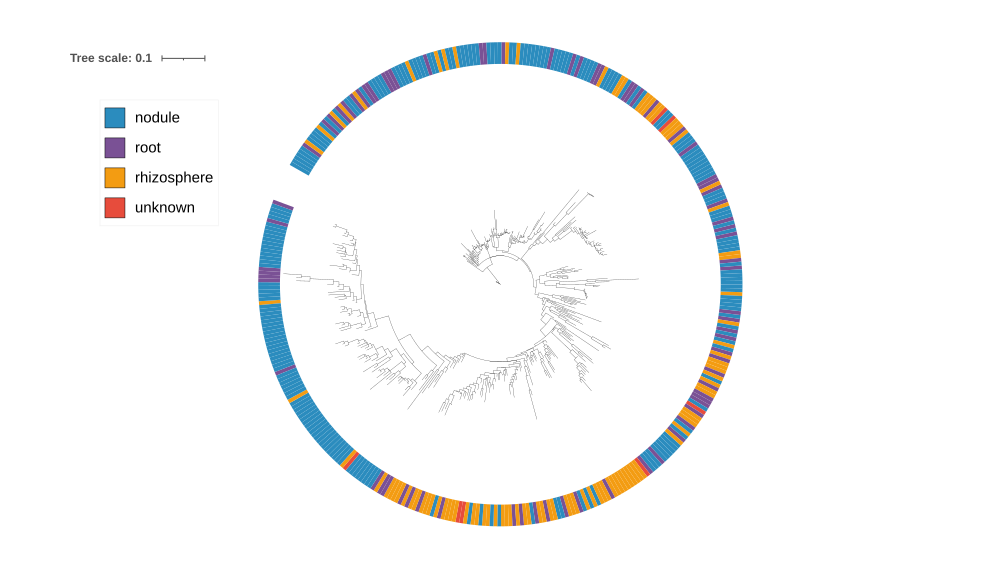
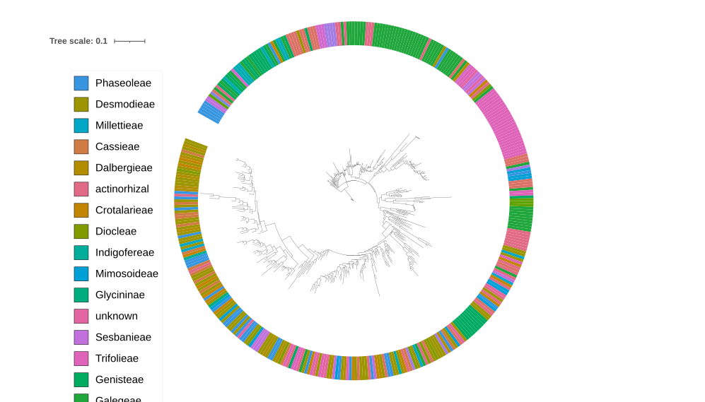
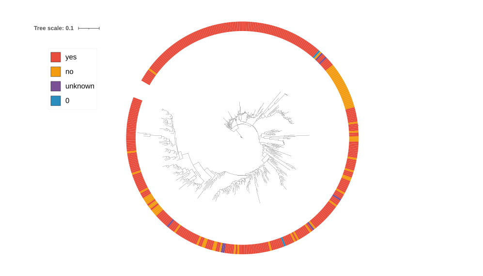
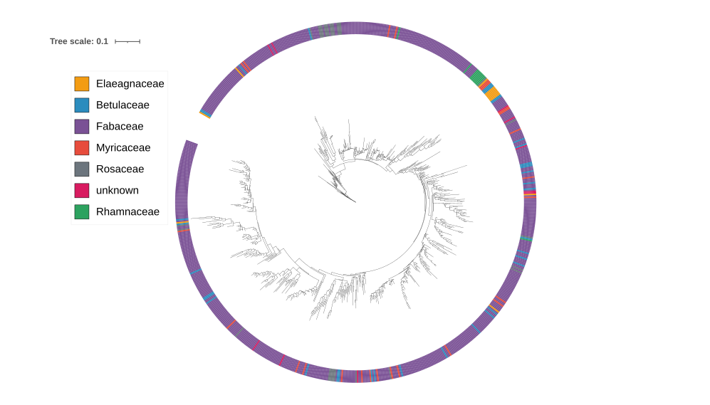

# symbiosis_sorted_all_sample_consensus_sequences_50percent Report

## Goal

This report summarizes the all-sample `symbiosis_sorted` functional-gene analysis using the updated `consensus_sequences_50percent.fasta` reference. This reference was provided by Pranoti/Ryan and contains one consensus sequence per functional gene, with IUPAC ambiguity codes allowed when supported by at least 50% of the source sequences.

The main goal of this version is to move from the earlier multi-region reference design to a cleaner gene-level reference design. In the previous reference, one gene such as `nifH` could have multiple target regions, so one biological sample could contribute multiple sample-target sequences to the same gene tree. In the consensus50 reference, each gene is represented once, so each sample can contribute at most one consensus sequence per gene.

The first tree-building target is `nifH`, because it is a standard nitrogen-fixation marker and showed strong recovery in the consensus50 mapping/coverage results.

## Key Results

| Result | Value |
|---|---:|
| Samples analyzed | 2,907 |
| Functional genes in consensus50 reference | 72 |
| Sample-gene coverage rows | 209,304 |
| Good sample-gene rows, percent covered >=80 and mean depth >=10 | 6,179 |
| Samples with at least one good gene | 2,052 |
| Samples with good `nifH` coverage | 1,572 |
| Strict nifH tree tips, pct80/depth10/N<=20 | 387 |
| Mixed-IUPAC nifH tree tips, pct80/depth10/N<=20 | 1,538 |
| Relaxed strict nifH tree tips, pct60/depth10/N<=40 | 751 |
| Metadata rows | 2,898 |
| Tree annotation fields prepared | sample type, site, host family, host tribe, native status |

## Main Inputs

| Input | Method/code run | Result/output |
|---|---|---|
| Trimmed paired-end reads from all samples | Reused the previously trimmed all-sample V2 `fastp` output. No new trimming was performed in this version. | Cluster path: `/mnt/dv/wid/projects6/SolisLemus-Intbio-raw/processed-data/symbiosis_sorted_v2/symbiosis_trimmed_fastp` |
| Consensus50 functional-gene reference | Reference provided by Pranoti/Ryan; one gene-level consensus sequence per target gene. | [`consensus_sequences_50percent.fasta`](../result/reference/consensus_sequences_50percent.fasta) |
| Metadata | Used for sample matching and iTOL tree annotation. | [`intbio_metadata_draft4.csv`](../result/tables/intbio_metadata_draft4.csv) |

## Reference Summary

The new reference is [`consensus_sequences_50percent.fasta`](../result/reference/consensus_sequences_50percent.fasta). It contains 72 functional-gene reference sequences. Each record is a gene-level consensus, not a long symbiosis-island region.

| Reference property | Value |
|---|---:|
| Reference records | 72 genes |
| Minimum gene length | 168 bp |
| Maximum gene length | 3,528 bp |
| Total reference length | 78,357 bp |
| A/C/G/T bases | 70,208 bp, 89.60% |
| IUPAC ambiguity bases excluding `N` | 6,724 bp, 8.58% |
| `N` bases | 1,425 bp, 1.82% |

Important interpretation: BWA-MEM does not biologically interpret IUPAC ambiguity codes as multiple possible alleles during mapping. Ambiguity-aware interpretation is handled later during pileup-based consensus calling.

## Step 1. Reuse Trimmed Reads

No new read trimming was done. The analysis reused the previously trimmed paired-end FASTQ files from the all-sample V2 analysis.

| Input | Method/code run | Result/output |
|---|---|---|
| V2 trimmed paired reads: `*_P1.fastq.gz` and `*_P2.fastq.gz` | No new code. Reads were already trimmed by `fastp` in the previous V2 workflow. | 2,907 paired samples available for mapping. |

## Step 2. Map Reads to the Consensus50 Reference

All trimmed samples were mapped to the consensus50 reference using BWA-MEM. Alignments were sorted and indexed with `samtools`.

| Input | Method/code run | Result/output |
|---|---|---|
| Trimmed paired FASTQ files and [`consensus_sequences_50percent.fasta`](../result/reference/consensus_sequences_50percent.fasta) | [`11_map_consensus50_all_samples_parallel.sh`](../code/11_map_consensus50_all_samples_parallel.sh) | Cluster BAM folder: `/mnt/dv/wid/projects6/SolisLemus-Intbio-raw/processed-data/symbiosis_sorted_v2_consensus_sequences_50percent/consensus_mapping_full` |
| Reference FASTA | `bwa index` was run if index files were missing. | BWA index files beside the reference on the cluster. |
| Each sample pair | `bwa mem -t $BWA_THREADS $REF P1 P2`, piped to `samtools sort -@ $SORT_THREADS`; then `samtools index` and `samtools flagstat`. | Mapping logs on cluster: `/mnt/dv/wid/projects6/SolisLemus-Intbio-raw/processed-data/symbiosis_sorted_v2_consensus_sequences_50percent/consensus_mapping_logs` |

### Mapping Parameters

| Parameter | Value |
|---|---|
| Mapper | BWA-MEM |
| BWA threads per job | 4 by default |
| Parallel jobs | configurable; full run used GNU Parallel |
| Sort tool | `samtools sort` |
| Sort threads per job | 2 by default |
| BAM index | `samtools index` |
| Mapping QC | `samtools flagstat` |

The total mapped-read percentage is lower than in the previous symbiosis-island mapping because this reference is much smaller and contains only 72 gene sequences. Therefore, the primary downstream QC is per-gene coverage/depth, not total read-mapping percentage.

## Step 3. Calculate Per-Gene Coverage

Coverage was calculated for every sample-gene pair.

| Input | Method/code run | Result/output |
|---|---|---|
| BAM files from `consensus_mapping_full`; consensus50 gene lengths | [`12_calculate_consensus_gene_coverage_v2.sh`](../code/12_calculate_consensus_gene_coverage_v2.sh) | [`consensus50_gene_coverage_all_samples.tsv`](../result/tables/consensus50_gene_coverage_all_samples.tsv) |
| Same coverage output | Local R code summarized coverage bins at mean depth >=10. | [`consensus50_gene_coverage_bins_depth10.tsv`](../result/tables/consensus50_gene_coverage_bins_depth10.tsv) |

### Coverage Columns

| Column | Meaning |
|---|---|
| `sample` | Sample ID. |
| `gene_ref` | Reference FASTA record, for example `nifH.fa`. |
| `gene` | Gene name after removing `.fa`. |
| `gene_length` | Length of the reference gene. |
| `covered_bases` | Number of reference positions with depth > 0. |
| `percent_covered` | `covered_bases / gene_length * 100`. |
| `mean_depth` | Mean depth across the full gene, including zero-depth positions. |
| `max_depth` | Maximum observed depth at any position in the gene. |

### Good-Coverage Definition

A sample-gene pair was counted as good when:

- `percent_covered >= 80`
- `mean_depth >= 10`

| Metric | Value |
|---|---:|
| Samples analyzed | 2,907 |
| Genes in consensus50 reference | 72 |
| Total sample-gene rows |2907*72 = 209,304 |
| Good sample-gene rows |  6,179 |
| Samples with at least one good gene | 2,052 |
| Good `nifH` sample-gene rows | 1,572 |

## Step 4. Summarize Gene Recovery Per Sample

For each sample, the number of genes passing the good-coverage threshold was counted.

| Input | Method/code run | Result/output |
|---|---|---|
| [`consensus50_gene_coverage_all_samples.tsv`](../result/tables/consensus50_gene_coverage_all_samples.tsv) | Local R visualization code counted genes with `percent_covered >= 80` and `mean_depth >= 10`. | [`consensus50_genes_per_sample_pct80.png`](../result/figures/consensus50_genes_per_sample_pct80.png) |
| Same table, grouped by sample type | Local R code split samples into `MC`, `No`, `Rh`, and `Ro`; zero-covered samples are shown separately. | [`consensus50_covered_gene_count_by_sample_type_blocks_with_MC.png`](../result/figures/consensus50_covered_gene_count_by_sample_type_blocks_with_MC.png) |
| Sensitivity visualization | Local R code also generated 50/10 and 80/10 versions. | [`covered_gene_count_by_sample_type_50_10.png`](../result/figures/covered_gene_count_by_sample_type_50_10.png), [`covered_gene_count_by_sample_type_80_10.png`](../result/figures/covered_gene_count_by_sample_type_80_10.png) |

## Step 5. Check MC Controls

BLAN is a real NEON site and should not be treated as a negative control. The only negative-control-like samples in this dataset are `MC-1` and `MC-2`, which are mock-community controls.

In simple words, `MC-1` and `MC-2` are samples with a known mock microbial community that should not contain nitrogen-fixing signal. They are useful for checking background/off-target signal, but there are only two of them.

| Input | Method/code run | Result/output |
|---|---|---|
| [`consensus50_gene_coverage_all_samples.tsv`](../result/tables/consensus50_gene_coverage_all_samples.tsv) | Filter `MC-1` and `MC-2`, then inspect genes with `percent_covered >= 80` and `mean_depth >= 10`. | [`consensus50_MC_gene_coverage_pct80.png`](../result/figures/consensus50_MC_gene_coverage_pct80.png) |

| MC result | Value |
|---|---:|
| MC samples | 2 |
| MC samples with at least one good gene | 2 |
| Gene recovered in both MC controls | `nifJ` |
| MC-1 `nifJ` coverage/depth | 90.08%; mean depth 14.38 |
| MC-2 `nifJ` coverage/depth | 90.05%; mean depth 10.15 |

Because the MC controls are n=2 and not zero-signal, they should be reported as a limited background check rather than used as a strict absence/presence filter.

## Step 6. Construct nifH Consensus Sequences

The first tree was built for `nifH`. A sample was selected for nifH consensus construction if `nifH` passed `percent_covered >= 80` and `mean_depth >= 10`.

| Input | Method/code run | Result/output |
|---|---|---|
| [`consensus50_gene_coverage_all_samples.tsv`](../result/tables/consensus50_gene_coverage_all_samples.tsv), consensus50 BAM files, and [`consensus_sequences_50percent.fasta`](../result/reference/consensus_sequences_50percent.fasta) | [`13_run_nifH_consensus_consensus50.sh`](../code/13_run_nifH_consensus_consensus50.sh), which calls [`13_extract_nifH_consensus_consensus50.py`](../code/13_extract_nifH_consensus_consensus50.py). | [`nifH_consensus_qc.tsv`](../result/tables/nifH_consensus_qc.tsv) |
| Single-dominant sequences | Pileup-based dominant-base consensus; only `pass_single_dominant` sequences are written to the strict FASTA. | [`nifH_consensus50_strict_single_dominant_pct80_depth10_Nle20.fasta`](../result/sequences/nifH_consensus50_strict_single_dominant_pct80_depth10_Nle20.fasta) |
| Single-dominant plus mixed-template sequences | Pileup-based consensus with IUPAC ambiguity codes for mixed positions. | [`nifH_consensus50_iupac_all_pass_pct80_depth10_Nle20.fasta`](../result/sequences/nifH_consensus50_iupac_all_pass_pct80_depth10_Nle20.fasta) |

### Pileup and Consensus Parameters

| Parameter | Value |
|---|---:|
| Target gene | `nifH.fa` |
| nifH reference length | 997 bp |
| Sample selection | `percent_covered >= 80`; `mean_depth >= 10` |
| Minimum base quality | Q20 |
| Minimum mapping quality | MAPQ 10 |
| Maximum allowed `N` percent | 20% |
| Mixed-site minimum depth | 20 |
| Mixed-site minor allele count | >=5 |
| Mixed-site minor allele fraction | >=0.20 |
| Mixed-sequence classification | mixed positions >10 |

### Treatment of Reference Ambiguity

The reference contains IUPAC ambiguity codes and some `N` bases. During consensus construction, these reference characters are not copied into the sample sequence automatically. Each sample position is called from aligned reads:

- if reads strongly support a single base, the sample consensus receives that A/C/G/T base;
- if two or more bases pass the mixed-site rule, the mixed-IUPAC sequence receives an ambiguity code such as `R` for A/G or `Y` for C/T;
- if read support is missing or too weak, the sample consensus receives `N`.

Therefore, `N` in the final sample consensus means unknown/no confident sample-level base, not necessarily that the raw reads contained `N`.

### nifH Consensus Output, pct80/depth10/N<=20

| Status | Count | Meaning |
|---|---:|---|
| `pass_single_dominant` | 387 | Clear dominant consensus; included in strict tree. |
| `pass_mixed_possible_multitemplate` | 1,151 | Passes coverage/N filters but has >10 mixed positions; included in mixed-IUPAC tree. |
| `fail_high_N` | 34 | Excluded because N percent was >20%. |
| Total evaluated | 1,572 | Samples with enough nifH coverage to attempt consensus calling. |

The strict FASTA contains 387 sequences. The mixed-IUPAC FASTA contains 1,538 sequences, which equals 387 single-dominant plus 1,151 mixed-possible-multitemplate sequences.

## Step 7. Align nifH Consensus Sequences

Consensus sequences were aligned with MAFFT before tree inference.

| Input | Method/code run | Result/output |
|---|---|---|
| Strict FASTA, pct80/depth10/N<=20 | MAFFT nucleotide alignment. | [`nifH_consensus50_strict_single_dominant.mafft.fasta`](../result/sequences/nifH_consensus50_strict_single_dominant.mafft.fasta), [`nifH_consensus50_strict_single_dominant.mafft.log`](../result/sequences/nifH_consensus50_strict_single_dominant.mafft.log) |
| Mixed-IUPAC FASTA, pct80/depth10/N<=20 | MAFFT nucleotide alignment. | [`nifH_consensus50_iupac_all_pass.mafft.fasta`](../result/sequences/nifH_consensus50_iupac_all_pass.mafft.fasta), [`nifH_consensus50_iupac_all_pass.mafft.log`](../result/sequences/nifH_consensus50_iupac_all_pass.mafft.log) |
| Strict FASTA, pct60/depth10/N<=40 | MAFFT nucleotide alignment. | [`nifH_consensus50_strict_single_dominant_pct60_depth10_Nle40.mafft.fasta`](../result/sequences/nifH_consensus50_strict_single_dominant_pct60_depth10_Nle40.mafft.fasta), [`nifH_consensus50_strict_single_dominant_pct60_depth10_Nle40.mafft.log`](../result/sequences/nifH_consensus50_strict_single_dominant_pct60_depth10_Nle40.mafft.log) |

Because all sequences are reconstructed against the same `nifH.fa` coordinate system, alignments may contain few or no gaps for the stricter pct80 set. The relaxed pct60/Nle40 alignment is longer because allowing more missing sequence can introduce additional alignment uncertainty.

## Step 8. Build nifH Trees with IQ-TREE

Tree inference used IQ-TREE with ModelFinder and support estimation.

| Tree | Input | Method/code run | Result/output |
|---|---|---|---|
| Strict nifH tree, pct80/depth10/N<=20 | [`nifH_consensus50_strict_single_dominant.mafft.fasta`](../result/sequences/nifH_consensus50_strict_single_dominant.mafft.fasta) | [`14_build_nifH_consensus50_strict_tree_iqtree_v2.sh`](../code/14_build_nifH_consensus50_strict_tree_iqtree_v2.sh) | [`nifH_consensus50_strict_single_dominant.treefile`](../result/trees/nifH_consensus50_strict_single_dominant.treefile), [`nifH_consensus50_strict_single_dominant.iqtree`](../result/trees/nifH_consensus50_strict_single_dominant.iqtree), [`nifH_consensus50_strict_single_dominant.log`](../result/trees/nifH_consensus50_strict_single_dominant.log) |
| Mixed-IUPAC nifH tree, pct80/depth10/N<=20 | [`nifH_consensus50_iupac_all_pass.mafft.fasta`](../result/sequences/nifH_consensus50_iupac_all_pass.mafft.fasta) | [`14b_build_nifH_consensus50_iupac_tree_iqtree_v2.sh`](../code/14b_build_nifH_consensus50_iupac_tree_iqtree_v2.sh) | [`nifH_consensus50_iupac_all_pass.treefile`](../result/trees/nifH_consensus50_iupac_all_pass.treefile), [`nifH_consensus50_iupac_all_pass.iqtree`](../result/trees/nifH_consensus50_iupac_all_pass.iqtree), [`nifH_consensus50_iupac_all_pass.log`](../result/trees/nifH_consensus50_iupac_all_pass.log), [`nifH_consensus50_iupac_all_pass.contree`](../result/trees/nifH_consensus50_iupac_all_pass.contree) |
| Relaxed strict nifH tree, pct60/depth10/N<=40 | [`nifH_consensus50_strict_single_dominant_pct60_depth10_Nle40.mafft.fasta`](../result/sequences/nifH_consensus50_strict_single_dominant_pct60_depth10_Nle40.mafft.fasta) | [`17_run_nifH_strict_tree_pct60_depth10_consensus50.sh`](../code/17_run_nifH_strict_tree_pct60_depth10_consensus50.sh) | [`nifH_consensus50_strict_single_dominant_pct60_depth10_Nle40.treefile`](../result/trees/nifH_consensus50_strict_single_dominant_pct60_depth10_Nle40.treefile), [`nifH_consensus50_strict_single_dominant_pct60_depth10_Nle40.iqtree`](../result/trees/nifH_consensus50_strict_single_dominant_pct60_depth10_Nle40.iqtree), [`nifH_consensus50_strict_single_dominant_pct60_depth10_Nle40.log`](../result/trees/nifH_consensus50_strict_single_dominant_pct60_depth10_Nle40.log), [`nifH_consensus50_strict_single_dominant_pct60_depth10_Nle40.contree`](../result/trees/nifH_consensus50_strict_single_dominant_pct60_depth10_Nle40.contree) |

### IQ-TREE Parameters

| Parameter | Value |
|---|---|
| Tree program | IQ-TREE |
| Sequence type | DNA (`-st DNA`) |
| Model search | ModelFinder (`-m MFP`) |
| Branch support 1 | 1,000 ultrafast bootstraps (`-B 1000`) |
| Branch support 2 | 1,000 SH-aLRT replicates (`-alrt 1000`) |
| Threads | `AUTO` |

### Tree Summary

| Tree | Input sequences | Alignment length | Best model by BIC | Total tree length | Interpretation |
|---|---:|---:|---|---:|---|
| Strict pct80/depth10/N<=20 | 387 | 997 bp | `GTR+F+R7` | 9.8187 | Most conservative tree; only clear single-dominant calls. |
| Mixed-IUPAC pct80/depth10/N<=20 | 1,538 | 997 bp | `GTR+F+I+R9` | 27.1132 | Inclusive tree; retains possible mixed-template signal as IUPAC codes. |
| Strict pct60/depth10/N<=40 | 751 | 1,046 bp | `GTR+F+I+R8` | 19.4934 | Sensitivity tree; includes lower-coverage sequences with more missing data allowed. |

In the IQ-TREE outputs, branch labels are reported as `SH-aLRT support (%) / ultrafast bootstrap support (%)`.

## Step 9. Metadata Matching and iTOL Annotation

Metadata were used to prepare iTOL annotation files for tree visualization. The main annotations are sample type, site, host family, host tribe, and native status.

| Input | Method/code run | Result/output |
|---|---|---|
| [`intbio_metadata_draft4.csv`](../result/tables/intbio_metadata_draft4.csv), tree tip IDs, and sample IDs | [`18_make_itol_metadata_annotations.R`](../code/18_make_itol_metadata_annotations.R) | Annotation files in [`result/annotations`](../result/annotations) |
| Strict pct80 tree tips | Same R script | `strict_pct80_Nle20_itol_*_colorstrip.txt` files |
| Mixed-IUPAC pct80 tree tips | Same R script | `iupac_pct80_Nle20_itol_*_colorstrip.txt` files |
| Strict pct60/Nle40 tree tips | Same R script | `strict_pct60_Nle40_itol_*_colorstrip.txt` files |

### Metadata Summary

| Metadata field | Number of categories | Usefulness for tree annotation |
|---|---:|---|
| `Type` | 4 | Primary sample-type annotation: mock community, nodule, rhizosphere, root. |
| `Site` | 36 | Important ecological/site annotation. |
| `Family` | 6 | Good host-level annotation; readable on trees. |
| `Tribe` | 23 | Useful host phylogenetic/taxonomic annotation. |
| `native` | 4 | Useful biological annotation if categories are confirmed. |
| `Genus` | 59 | Informative but many colors; better for focused views. |
| `Species` | 205 | Too many categories for a global color strip. |
| `Date (field collection)` | 138 | Collection date; not treated as sequencing-batch time series. |
| `Lat`/`Long` | continuous | Useful for map/gradient annotations, but incomplete. |

### Metadata Matching Summary

After harmonizing the `OAES_19` and `OAES_24` naming format, the metadata and analysis outputs are mostly consistent.

| Metadata comparison | Count |
|---|---:|
| Metadata unique samples | 2,898 |
| Analysis unique samples | 2,907 |
| Analysis samples missing from metadata | 24 |
| Metadata samples missing from analysis | 15 |
| Net difference | 9 |
| Strict pct80 tree annotation tips | 387 |
| Mixed-IUPAC pct80 tree annotation tips | 1,538 |
| Strict pct60/Nle40 tree annotation tips | 751 |

## Final Tree Figures

These figures were exported from iTOL after uploading the tree files and metadata color-strip annotations.

### Strict pct80/depth10/N<=20 Tree

This tree contains 387 strict single-dominant nifH consensus sequences.

### Mixed-IUPAC pct80/depth10/N<=20 Tree

This tree contains 1,538 nifH consensus sequences: 387 single-dominant sequences plus 1,151 possible mixed-template sequences. It is more inclusive, but mixed-IUPAC signal is threshold-based and should not be interpreted as direct proof of multiple organisms.

### Relaxed Strict pct60/depth10/N<=40 Tree

This sensitivity tree contains 751 strict single-dominant nifH consensus sequences. It allows lower coverage and more missing sequence than the primary strict tree, so it increases sample inclusion but should be interpreted as a sensitivity analysis.

## Figure Catalog

| Figure file | Definition |
|---|---|
| [`consensus50_gene_coverage_bins_depth10_R.png`](../result/figures/consensus50_gene_coverage_bins_depth10_R.png) | For each of the 72 consensus-reference genes, shows how many samples fall into percent-coverage bins. Only rows with mean depth >=10 are counted. Useful for selecting strong candidate genes such as `nifH`. |
| [`consensus50_genes_per_sample_pct80.png`](../result/figures/consensus50_genes_per_sample_pct80.png) | Samples sorted by the number of genes passing percent covered >=80 and mean depth >=10. Shows how many functional genes are strongly recovered per sample. |
| [`consensus50_covered_gene_count_by_sample_type_blocks_with_MC.png`](../result/figures/consensus50_covered_gene_count_by_sample_type_blocks_with_MC.png) | Same gene-count idea, but split into MC, nodule, rhizosphere, and root sample groups. Gray points mark samples with zero covered genes. |
| [`covered_gene_count_by_sample_type_80_10.png`](../result/figures/covered_gene_count_by_sample_type_80_10.png) | Sample-type grouped gene-count figure using the 80% coverage and 10 mean-depth threshold. |
| [`covered_gene_count_by_sample_type_50_10.png`](../result/figures/covered_gene_count_by_sample_type_50_10.png) | Sample-type grouped gene-count figure using a relaxed 50% coverage and 10 mean-depth threshold. |
| [`consensus50_MC_gene_coverage_pct80.png`](../result/figures/consensus50_MC_gene_coverage_pct80.png) | MC-control gene coverage summary; shows which genes pass the good-coverage threshold in `MC-1` and `MC-2`. |
| [`strict_pct80_Nle20_itol_sample_type_colorstrip.svg`](../result/trees/Figure/strict_pct80_Nle20_itol_sample_type_colorstrip.svg) | Strict pct80 nifH tree colored by sample type. |
| [`strict_pct80_Nle20_itol_family_colorstrip.svg`](../result/trees/Figure/strict_pct80_Nle20_itol_family_colorstrip.svg) | Strict pct80 nifH tree colored by host family. |
| [`strict_pct80_Nle20_itol_tribe_colorstrip.svg`](../result/trees/Figure/strict_pct80_Nle20_itol_tribe_colorstrip.svg) | Strict pct80 nifH tree colored by host tribe. |
| [`strict_pct80_Nle20_itol_native_colorstrip.svg`](../result/trees/Figure/strict_pct80_Nle20_itol_native_colorstrip.svg) | Strict pct80 nifH tree colored by native status. |
| [`iupac_pct80_Nle20_itol_sample_type_colorstrip.svg`](../result/trees/Figure/iupac_pct80_Nle20_itol_sample_type_colorstrip.svg) | Mixed-IUPAC pct80 nifH tree colored by sample type. |
| [`iupac_pct80_Nle20_itol_family_colorstrip.svg`](../result/trees/Figure/iupac_pct80_Nle20_itol_family_colorstrip.svg) | Mixed-IUPAC pct80 nifH tree colored by host family. |
| [`strict_pct60_Nle40_itol_sample_type_colorstrip.svg`](../result/trees/Figure/strict_pct60_Nle40_itol_sample_type_colorstrip.svg) | Relaxed strict pct60/Nle40 nifH tree colored by sample type. |
| [`strict_pct60_Nle40_itol_family_colorstrip.svg`](../result/trees/Figure/strict_pct60_Nle40_itol_family_colorstrip.svg) | Relaxed strict pct60/Nle40 nifH tree colored by host family. |

## Table Catalog

| Table file | Definition |
|---|---|
| [`consensus50_gene_coverage_all_samples.tsv`](../result/tables/consensus50_gene_coverage_all_samples.tsv) | Main per-sample, per-gene coverage table for all 2,907 samples and 72 genes. Contains covered bases, percent covered, mean depth, and max depth. |
| [`consensus50_gene_coverage_bins_depth10.tsv`](../result/tables/consensus50_gene_coverage_bins_depth10.tsv) | Counts of samples in percent-coverage bins for each gene after requiring mean depth >=10. |
| [`nifH_consensus_qc.tsv`](../result/tables/nifH_consensus_qc.tsv) | nifH consensus QC for the primary pct80/depth10/N<=20 run. Includes pileup coverage, N percent, mixed-site counts, thresholds, and final status. |
| [`nifH_consensus_qc_pct60_depth10_Nle40.tsv`](../result/tables/nifH_consensus_qc_pct60_depth10_Nle40.tsv) | nifH consensus QC for the relaxed pct60/depth10/N<=40 sensitivity run. |
| [`intbio_metadata_draft4.csv`](../result/tables/intbio_metadata_draft4.csv) | Metadata file used for tree annotation. Includes sample type, site, host taxonomy, native status, location, and field collection date. |
| [`metadata_analysis_sample_id_comparison.tsv`](../result/tables/metadata_analysis_sample_id_comparison.tsv) | Sample-ID matching table comparing analysis sample IDs to metadata sample IDs after name normalization. |
| [`metadata_annotation_run_summary.tsv`](../result/tables/metadata_annotation_run_summary.tsv) | Summary counts from metadata matching and tree annotation generation. |
| [`metadata_missing_values_by_column.tsv`](../result/tables/metadata_missing_values_by_column.tsv) | Missing-value counts for each metadata column. |
| [`metadata_samples_missing_from_metadata.tsv`](../result/tables/metadata_samples_missing_from_metadata.tsv) | Analysis samples not found in the metadata file. |
| [`metadata_samples_missing_from_analysis.tsv`](../result/tables/metadata_samples_missing_from_analysis.tsv) | Metadata samples not found in the analysis sample set. |
| [`metadata_samples_not_in_analysis_after_name_fix.tsv`](../result/tables/metadata_samples_not_in_analysis_after_name_fix.tsv) | Metadata-only samples remaining after correcting the OAES naming mismatch. |
| [`metadata_analysis_samples_by_site.tsv`](../result/tables/metadata_analysis_samples_by_site.tsv) | Analysis sample counts by site. |
| [`metadata_analysis_samples_by_sample_type.tsv`](../result/tables/metadata_analysis_samples_by_sample_type.tsv) | Analysis sample counts by sample type. |

## Code Catalog

| Code file | Purpose |
|---|---|
| [`11_map_consensus50_all_samples_parallel.sh`](../code/11_map_consensus50_all_samples_parallel.sh) | Maps all trimmed reads to the consensus50 reference with BWA-MEM and GNU Parallel. |
| [`12_calculate_consensus_gene_coverage_v2.sh`](../code/12_calculate_consensus_gene_coverage_v2.sh) | Calculates per-gene coverage/depth for every sample from BAM files. |
| [`13_extract_nifH_consensus_consensus50.py`](../code/13_extract_nifH_consensus_consensus50.py) | Parses `samtools mpileup` output and constructs dominant and IUPAC-aware nifH consensus sequences. |
| [`13_run_nifH_consensus_consensus50.sh`](../code/13_run_nifH_consensus_consensus50.sh) | Selects nifH samples by coverage/depth and runs the consensus extraction script. |
| [`14_build_nifH_consensus50_strict_tree_iqtree_v2.sh`](../code/14_build_nifH_consensus50_strict_tree_iqtree_v2.sh) | Builds the strict pct80/depth10/N<=20 nifH tree with MAFFT and IQ-TREE. |
| [`14b_build_nifH_consensus50_iupac_tree_iqtree_v2.sh`](../code/14b_build_nifH_consensus50_iupac_tree_iqtree_v2.sh) | Builds the mixed-IUPAC pct80/depth10/N<=20 nifH tree. |
| [`17_run_nifH_strict_tree_pct60_depth10_consensus50.sh`](../code/17_run_nifH_strict_tree_pct60_depth10_consensus50.sh) | Builds the relaxed strict pct60/depth10/N<=40 sensitivity tree. |
| [`18_make_itol_metadata_annotations.R`](../code/18_make_itol_metadata_annotations.R) | Creates iTOL color-strip annotation files from metadata for multiple tree outputs. |

## Interpretation

The consensus50 reference makes the nifH analysis easier to explain because there is one `nifH` reference sequence instead of multiple `nifH` target regions. This means each sample contributes at most one nifH consensus sequence to each nifH tree.

The strict pct80 tree is the most conservative result because it includes only 387 sequences with clear dominant sample-level consensus calls and <=20% unknown bases. The mixed-IUPAC pct80 tree is more inclusive, with 1,538 sequences, because it keeps possible mixed-template samples and represents mixed positions using ambiguity codes. The relaxed pct60/Nle40 strict tree includes 751 single-dominant sequences and is useful as a sensitivity analysis, but it allows more missing sequence and should not replace the primary strict tree without discussion.

## Important Caveats

1. MC controls are limited to n=2, so they should be interpreted cautiously.
2. BLAN is a real NEON field site and should not be treated as a negative control.
3. Mixed-IUPAC calls are threshold-based: depth >=20, minor allele count >=5, minor allele fraction >=0.20, and mixed positions >10.
4. Mixed signal suggests possible multiple templates, multicopy signal, or strain mixture, but it is not direct proof of multiple organisms.
5. Tree tips represent sample-level nifH consensus sequences, not individual bacterial isolates.
6. Reference-guided mapping can miss novel or highly divergent nif/nod genes that do not align well to the reference.
7. BWA-MEM does not biologically interpret IUPAC reference codes as all possible alleles. IUPAC-aware interpretation occurs during downstream consensus calling.

## Current Conclusions

1. The consensus50 reference includes 72 functional genes and is a cleaner gene-level reference for this analysis.
2. Across 2,907 samples, 2,052 samples have at least one gene with percent covered >=80 and mean depth >=10.
3. `nifH` is strongly recovered and was selected as the first tree-building target.
4. The primary strict nifH tree contains 387 single-dominant sample consensus sequences.
5. The mixed-IUPAC nifH tree contains 1,538 sequences and preserves possible mixed-template positions as IUPAC ambiguity codes.
6. The relaxed strict pct60/Nle40 tree contains 751 sequences and can be used as a sensitivity analysis.
7. Metadata annotations are now available for sample type, site, host family, host tribe, and native status.

## Suggested Next Steps

1. Confirm the remaining metadata-only and analysis-only sample IDs.
2. Decide whether the primary reported tree should be the strict pct80 tree, with mixed-IUPAC and pct60/Nle40 trees reported as sensitivity analyses.
3. Add a diagnostic plot comparing depth at A/C/G/T, IUPAC, and `N` positions in the `nifH` reference.
4. Repeat the same consensus/tree workflow for other high-coverage genes such as `nifD`, `nifK`, or `nifA`.
5. If host-plant metadata are finalized, use the annotated nifH trees as input for downstream host-symbiont association or cophylogeny analyses.
